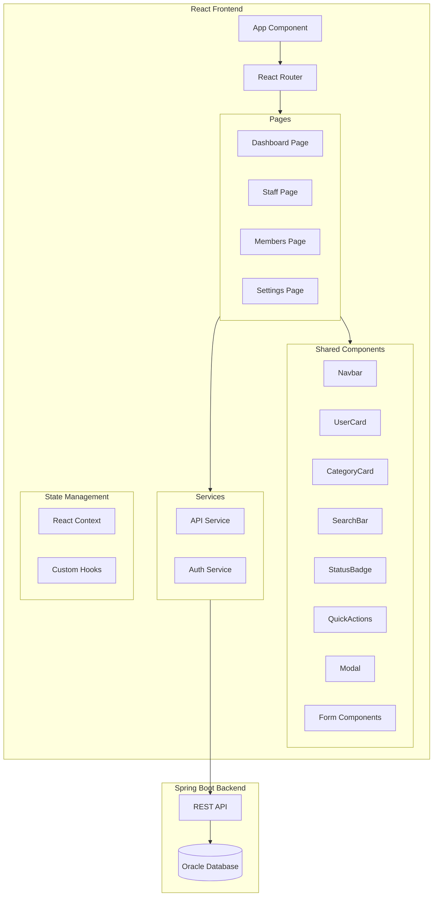

# Design Document

## Overview

The Gym Frontend is a React-based single-page application (SPA) that provides a modern, responsive dashboard interface for the Gym Management System. It connects to the existing Spring Boot backend API to display and manage gym owners, trainers, staff, members, and settings. The application uses React with TypeScript, React Router for navigation, and a component-based architecture with reusable UI components.

## Architecture



## Components and Interfaces

### Page Components

#### Dashboard Page
- Displays four CategoryCard components for Owners, Trainers, Staff, Customers
- Shows user count and list of users under each category
- Includes QuickActions panel on the right side
- Fetches aggregated data from `/api/stats` endpoint

#### Staff Page
- Grid layout of UserCard components for staff members
- "Add New Staff" button triggers modal form
- SearchBar for filtering by name or email
- Fetches data from `/api/users?role=STAFF,TRAINER`

#### Members Page
- Grid layout of UserCard components for gym members
- "Add New Member" button triggers modal form
- SearchBar for filtering by name or email
- Fetches data from `/api/users?role=CUSTOMER`

#### Settings Page
- Four card sections: General Settings, Profile, Notifications, Billing
- Form inputs for editable fields
- Toggle switches for notification preferences
- Save/Cancel buttons for form submission

### Shared Components

```typescript
// UserCard Component Props
interface UserCardProps {
  id: number;
  name: string;
  email: string;
  avatarUrl?: string;
  role?: string;        // For staff: "Head Trainer", "Desk Manager"
  plan?: string;        // For members: "Gold Plan", "Silver Plan"
  status: 'active' | 'expired';
  onClick?: () => void;
}

// CategoryCard Component Props
interface CategoryCardProps {
  title: string;        // "Owners", "Trainers", "Staff", "Customers"
  count: number;
  icon: React.ReactNode;
  users: UserSummary[];
  onViewAll: () => void;
  onAddNew: () => void;
}

// StatusBadge Component Props
interface StatusBadgeProps {
  status: 'active' | 'expired';
}

// SearchBar Component Props
interface SearchBarProps {
  placeholder: string;
  value: string;
  onChange: (value: string) => void;
}

// Navbar Component Props
interface NavbarProps {
  currentPage: string;
  onLogout: () => void;
}
```

### API Service Interface

```typescript
interface ApiService {
  // User endpoints
  getUsers(role?: string): Promise<User[]>;
  getUserById(id: number): Promise<User>;
  createUser(user: CreateUserDto): Promise<User>;
  updateUser(id: number, user: UpdateUserDto): Promise<User>;
  deleteUser(id: number): Promise<void>;
  
  // Stats endpoint
  getStats(): Promise<DashboardStats>;
  
  // Settings endpoints
  getSettings(): Promise<GymSettings>;
  updateSettings(settings: UpdateSettingsDto): Promise<GymSettings>;
}

interface DashboardStats {
  owners: { count: number; users: UserSummary[] };
  trainers: { count: number; users: UserSummary[] };
  staff: { count: number; users: UserSummary[] };
  customers: { count: number; users: UserSummary[] };
}
```

## Data Models

```typescript
// User model matching backend entity
interface User {
  id: number;
  username: string;
  email: string;
  firstName: string;
  lastName: string;
  avatarUrl?: string;
  roles: Role[];
  plan?: MembershipPlan;
  status: 'ACTIVE' | 'EXPIRED';
  createdAt: string;
  updatedAt: string;
}

interface UserSummary {
  id: number;
  name: string;
  email: string;
  avatarUrl?: string;
}

interface Role {
  id: number;
  name: 'OWNER' | 'TRAINER' | 'STAFF' | 'CUSTOMER';
}

interface MembershipPlan {
  id: number;
  name: 'Gold Plan' | 'Silver Plan' | 'Platinum Plan';
  price: number;
  expiryDate?: string;
}

interface GymSettings {
  gymName: string;
  address: string;
  contactEmail: string;
  notifications: {
    emailAlerts: boolean;
    smsAlerts: boolean;
  };
  billing: {
    cardLastFour: string;
    currentPlan: string;
  };
}

// DTOs for create/update operations
interface CreateUserDto {
  username: string;
  email: string;
  firstName: string;
  lastName: string;
  password: string;
  roleIds: number[];
  planId?: number;
}

interface UpdateUserDto {
  email?: string;
  firstName?: string;
  lastName?: string;
  avatarUrl?: string;
  roleIds?: number[];
  planId?: number;
  status?: 'ACTIVE' | 'EXPIRED';
}

interface UpdateSettingsDto {
  gymName?: string;
  address?: string;
  contactEmail?: string;
  notifications?: {
    emailAlerts?: boolean;
    smsAlerts?: boolean;
  };
}
```


## Correctness Properties

*A property is a characteristic or behavior that should hold true across all valid executions of a system-essentially, a formal statement about what the system should do. Properties serve as the bridge between human-readable specifications and machine-verifiable correctness guarantees.*

### Property 1: User Card Data Rendering
*For any* valid user object with name, email, and optional role/plan/status fields, rendering a UserCard component SHALL display all provided fields in the output.
**Validates: Requirements 1.2, 2.1, 3.1**

### Property 2: Search Filter Correctness
*For any* search query string and list of users, the filtered results SHALL only contain users whose name or email includes the search query (case-insensitive).
**Validates: Requirements 2.3, 3.3**

### Property 3: Status Badge Color Mapping
*For any* user with a status field, the StatusBadge component SHALL render with green styling for 'active' status and orange styling for 'expired' status.
**Validates: Requirements 2.5, 3.5**

### Property 4: Navigation Active State
*For any* navigation link that is clicked, the corresponding route SHALL become active and that link SHALL be visually highlighted as the current page.
**Validates: Requirements 5.4**

### Property 5: Form Cancel Reverts State
*For any* form with modified values, clicking the Cancel button SHALL restore all fields to their original values before modification.
**Validates: Requirements 4.7**

### Property 6: API Error Display
*For any* failed API request, the Frontend SHALL display an error message containing error information and render a retry button.
**Validates: Requirements 6.3**

### Property 7: API Data Rendering
*For any* successful API response containing user data, the Frontend SHALL render all users from the response in the appropriate UI components.
**Validates: Requirements 6.4**

## Error Handling

### API Error Handling
- Network errors: Display "Unable to connect to server" message with retry button
- 401 Unauthorized: Redirect to login page
- 403 Forbidden: Display "Access denied" message
- 404 Not Found: Display "Resource not found" message
- 500 Server Error: Display "Server error occurred" message with retry button

### Form Validation Errors
- Required field empty: Display inline error "This field is required"
- Invalid email format: Display "Please enter a valid email address"
- Password too short: Display "Password must be at least 8 characters"

### Loading States
- Initial page load: Show skeleton loaders for cards
- Form submission: Disable submit button and show spinner
- Data refresh: Show subtle loading indicator without blocking UI

## Testing Strategy

### Unit Testing
- Use Jest and React Testing Library for component testing
- Test individual components in isolation (UserCard, StatusBadge, SearchBar, etc.)
- Test utility functions (search filtering, data transformation)
- Test form validation logic

### Property-Based Testing
- Use fast-check library for property-based testing in TypeScript/JavaScript
- Configure minimum 100 iterations per property test
- Each property test must be tagged with format: '**Feature: gym-frontend, Property {number}: {property_text}**'

**Property Tests to Implement:**
1. UserCard renders all provided user fields
2. Search filter returns only matching users
3. StatusBadge applies correct color class based on status
4. Navigation highlights active route
5. Form cancel restores original values
6. Error states display error message and retry button
7. Successful API data renders all users

### Integration Testing
- Test page components with mocked API responses
- Test navigation flow between pages
- Test form submission and API interaction
- Test error handling scenarios

### Test File Structure
```
frontend/
├── src/
│   ├── components/
│   │   ├── UserCard/
│   │   │   ├── UserCard.tsx
│   │   │   └── UserCard.test.tsx
│   │   ├── StatusBadge/
│   │   │   ├── StatusBadge.tsx
│   │   │   └── StatusBadge.test.tsx
│   │   └── ...
│   ├── pages/
│   │   ├── Dashboard/
│   │   │   ├── Dashboard.tsx
│   │   │   └── Dashboard.test.tsx
│   │   └── ...
│   ├── services/
│   │   ├── api.ts
│   │   └── api.test.ts
│   └── utils/
│       ├── search.ts
│       └── search.test.ts
└── package.json
```
