# Super Admin Control Panel — UI/UX Wireframes
## Complete Visual Guide: Every Page, Every Button, Every Modal

---

## 1. 🖥️ Main Dashboard — System Health Overview

Your first screen every morning. Everything at a glance.


### What Each Element Does

| Element | Click Action | Shows |
|---------|-------------|-------|
| **Total Gyms card** | → Navigate to `/superadmin/gyms` | Full gym management table |
| **Active Users card** | → Navigate to `/superadmin/users` | Global user list |
| **MRR card** | → Navigate to `/superadmin/revenue` | Revenue dashboard |
| **Errors Today card** | → Navigate to `/superadmin/errors` | Error tracker |
| **System Health: Backend** | → Expand to show details | CPU %, RAM %, uptime, last restart, version |
| **System Health: PostgreSQL** | → Expand to show details | Connections, query time, disk usage |
| **System Health: Redis** | → Expand to show details | Memory usage, hit rate, key count |
| **System Health: WebSocket** | → Expand to show details | Connection count, message rate, errors |
| **System Health: Storage** | → Expand to show details | Used/total, files by type, largest files |
| **Response Time chart** | → Hover for exact values | Tooltip: "p95: 120ms at 14:32" |
| **Real-time Users counter** | → Click for live list | Shows logged-in users with gym name |
| **Alert entry** | → Click to expand | Full alert detail + action buttons |
| **🔔 Notification bell** | → Opens dropdown | Recent alerts: Critical top, action buttons |
| **🔍 Search bar** | → Type to search | Search gyms, users, settings globally |
| **👤 Avatar** | → Opens dropdown | Profile, Settings, Logout |

### Sidebar Navigation

| Icon | Label | Route | What Opens |
|------|-------|-------|------------|
| 📊 | Dashboard | `/superadmin/` | System health (this page) |
| 🏢 | Gyms | `/superadmin/gyms` | All gym management |
| 👤 | Users | `/superadmin/users` | Global user search |
| 💰 | Revenue | `/superadmin/revenue` | Financial dashboard |
| 🐛 | Errors | `/superadmin/errors` | Error tracker |
| 🚦 | Features | `/superadmin/features` | Feature flags |
| 🔒 | Security | `/superadmin/security` | Security monitor |
| 🗄️ | Database | `/superadmin/database` | Database health |
| 📈 | Analytics | `/superadmin/analytics` | Platform analytics |
| ⚙️ | Settings | `/superadmin/settings` | Platform settings |

---

## 2. 🏢 Gym Management — All 500+ Gyms

Manage every gym from one table. Click any row to see full details with action buttons.


### What Each Element Does

| Element | Click Action | Shows |
|---------|-------------|-------|
| **🔍 Search bar** | Type gym name/owner | Filters table in real-time |
| **Plan: All dropdown** | Select plan tier | Filter: Starter / Pro / Enterprise |
| **Status: All dropdown** | Select status | Filter: Active / Suspended / Trial / Expired |
| **Country: All dropdown** | Select country | Filter by country |
| **"Add Gym" button** | → Opens modal | Create gym form: name, owner email, plan |
| **Any table row** | → Opens right slide-over | Gym detail panel with stats + actions |
| **Plan badge (Pro/Enterprise/Starter)** | Visual only | Color-coded tier identification |
| **Status badge (Active/Suspended)** | Visual only | Green = active, Red = suspended |
| **⋮ Actions menu** | → Opens dropdown | Quick actions: View, Suspend, Export |
| **Pagination** | → Load next/prev page | Navigate 20 rows per page |

### Gym Detail Slide-Over (Right Panel)

| Element | Click Action | What Happens |
|---------|-------------|-------------|
| **"Impersonate Owner" button** | → Confirms dialog | Opens gym as if you are the owner (logged in audit trail) |
| **"Change Plan" button** | → Opens modal | Dropdown of plans + effective date picker |
| **"Suspend Gym" button** | → Confirms dialog | Shows reason input + "Suspend" confirm button |
| **"Export Data" button** | → Download starts | CSV/JSON export of all gym's data |
| **✕ Close button** | → Closes panel | Returns to gym list |

### Modals That Open

**Add Gym Modal:**
```
┌──────────────────────────────┐
│ Create New Gym          [✕]  │
├──────────────────────────────┤
│ Gym Name: [____________]     │
│ Owner Email: [__________]    │
│ Plan: [Starter ▾]           │
│ Country: [India ▾]          │
│ City: [____________]         │
│                              │
│ □ Send welcome email         │
│ □ Start free trial (14 days) │
│                              │
│ [Cancel]  [Create Gym ✓]     │
└──────────────────────────────┘
```

**Suspend Gym Modal:**
```
┌──────────────────────────────┐
│ ⚠️ Suspend FitZone Mumbai    │
├──────────────────────────────┤
│ This will immediately block  │
│ all users from this gym.     │
│                              │
│ Reason: [________________]   │
│ Duration: [Indefinite ▾]     │
│                              │
│ [Cancel]  [🔴 Suspend]       │
└──────────────────────────────┘
```

---

## 3. 👤 User Management — Global Search Across All Gyms

Find any user, view their details, force actions if needed.


### What Each Element Does

| Element | Click Action | Shows |
|---------|-------------|-------|
| **🔍 Search bar** | Type name/email/phone | Searches across ALL gyms |
| **Role pills (All/Owner/Trainer/Member/Staff)** | Click to filter | Shows only that role |
| **Status pills (Active/Suspended/Banned)** | Click to filter | Shows by status |
| **Any user row** | → Opens right panel | Full user detail |
| **Role badge** | Visual only | Color: Owner=purple, Trainer=blue, Member=green, Staff=orange |

### User Detail Panel Actions

| Button | Click Action | What Happens |
|--------|-------------|-------------|
| **"Reset Password"** | → Sends reset email | User receives password reset link |
| **"Change Role"** | → Opens role selector | Dropdown: Member → Trainer → Staff → Owner |
| **"Ban User"** | → Confirms dialog | Blocks user from entire platform |
| **"Export Data"** | → Downloads file | All user's data as JSON (GDPR compliance) |
| **"Force Logout"** (per session) | → Kills session | That specific device is logged out immediately |

---

## 4. 💰 Revenue Dashboard

Track every dollar earned across the platform.


### What Each Element Does

| Element | Click Action | Shows |
|---------|-------------|-------|
| **MRR card** | → Shows MRR breakdown | Per-plan MRR, growth rate, forecast |
| **ARR card** | → Shows annual projection | Monthly projections to year-end |
| **Churn Rate card** | → Shows churned gyms | List of gyms that cancelled + cancellation reasons |
| **Avg LTV card** | → Shows LTV analysis | LTV by plan tier, by country |
| **Revenue chart** | → Hover for values | Tooltip: "$24,350 in October 2024" |
| **Revenue by Plan donut** | → Click segment | Filters table to show only that plan's gyms |
| **Recent Payments table** | → Click row | Opens payment detail with invoice link |
| **"Retry" button** | → Re-charges card | Attempts payment again |
| **"Contact" button** | → Opens email draft | Pre-filled email to gym owner about failed payment |

---

## 5. 🚦 Feature Flags — Safe Rollouts

Toggle features ON/OFF per gym or globally. Critical for releasing new features safely.


### What Each Element Does

| Element | Click Action | Shows |
|---------|-------------|-------|
| **"Create Flag" button** | → Opens create form | Name, description, default state |
| **Toggle switch (ON/OFF)** | → Toggles immediately | Enables/disables feature across target gyms |
| **Feature card** | → Click to expand | Shows edit modal with rollout settings |
| **Rollout progress bar** | Visual only | Shows % of gyms with feature enabled |
| **Target tag (Beta/All/Selected)** | Visual only | Quick identifier for rollout scope |

### Edit Flag Modal

| Element | Action | Description |
|---------|--------|-------------|
| **Rollout Strategy dropdown** | Select type | "All Gyms" / "Percentage" / "Specific Gyms" |
| **Percentage slider** | Drag to set | 0-100% gradual rollout |
| **Gym selector checkboxes** | Check/uncheck | Select individual gyms |
| **"Save" button** | → Saves changes | Applies new rollout immediately |
| **"Cancel" button** | → Closes modal | No changes saved |

---

## 6. 🐛 Error Tracker — Live Production Errors

See every error happening across all gyms in real-time.


### What Each Element Does

| Element | Click Action | Shows |
|---------|-------------|-------|
| **Filter tabs (All/Critical/Warning/Info)** | Click to filter | Shows errors of that severity |
| **Error group card** | → Click to expand | Full stack trace + affected gyms |
| **Status dropdown** | Select status | "Investigating" / "Fixing" / "Resolved" |
| **"Mark Resolved" button** | → Marks resolved | Removes from active view, archives |
| **"Assign" button** | → Opens assign modal | Assign to team member for fixing |
| **"Mute" button** | → Mutes error | Stops notifications for this error type |
| **"View Full Query"** | → Expands SQL | Shows complete slow query text |
| **Affected Gyms list** | → Click gym name | Opens gym detail in new tab |
| **Stack trace** | Copyable | Click to copy for debugging |

---

## 7. 🔒 Security Monitor — Real-Time Protection

Live feed of every login attempt, threat detection, and IP management.


### What Each Element Does

| Element | Click Action | Shows |
|---------|-------------|-------|
| **"3 Active Threats" badge** | → Scrolls to threats | Shows threat detail cards |
| **Failed Logins card** | → Opens filtered feed | Only failed attempts |
| **Blocked IPs card** | → Scrolls to table | IP block management |
| **Active Sessions card** | → Opens session list | All active sessions with kill option |
| **2FA Adoption card** | → Opens 2FA report | Which owners have/haven't enabled 2FA |
| **Login feed entry (green)** | → Shows full details | IP, UserAgent, location, time |
| **Login feed entry (red)** | → Shows full details | Failed reason, attempt count |
| **Login feed entry (yellow)** | → Shows full details | Suspicious pattern description |
| **Threat Map dots** | → Hover for details | Country, attack count, attack type |
| **"Unblock" button** | → Confirms + unblocks | Removes IP from blocklist |
| **"Block IP" FAB** | → Opens block form | Enter IP + reason + duration |

### Block IP Modal
```
┌──────────────────────────────┐
│ Block IP Address        [✕]  │
├──────────────────────────────┤
│ IP: [___.___.___.___ ]       │
│ Reason: [Brute force ▾]     │
│ Duration: [24 hours ▾]      │
│                              │
│ [Cancel]  [🔴 Block IP]      │
└──────────────────────────────┘
```

---

## 8. 🗄️ Database Health — Performance & Storage

Monitor database performance, catch slow queries, track storage growth.


### What Each Element Does

| Element | Click Action | Shows |
|---------|-------------|-------|
| **Total Size card** | → Opens storage detail | Growth over time chart |
| **Active Connections gauge** | → Opens pool detail | Active, idle, waiting breakdown |
| **Avg Query Time** | → Opens slow query report | All queries >50ms sorted by time |
| **Backup Status** | → Opens backup history | Last 30 backup times, sizes, results |
| **Table Sizes bars** | → Click bar | Shows per-gym breakdown for that table |
| **Connection Pool gauge** | Visual | Green=healthy, yellow=watch, red=critical |
| **"View Full Query" link** | → Expands query | Full SQL + EXPLAIN plan |
| **Last Backup timestamp** | → Click | Shows backup log with download link |
| **Next Backup timer** | → Click | Shows backup schedule settings |

---

## 9. 📱 Mobile PWA — Access From Your Phone

Install on your phone home screen. Get push notifications. Manage on the go.


### Mobile-Specific UI Elements

| Element | Touch Action | Shows |
|---------|-------------|-------|
| **☰ Hamburger menu** | → Slides out sidebar | Full navigation menu |
| **🔔 Notification bell** | → Opens notification list | Recent alerts, tap to act |
| **Stat cards (2x2 grid)** | → Tap any card | Opens that section (Gyms/Users/Revenue/Errors) |
| **System Health bars** | → Tap any bar | Shows detail for that component |
| **Quick Action buttons** | → Tap to navigate | View Gyms / Users / Security / Errors |
| **Alert entries** | → Tap to expand | Shows alert detail + action buttons |
| **➕ FAB (floating button)** | → Opens quick actions | Quick create: gym, user, alert, broadcast |
| **Bottom nav: Home** | → Dashboard | Returns to this overview |
| **Bottom nav: Gyms** | → Gym list | Scrollable gym cards for mobile |
| **Bottom nav: Security** | → Security feed | Login feed + threat alerts |
| **Bottom nav: Alerts** | → Alert list | All alerts sorted by severity |
| **Bottom nav: More** | → More options | Revenue, Features, Database, Analytics, Settings |

### Mobile Push Notifications

| Notification Type | Tapping Opens | Priority |
|-------------------|---------------|----------|
| 🔴 "Server DOWN" | System Health page | Critical — vibrate + sound |
| 🔴 "Brute force from 45.33.x.x" | Security Monitor | Critical |
| 🟡 "High memory 82%" | System Health | Warning |
| 🟡 "Failed payment: FitZone" | Revenue > Failed Payments | Warning |
| 🟢 "New gym registered" | Gym Detail | Info |
| 🟢 "Daily report ready" | Email attachment | Info |

---

## Complete Interaction Flow Diagram

```mermaid
graph TD
    A["🖥️ Dashboard"] --> B["Total Gyms 487"]
    A --> C["Active Users 12.8K"]
    A --> D["MRR $24,350"]
    A --> E["Errors 3"]
    
    B --> F["🏢 Gym Management"]
    C --> G["👤 User Management"]
    D --> H["💰 Revenue"]
    E --> I["🐛 Error Tracker"]
    
    F --> F1["Click Row → Slide-over Detail"]
    F1 --> F2["Impersonate Owner"]
    F1 --> F3["Change Plan Modal"]
    F1 --> F4["Suspend Gym Modal"]
    F1 --> F5["Export Data Download"]
    
    G --> G1["Click User → Detail Panel"]
    G1 --> G2["Reset Password Email"]
    G1 --> G3["Change Role Modal"]
    G1 --> G4["Ban User Confirm"]
    G1 --> G5["Force Logout Session"]
    
    H --> H1["Click Metric → Breakdown"]
    H --> H2["Click Payment → Invoice"]
    H --> H3["Retry Failed Payment"]
    
    I --> I1["Click Error → Stack Trace"]
    I1 --> I2["Mark Resolved"]
    I1 --> I3["Assign to Team"]
    I1 --> I4["Mute Error Type"]
    
    A --> J["🚦 Feature Flags"]
    J --> J1["Toggle ON/OFF"]
    J --> J2["Click → Edit Modal"]
    J2 --> J3["Rollout Strategy"]
    J2 --> J4["Gym Selector"]
    
    A --> K["🔒 Security"]
    K --> K1["Live Login Feed"]
    K --> K2["Block IP FAB"]
    K --> K3["Unblock IP Button"]
    
    A --> L["🗄️ Database"]
    L --> L1["Slow Queries Table"]
    L --> L2["Connection Pool Gauge"]
    L --> L3["Backup History"]
    
    A --> M["📱 Mobile PWA"]
    M --> M1["Push Notifications"]
    M --> M2["Bottom Nav"]
    M --> M3["Quick Actions"]
```



---

## Design System

| Token | Value | Usage |
|-------|-------|-------|
| **Background** | `#0D1117` | Page background |
| **Card background** | `#161B22` | All card/panel backgrounds |
| **Sidebar** | `#0D1117` with left border | Navigation |
| **Primary accent** | `#58A6FF` | Links, active items, primary buttons |
| **Success** | `#3FB950` | Healthy status, positive metrics |
| **Warning** | `#D29922` | Alerts, degraded health |
| **Danger** | `#F85149` | Errors, critical alerts, suspend actions |
| **Text primary** | `#E6EDF3` | All main text |
| **Text secondary** | `#8B949E` | Labels, timestamps, secondary info |
| **Border** | `#30363D` | Card borders, table dividers |
| **Font** | `Inter, system-ui` | All UI text |
| **Font mono** | `JetBrains Mono` | Code, SQL queries, stack traces |

---

## Responsive Breakpoints

| Breakpoint | Layout Change |
|-----------|---------------|
| **Desktop (>1200px)** | Sidebar visible + full table + right panels |
| **Tablet (768-1200px)** | Collapsed sidebar (icons only) + responsive table |
| **Mobile (<768px)** | Bottom nav replaces sidebar, cards stack vertically, tables become card lists |
