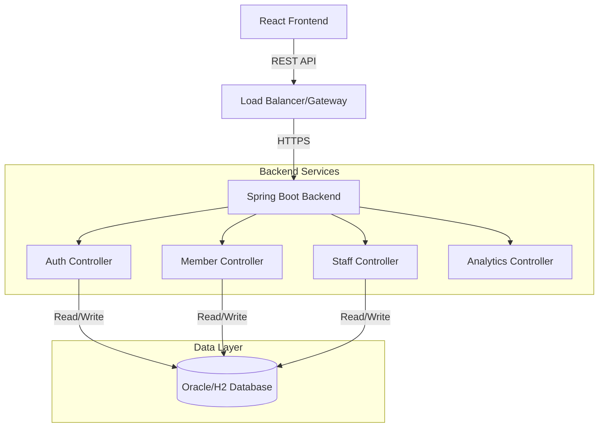

# Application Architecture & Documentation

## 1. Executive Summary
The application consists of two distinct components:
1.  **Backend System:** A robust, monolithic Spring Boot application providing the core logic for the Gym Management System (AthlonX). It exposes REST APIs for gym operations, member management, authentication, and reporting.
2.  **Frontend Application:** A React (Vite) Single Page Application (SPA) providing the dashboard and management interface for gym owners, staff, and members.

---

## 2. Backend Architecture (Gym Management System)

### 2.1 Technology Stack
*   **Framework:** Spring Boot 3.2.3
*   **Language:** Java 17
*   **Database:** 
    *   **Production:** Oracle Database (via `ojdbc11`)
    *   **Development/Test:** H2 Database (In-Memory)
    *   **Migration:** Flyway
*   **Security:** Spring Security, JWT (JSON Web Tokens), OAuth2 Client (Google)
*   **Build Tool:** Maven

### 2.2 System Architecture Diagram

### 2.3 Core Components & Interactions

#### A. Controller Layer (`com.gym.management.controller`)
Handles incoming HTTP requests, input validation, and maps requests to service methods.
*   **`AuthController`**: Handles login, registration, and token generation.
*   **`MembershipController`**: Manages member subscriptions and renewals.
*   **`DashboardController`**: Aggregates data for admin/staff dashboards.
*   **`PTSessionController`**: Manages Personal Training sessions.

#### B. Service Layer (`com.gym.management.service`)
Contains the business logic.
*   **`MembershipService`**:
    *   **Logic:** Calculates membership expiration based on packages.
*   **`UserService`**:
    *   **Logic:** Aggregates user data with membership status.
*   **`AuthService`**:
    *   **Logic:** Validates credentials and loads user roles.

#### C. Data Layer (`com.gym.management.repository`)
Uses Spring Data JPA to interact with the database.

### 2.5 Security & Authentication
*   **Mechanism:** Stateless JWT Authentication.
*   **Flow:** Client sends JWT in `Authorization: Bearer <token>` header.

---

## 3. Frontend Architecture (Dashboard App)

### 3.1 Technology Stack
*   **Framework:** React 19 (Vite)
*   **Language:** TypeScript
*   **Styling:** Tailwind CSS v4, CSS Modules
*   **State Management:** React Context API
*   **UI Components:** Custom components, Material UI (being phased out for Tailwind), Lucide Icons
*   **Testing:** Vitest, Playwright

### 3.2 Structure
*   **`src/App.tsx`**: Main Application entry point.
*   **`src/pages/`**: Route components (Dashboard, Members, etc.).
*   **`src/contexts/`**: Global state (Auth, Theme).
*   **`src/components/`**: Reusable UI components.

### 3.3 User Interface
*   **Design System:** "Dream Design" - Dark/Light mode, enterprise-grade, dense data display.
*   **Responsiveness:** Fully responsive using Tailwind.

---

## 4. Key Business Logic

1.  **Membership Validity:** Access based on `ACTIVE` status and `endDate`.
2.  **Role Management:** Multi-role support (e.g., `TRAINER` and `MANAGER`).
3.  **Booking Conflicts:** Optimistic locking ensures no double bookings.

---

## 5. API Documentation (Key Endpoints)

| Method | Endpoint | Description |
| :--- | :--- | :--- |
| **POST** | `/auth/login` | Authenticate user & get Token |
| **GET** | `/api/users/members/paginated` | List members (Paginated) |
| **POST** | `/api/memberships/renew` | Renew membership |
| **GET** | `/api/dashboard/stats` | Get gym statistics |
