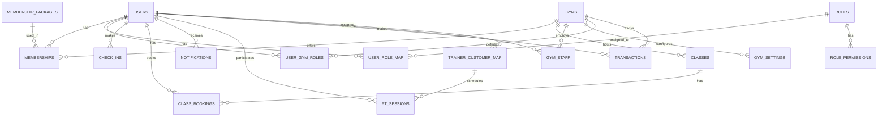

# 🏋️ AthlonX Gym Management System - Database Structure Report

**Generated:** January 8, 2026  
**Database:** Oracle 23ai FREE  
**Schema:** SYSTEM  
**Total Application Tables:** 25

---

## 📊 Database Overview

---

## 📋 Table Summary

| Table | Records | Description |
|-------|---------|-------------|
| **USERS** | 170 | All system users (members, trainers, staff, admins) |
| **GYMS** | 1 | Gym locations/branches |
| **MEMBERSHIPS** | 103 | Active/inactive member subscriptions |
| **MEMBERSHIP_PACKAGES** | 5 | Available membership plans |
| **CLASSES** | - | Group fitness classes |
| **CLASS_BOOKINGS** | - | Class reservations |
| **CHECK_INS** | - | Member gym entry logs |
| **ROLES** | 4 | System roles (ADMIN, TRAINER, MEMBER, etc.) |
| **USER_ROLE_MAP** | 158 | User-to-role assignments |
| **USER_GYM_ROLES** | - | Gym-specific role assignments |
| **TRAINER_CUSTOMER_MAP** | 19 | Trainer-member assignments |
| **PT_SESSIONS** | 6 | Personal training sessions |
| **TRANSACTIONS** | 51 | Payment records |
| **STAFF_SHIFTS** | 4 | Staff work schedules |
| **STAFF_PERFORMANCE** | 4 | Staff KPI tracking |
| **GYM_SETTINGS** | 10 | Configuration settings |
| **NOTIFICATIONS** | - | User notifications |
| **ALERTS** | - | System alerts |
| **ROLE_APPLICATIONS** | - | Role upgrade requests |
| **ROLE_CHANGE_AUDIT** | - | Role change history |
| **ROLE_PERMISSIONS** | - | Permission assignments |
| **OTP_CODES** | - | One-time passwords |
| **BLACKOUT_DAYS** | 3 | Gym closure dates |
| **PROGRESS_NOTES** | - | Member progress tracking |

---

## 🗃️ Detailed Table Structures

### 👤 USERS (Core User Table)

| Column | Type | Length | Nullable | Description |
|--------|------|--------|----------|-------------|
| USER_ID | NUMBER | 22 | NO | Primary Key |
| USERNAME | VARCHAR2 | 100 | NO | Unique login name |
| PASSWORD | VARCHAR2 | 255 | NO | Encrypted password |
| FULL_NAME | VARCHAR2 | 100 | YES | Display name |
| EMAIL | VARCHAR2 | 100 | YES | Email address |
| PHONE | VARCHAR2 | 1020 | YES | Phone number |
| PHONE_NUMBER | VARCHAR2 | 20 | YES | Alternate phone |
| STATUS | VARCHAR2 | 1020 | YES | Account status |
| AVATAR_ID | VARCHAR2 | 1020 | YES | Profile picture |
| GOOGLE_ID | VARCHAR2 | 255 | YES | OAuth Google ID |
| FACEBOOK_ID | VARCHAR2 | 255 | YES | OAuth Facebook ID |
| AUTH_PROVIDER | VARCHAR2 | 20 | YES | Authentication method |
| IS_FIRST_LOGIN | NUMBER | 22 | YES | First login flag |
| ACCOUNT_NON_LOCKED | NUMBER | 22 | YES | Lock status |
| CREATED_AT | TIMESTAMP | 11 | YES | Registration date |
| CREATED_BY | NUMBER | 22 | YES | Creator user ID |
| LEAVING_DATE | DATE | 7 | YES | Departure date |
| PASSWORD_CHANGED_AT | TIMESTAMP | 11 | YES | Last password change |

**Indexes:** `UK_USERS_GOOGLE_ID`, `UK_USERS_FACEBOOK_ID`, `UK_USERS_PHONE`, `IDX_USERS_EMAIL`

---

### 🏢 GYMS

| Column | Type | Length | Nullable | Description |
|--------|------|--------|----------|-------------|
| GYM_ID | NUMBER | 22 | NO | Primary Key |
| GYM_NAME | VARCHAR2 | 100 | NO | Gym name |
| ADDRESS | VARCHAR2 | 255 | YES | Physical address |
| PHONE | VARCHAR2 | 20 | YES | Contact phone |
| EMAIL | VARCHAR2 | 100 | YES | Contact email |
| OWNER_ID | NUMBER | 22 | NO | FK → USERS |
| CREATED_AT | TIMESTAMP | 11 | YES | Creation date |

---

### 💳 MEMBERSHIPS

| Column | Type | Length | Nullable | Description |
|--------|------|--------|----------|-------------|
| MEMBERSHIP_ID | NUMBER | 22 | NO | Primary Key |
| USER_ID | NUMBER | 22 | NO | FK → USERS |
| GYM_ID | NUMBER | 22 | YES | FK → GYMS |
| PACKAGE_ID | NUMBER | 22 | NO | FK → MEMBERSHIP_PACKAGES |
| START_DATE | DATE | 7 | NO | Subscription start |
| END_DATE | DATE | 7 | NO | Subscription end |
| STATUS | VARCHAR2 | 20 | YES | ACTIVE/EXPIRED/CANCELLED |
| CREATED_AT | TIMESTAMP | 11 | YES | Record creation |

**Indexes:** `IDX_MEMBERSHIPS_END_DATE`

---

### 📦 MEMBERSHIP_PACKAGES

| Column | Type | Length | Nullable | Description |
|--------|------|--------|----------|-------------|
| PACKAGE_ID | NUMBER | 22 | NO | Primary Key |
| PACKAGE_NAME | VARCHAR2 | 100 | NO | Plan name |
| DESCRIPTION | VARCHAR2 | 500 | YES | Plan details |
| PRICE | NUMBER | 22 | NO | Monthly price |
| DURATION_MONTHS | NUMBER | 22 | NO | Duration |
| IS_ACTIVE | NUMBER | 22 | YES | Availability flag |

**Indexes:** `IDX_MP_ACTIVE`

---

### 🏃 CLASSES

| Column | Type | Length | Nullable | Description |
|--------|------|--------|----------|-------------|
| CLASS_ID | NUMBER | 22 | NO | Primary Key |
| CLASS_NAME | VARCHAR2 | 100 | NO | Class title |
| DESCRIPTION | VARCHAR2 | 500 | YES | Class details |
| TRAINER_ID | NUMBER | 22 | YES | FK → USERS (trainer) |
| GYM_ID | NUMBER | 22 | YES | FK → GYMS |
| SCHEDULE_TIME | TIMESTAMP | 11 | YES | Class time |
| DURATION_MINUTES | NUMBER | 22 | YES | Duration |
| MAX_CAPACITY | NUMBER | 22 | YES | Seat limit |
| CURRENT_BOOKINGS | NUMBER | 22 | YES | Current count |

---

### 📅 CLASS_BOOKINGS

| Column | Type | Length | Nullable | Description |
|--------|------|--------|----------|-------------|
| BOOKING_ID | NUMBER | 22 | NO | Primary Key |
| USER_ID | NUMBER | 22 | NO | FK → USERS |
| CLASS_ID | NUMBER | 22 | NO | FK → CLASSES |
| GYM_ID | NUMBER | 22 | YES | FK → GYMS |
| STATUS | VARCHAR2 | 20 | YES | CONFIRMED/CANCELLED |
| BOOKED_AT | TIMESTAMP | 11 | YES | Booking time |

---

### ✅ CHECK_INS

| Column | Type | Length | Nullable | Description |
|--------|------|--------|----------|-------------|
| CHECK_IN_ID | NUMBER | 22 | NO | Primary Key |
| USER_ID | NUMBER | 22 | NO | FK → USERS |
| CHECK_IN_TIME | TIMESTAMP | 11 | NO | Entry time |
| CHECK_OUT_TIME | TIMESTAMP | 11 | YES | Exit time |

---

### 🔐 ROLES

| Column | Type | Length | Nullable | Description |
|--------|------|--------|----------|-------------|
| ROLE_ID | NUMBER | 22 | NO | Primary Key |
| ROLE_NAME | VARCHAR2 | 50 | NO | ADMIN, TRAINER, MEMBER, STAFF |

---

### 🔗 USER_ROLE_MAP

| Column | Type | Length | Nullable | Description |
|--------|------|--------|----------|-------------|
| MAP_ID | NUMBER | 22 | NO | Primary Key |
| USER_ID | NUMBER | 22 | NO | FK → USERS |
| ROLE_ID | NUMBER | 22 | NO | FK → ROLES |

---

### 🏢 USER_GYM_ROLES (Multi-Gym Role Support)

| Column | Type | Length | Nullable | Description |
|--------|------|--------|----------|-------------|
| ID | NUMBER | 22 | NO | Primary Key |
| USER_ID | NUMBER | 22 | NO | FK → USERS |
| GYM_ID | NUMBER | 22 | NO | FK → GYMS |
| ROLE | VARCHAR2 | 20 | NO | Role at this gym |
| STATUS | VARCHAR2 | 20 | NO | ACTIVE/INACTIVE |
| GRANTED_BY | NUMBER | 22 | YES | FK → USERS |
| GRANTED_AT | TIMESTAMP | 11 | YES | Grant date |
| EXPIRES_AT | TIMESTAMP | 11 | YES | Expiration |
| NOTES | VARCHAR2 | 500 | YES | Comments |

**Indexes:** `IDX_UGR_USER`, `IDX_UGR_GYM`, `IDX_UGR_ROLE`, `IDX_UGR_STATUS`, `UK_USER_GYM_ROLE`

---

### 🏋️ TRAINER_CUSTOMER_MAP

| Column | Type | Length | Nullable | Description |
|--------|------|--------|----------|-------------|
| MAP_ID | NUMBER | 22 | NO | Primary Key |
| TRAINER_USER_ID | NUMBER | 22 | NO | FK → USERS (trainer) |
| CUSTOMER_USER_ID | NUMBER | 22 | NO | FK → USERS (member) |

---

### 💪 PT_SESSIONS (Personal Training)

| Column | Type | Length | Nullable | Description |
|--------|------|--------|----------|-------------|
| SESSION_ID | NUMBER | 22 | NO | Primary Key |
| TRAINER_ID | NUMBER | 22 | NO | FK → USERS |
| MEMBER_ID | NUMBER | 22 | NO | FK → USERS |
| GYM_ID | NUMBER | 22 | YES | FK → GYMS |
| SESSION_DATE | TIMESTAMP | 11 | NO | Schedule time |
| DURATION_MINUTES | NUMBER | 22 | NO | Session length |
| STATUS | VARCHAR2 | 20 | NO | SCHEDULED/COMPLETED/CANCELLED |
| PROGRESS_NOTES | CLOB | 4000 | YES | Session notes |
| WORKOUT_PLAN | CLOB | 4000 | YES | Exercise plan |
| DIET_PLAN | CLOB | 4000 | YES | Nutrition plan |
| IS_RECURRING | NUMBER | 22 | YES | Recurring flag |
| RECURRING_FREQUENCY | VARCHAR2 | 20 | YES | WEEKLY/BIWEEKLY |
| CREATED_AT | TIMESTAMP | 11 | YES | Creation date |
| UPDATED_AT | TIMESTAMP | 11 | YES | Last update |

**Indexes:** `IDX_PTS_TRAINER`, `IDX_PTS_MEMBER`, `IDX_PTS_DATE`, `IDX_PTS_STATUS`

---

### 💰 TRANSACTIONS

| Column | Type | Length | Nullable | Description |
|--------|------|--------|----------|-------------|
| TRANSACTION_ID | NUMBER | 22 | NO | Primary Key |
| USER_ID | NUMBER | 22 | YES | FK → USERS |
| GYM_ID | NUMBER | 22 | YES | FK → GYMS |
| AMOUNT | NUMBER | 22 | YES | Transaction amount |
| CATEGORY | VARCHAR2 | 1020 | YES | MEMBERSHIP/PT/CLASS |
| STATUS | VARCHAR2 | 1020 | YES | SUCCESS/PENDING/FAILED |
| DESCRIPTION | VARCHAR2 | 1020 | YES | Details |
| DATE_TIME | TIMESTAMP | 11 | NO | Transaction time |

---

### 👷 GYM_STAFF

| Column | Type | Length | Nullable | Description |
|--------|------|--------|----------|-------------|
| STAFF_ID | NUMBER | 22 | NO | Primary Key |
| USER_ID | NUMBER | 22 | NO | FK → USERS |
| GYM_ID | NUMBER | 22 | NO | FK → GYMS |
| POSITION | VARCHAR2 | 50 | YES | Job title |
| HIRE_DATE | DATE | 7 | YES | Start date |
| SALARY | NUMBER | 22 | YES | Compensation |
| STATUS | VARCHAR2 | 20 | YES | ACTIVE/INACTIVE |

---

### 📊 STAFF_PERFORMANCE

| Column | Type | Length | Nullable | Description |
|--------|------|--------|----------|-------------|
| PERFORMANCE_ID | NUMBER | 22 | NO | Primary Key |
| STAFF_ID | NUMBER | 22 | NO | FK → USERS |
| RECORD_MONTH | VARCHAR2 | 7 | NO | YYYY-MM |
| SESSIONS_COMPLETED | NUMBER | 22 | YES | Sessions count |
| ATTENDANCE_RATE | NUMBER | 22 | YES | Attendance % |
| SATISFACTION_SCORE | NUMBER | 22 | YES | Customer rating |
| PRESENT_DAYS | NUMBER | 22 | YES | Days present |
| ABSENT_DAYS | NUMBER | 22 | YES | Days absent |
| LATE_DAYS | NUMBER | 22 | YES | Days late |

**Unique Constraint:** `UK_STAFF_MONTH` (STAFF_ID + RECORD_MONTH)

---

### ⏰ STAFF_SHIFTS

| Column | Type | Length | Nullable | Description |
|--------|------|--------|----------|-------------|
| SHIFT_ID | NUMBER | 22 | NO | Primary Key |
| STAFF_ID | NUMBER | 22 | NO | FK → USERS |
| SHIFT_DATE | DATE | 7 | NO | Work date |
| START_TIME | TIMESTAMP | 11 | NO | Shift start |
| END_TIME | TIMESTAMP | 11 | NO | Shift end |
| STATUS | VARCHAR2 | 20 | YES | SCHEDULED/COMPLETED |

---

### ⚙️ GYM_SETTINGS

| Column | Type | Length | Nullable | Description |
|--------|------|--------|----------|-------------|
| SETTING_ID | NUMBER | 22 | NO | Primary Key |
| SETTING_TYPE | VARCHAR2 | 50 | NO | Setting category |
| SETTING_KEY | VARCHAR2 | 100 | NO | Setting name |
| SETTING_VALUE | CLOB | 4000 | YES | Value (JSON/text) |

---

### 🔔 NOTIFICATIONS

| Column | Type | Length | Nullable | Description |
|--------|------|--------|----------|-------------|
| NOTIFICATION_ID | NUMBER | 22 | NO | Primary Key |
| USER_ID | NUMBER | 22 | NO | FK → USERS |
| TITLE | VARCHAR2 | 200 | NO | Notification title |
| MESSAGE | CLOB | 4000 | YES | Content |
| IS_READ | NUMBER | 22 | YES | Read status |
| CREATED_AT | TIMESTAMP | 11 | YES | Send time |

---

### 📝 ROLE_APPLICATIONS

| Column | Type | Length | Nullable | Description |
|--------|------|--------|----------|-------------|
| ID | NUMBER | 22 | NO | Primary Key |
| USER_ID | NUMBER | 22 | NO | FK → USERS (applicant) |
| GYM_ID | NUMBER | 22 | NO | FK → GYMS |
| REQUESTED_ROLE | VARCHAR2 | 20 | NO | Target role |
| STATUS | VARCHAR2 | 20 | NO | PENDING/APPROVED/REJECTED |
| CREDENTIALS | CLOB | 4000 | YES | Supporting docs |
| REVIEWED_BY | NUMBER | 22 | YES | FK → USERS (reviewer) |
| REVIEWED_AT | TIMESTAMP | 11 | YES | Review date |
| REJECTION_REASON | VARCHAR2 | 500 | YES | Decline reason |
| APPLIED_AT | TIMESTAMP | 11 | YES | Application date |

---

### 📜 ROLE_CHANGE_AUDIT

| Column | Type | Length | Nullable | Description |
|--------|------|--------|----------|-------------|
| ID | NUMBER | 22 | NO | Primary Key |
| USER_ID | NUMBER | 22 | NO | Affected user |
| GYM_ID | NUMBER | 22 | NO | FK → GYMS |
| ACTION | VARCHAR2 | 30 | NO | GRANT/REVOKE/MODIFY |
| OLD_ROLE | VARCHAR2 | 20 | YES | Previous role |
| NEW_ROLE | VARCHAR2 | 20 | YES | New role |
| PERFORMED_BY | NUMBER | 22 | NO | Admin user |
| PERFORMED_AT | TIMESTAMP | 11 | NO | Action time |
| IP_ADDRESS | VARCHAR2 | 45 | YES | Client IP |
| USER_AGENT | VARCHAR2 | 500 | YES | Browser info |
| NOTES | VARCHAR2 | 500 | YES | Comments |

---

### 🔑 OTP_CODES

| Column | Type | Length | Nullable | Description |
|--------|------|--------|----------|-------------|
| ID | NUMBER | 22 | NO | Primary Key |
| USER_ID | NUMBER | 22 | NO | FK → USERS |
| OTP_CODE | VARCHAR2 | 10 | NO | Verification code |
| OTP_TYPE | VARCHAR2 | 20 | NO | SMS/EMAIL/WHATSAPP |
| TARGET | VARCHAR2 | 100 | NO | Phone/Email |
| EXPIRES_AT | TIMESTAMP | 11 | NO | Expiration time |
| IS_USED | NUMBER | 22 | YES | Used flag |
| CREATED_AT | TIMESTAMP | 11 | YES | Generation time |

---

### 🚫 BLACKOUT_DAYS

| Column | Type | Length | Nullable | Description |
|--------|------|--------|----------|-------------|
| ID | NUMBER | 22 | NO | Primary Key |
| BLACKOUT_DATE | DATE | 7 | NO | Closure date |
| REASON | VARCHAR2 | 200 | YES | Closure reason |

---

## 🔗 Foreign Key Relationships

| Parent Table | Child Table | Relationship |
|--------------|-------------|--------------|
| USERS | MEMBERSHIPS | User has memberships |
| USERS | USER_ROLE_MAP | User has roles |
| USERS | USER_GYM_ROLES | User has gym-specific roles |
| USERS | CHECK_INS | User makes check-ins |
| USERS | CLASS_BOOKINGS | User books classes |
| USERS | NOTIFICATIONS | User receives notifications |
| USERS | PT_SESSIONS | User has PT sessions |
| USERS | TRANSACTIONS | User makes transactions |
| USERS | GYM_STAFF | User is staff |
| USERS | TRAINER_CUSTOMER_MAP | Trainer-member pairing |
| USERS | ROLE_APPLICATIONS | User applies for roles |
| USERS | OTP_CODES | User has OTP codes |
| GYMS | MEMBERSHIPS | Gym has memberships |
| GYMS | CLASSES | Gym hosts classes |
| GYMS | GYM_STAFF | Gym employs staff |
| GYMS | GYM_SETTINGS | Gym has settings |
| GYMS | USER_GYM_ROLES | Gym has role assignments |
| GYMS | TRANSACTIONS | Gym tracks transactions |
| GYMS | ROLE_APPLICATIONS | Gym receives applications |
| ROLES | USER_ROLE_MAP | Role assigned to users |
| MEMBERSHIP_PACKAGES | MEMBERSHIPS | Package used in memberships |
| CLASSES | CLASS_BOOKINGS | Class has bookings |

---

## 📈 Key Statistics

| Metric | Value |
|--------|-------|
| Total Users | 170 |
| Active Memberships | 103 |
| Membership Packages | 5 |
| User-Role Mappings | 158 |
| Trainer-Customer Pairs | 19 |
| PT Sessions | 6 |
| Transactions | 51 |
| System Roles | 4 |
| Gyms | 1 |
| Gym Settings | 10 |

---

## 🛡️ Security Features

1. **OAuth Integration** - Google & Facebook login support
2. **OTP Verification** - SMS/Email/WhatsApp codes
3. **Role-Based Access** - Granular permission system
4. **Audit Trail** - Role change tracking
5. **Account Locking** - Security lockout capability

---

*Report generated from Oracle 23ai FREE database*
