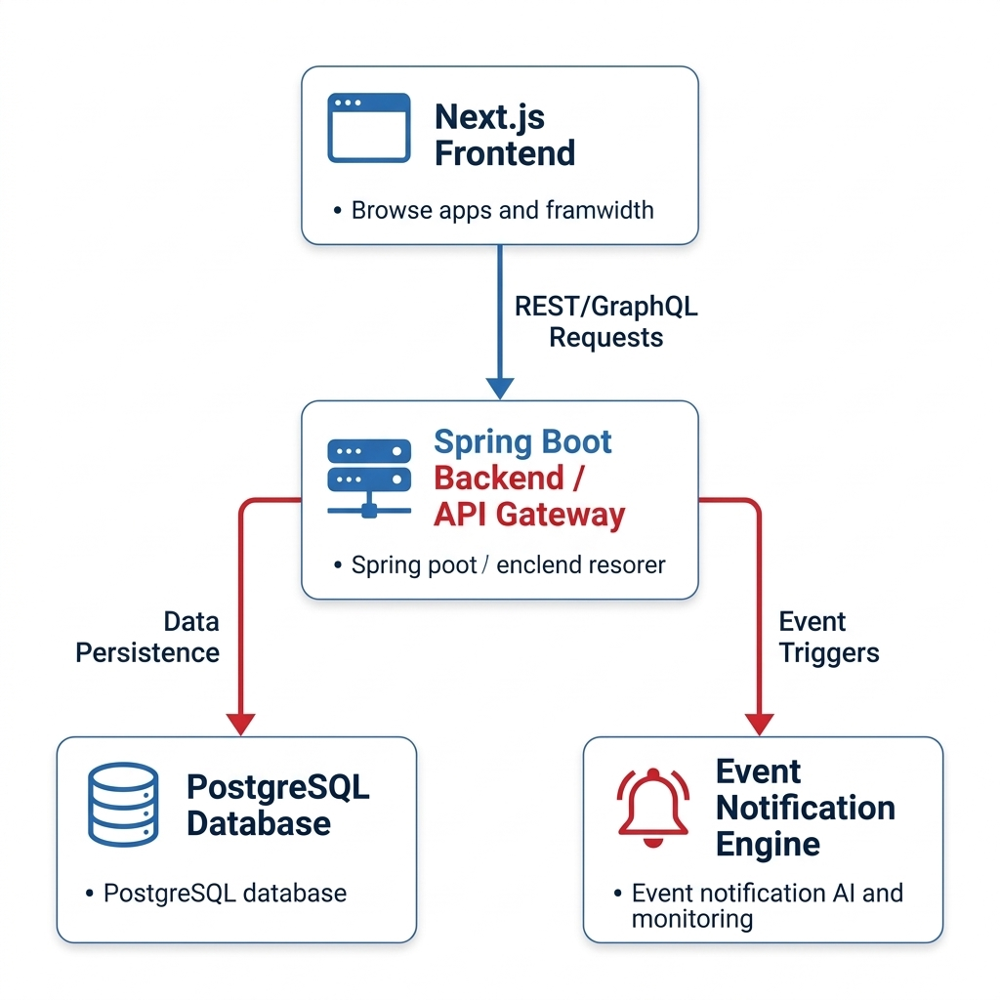

# A3 Poster Content & Layout Reference: Gym Management System

This document serves as a comprehensive guide for designing the A3 sizing project poster. Based on the provided ITMBU reference samples, this plan outlines the exact layout strategy, visual design language, and the precise, accurate details tailored specifically to your Gym Management System.

---

## 1. Structural Analysis of Reference Posters

Based on the provided references, the standard layout strictly follows this grid and visual hierarchy:

### Visual Language & Aesthetics
*   **Border:** A thick, professional **blue** border encompassing the entire A3 boundary.
*   **Background:** Clean, solid **white** to ensure maximum readability of research text.
*   **Header Typography:** Main titles and section headings use a bold **Red** serif or sans-serif font.
*   **Body Content:** Standard black, professional font (Times New Roman or Calibri), using bulleted points to avoid massive blocks of text.
*   **Alignment:** Text is primarily left-aligned or justified. The layout uses a 2-column aesthetic for text sections (like Benefits and Beneficiaries), moving into a full-width section for diagrams.

### Component Placement Map
1.  **Top Left:** University Logo & Information block (ITM Baroda University).
2.  **Top Center/Right:** Project Title (Centered and prominently sized).
3.  **Divider:** A horizontal blue line separating the header from the content.
4.  **Upper Region:** `Brief Description` (Paragraph format) followed by `Principle` (Paragraph or detailed bulleted list).
5.  **Middle Region (Text):** 2-Column layout for `Beneficiaries` (Left) and `Benefits` (Right).
6.  **Lower-Middle Region (Visuals):** 1-2 prominent diagrams/illustrations that visually explain what the project does (e.g., UI screens, Architecture flows).
7.  **Bottom Left:** `Technology Used` (Bulleted list).
8.  **Bottom Right:** Information Table containing Department, Semester, Name, and Guide.

---

## 2. Gym Management System - Poster Content Draft

Use the exact text below for your A3 poster to maintain professional academic standards while showcasing the technical depth of your project.

### Title Section
**Title:** FULL-STACK GYM MANAGEMENT SYSTEM
*(Format: Bold, RED, Centered)*

### Section 1: Brief Description
This is a robust, event-driven, full-stack platform designed to streamline and modernize daily fitness center operations. Leveraging an advanced Next.js/React frontend and a highly secure Spring Boot backend, the system offers a user-friendly digital environment for gym administrators, trainers, and members. It automates critical workflows including subscription management, attendance tracking, secure payment processing, and role-based data isolation. By integrating real-time notifications and scalable background processing, the platform ensures high operational efficiency and fosters elevated member engagement.

### Section 2: Principle
*   **Event-Driven Architecture:** Utilizes continuous background event processors to trigger real-time notifications, payment reminders, and systemic audit logs asynchronously without blocking primary user workflows.
*   **Role-Based Access Control (RBAC):** Adopts enterprise-grade security protocols utilizing JSON Web Tokens (JWT) and 2FA, enforcing strict data boundaries so Super Admins, Trainers, and Members access only authorized information.
*   **Stateless Scalability:** Engineered with a decoupled React/Spring Boot microservice-inspired architecture, allowing the API and User Interface to be independently scaled, maintained, and deployed on modern edge networks.
*   **Data-Driven Analytics:** Processes raw operational metrics (attendance, revenue, active subscriptions) into comprehensive visual dashboards, empowering decision-makers with actionable insights.

### Section 3: Beneficiaries
*(Format: 4-5 Bullet Points)*
*   Fitness Center Owners & Operators
*   Gym Administrators and Front-desk Staff
*   Personal Trainers and Coaches
*   Gym Members and Subscribers
*   Financial Auditors and System Maintainers

### Section 4: Benefits / Advantages
*(Format: 5-6 Bullet Points)*
*   Significantly Reduced Administrative Overhead
*   Automated Subscription & Revenue Tracking
*   Enhanced Transparency via Tamper-proof Audit Logs
*   Improved Stakeholder Communication via Real-time Notifications
*   Scalable Architecture for Multi-Branch Expansion
*   Premium, Intuitive UI boosting Member Experience

### Section 5: Technologies Used
*(Format: Bullet Points. Add respective small icons next to them if possible)*
*   **Frontend:** Next.js, React.js, Tailwind CSS
*   **Backend:** Java, Spring Boot 3, Spring Security
*   **Database:** PostgreSQL, Prisma ORM
*   **Deployment & DevOps:** Docker, Cloudflare Workers
*   **Security:** JWT Authentication

### Section 6: Information Table (Bottom Right)
*(Format: Use a light-blue table just like the sample)*
*   **Department:** B.Tech CSE (adjust if needed)
*   **Semester:** Semester – VIII
*   **Name:** Aryan Suthar
*   **Guide:** (Insert your Guide's Name), SoCSET, ITMBU

---

## 3. Visuals & Illustrations Strategy

To emulate the professional appearance of the samples, we placed a highly understandable AI-generated graphic centrally in the broad mid-to-lower section of the poster.

*(Note: Reduced diagram size in markdown for readibility, but retains high quality on the A3 poster canvas)*

**Graphic 1: The System Architecture**
*   **What it should be:** A beautiful, clean technical flowchart matching the university's red/blue theme.
*   **What it shows:** Next.js Frontend Dashboard interacting with a Spring Boot Backend which splits into the PostgreSQL Database and the Event Notification Engine.
*   **Why:** It proves the technical depth of your "Principle" section in a single glance in an aesthetically pleasing manner.

---

### Final Design Tips
*   Do not compress the text to fit the page; keep font sizes above `12pt` (preferably `14pt-16pt` for body text on an A3 canvas).
*   Ensure all images and diagrams are exported in High-Resolution (300 DPI) to prevent pixelation during physical printing.
*   Use the exact RED (`#CC0000` or similar pure red) and BLUE (`#003399` or similar navy blue) from the ITMBU logo to maintain brand consistency across the poster.
