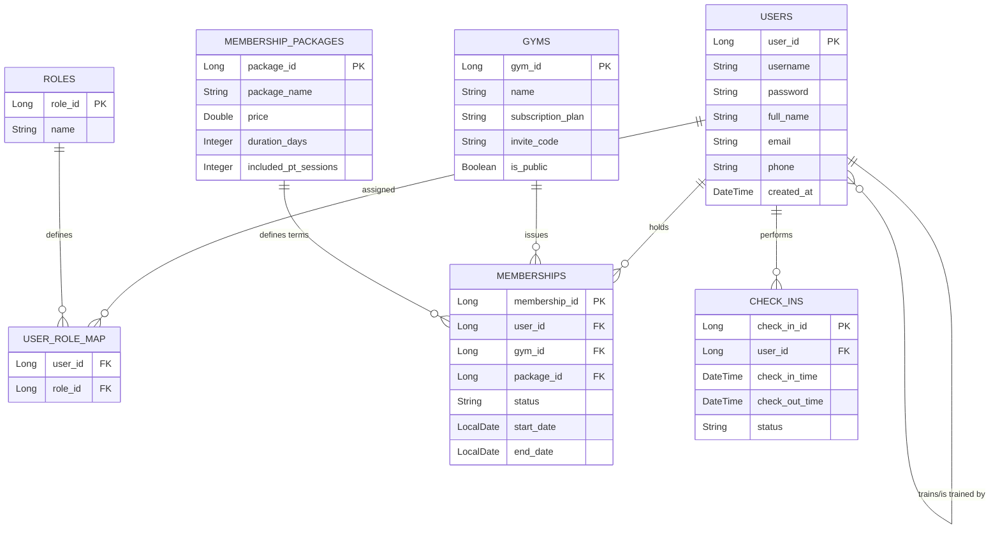
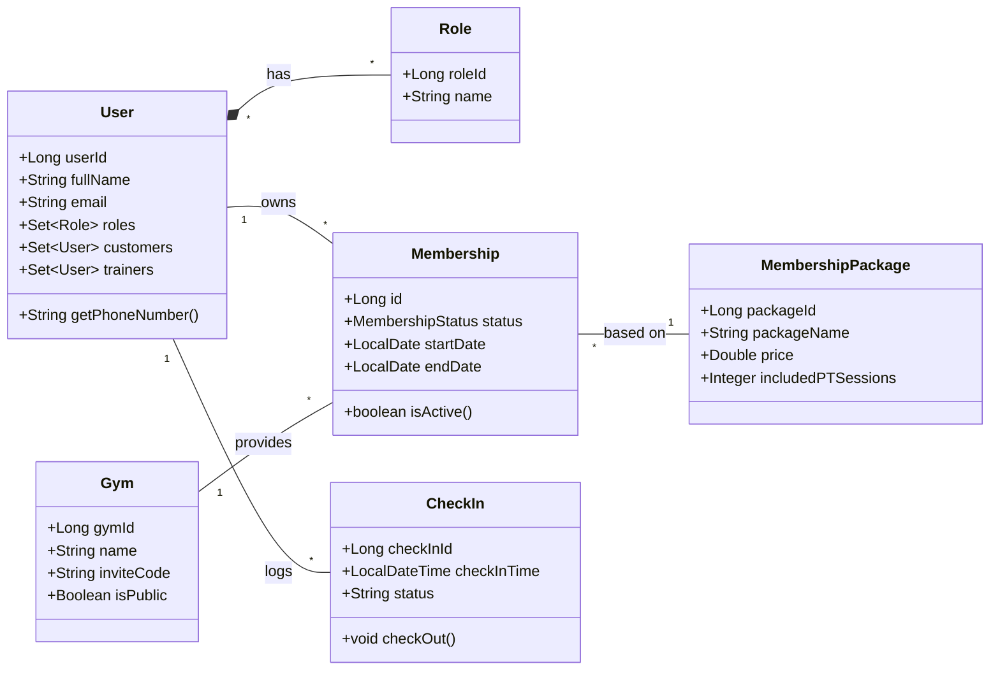
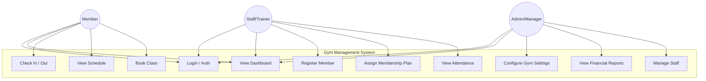
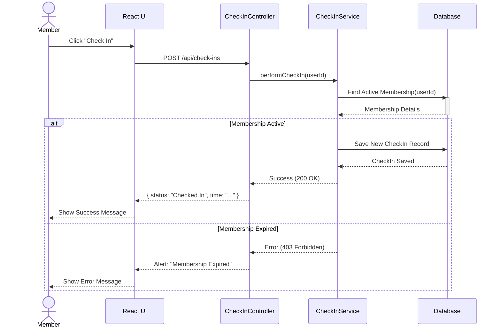

# System Architecture & Database Diagrams

This document contains comprehensive UML and Database diagrams for the **Gym Management System**. These diagrams are generated using **Mermaid.js**, which renders directly in most modern Markdown viewers (GitHub, GitLab, VS Code).

## 1. Entity-Relationship (ER) Diagram
This diagram represents the database schema, showing the tables (Entities) and their relationships (Foreign Keys).

## 2. Class Diagram (Backend Architecture)
This diagram illustrates the Java class structure, highlighting keys attributes and methods in the domain model.

## 3. High-Level Use Case Diagram
This diagram visualizes the primary interactions available to different types of users (Actors) in the system.

## 4. Sequence Diagram: Member Check-In Process
This diagram details the step-by-step logic flow when a member performs a check-in.

