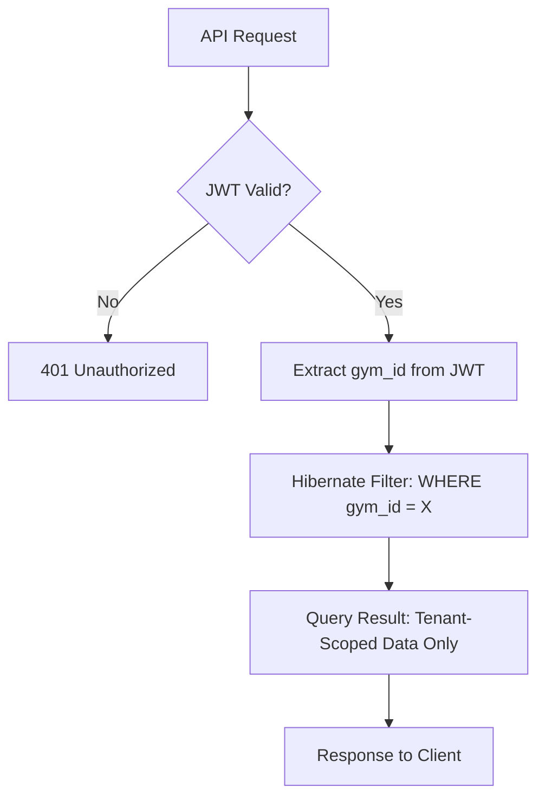

# Product Requirements Document (PRD)
## AthlonX Gym Management System — Version 2.0 AthlonX V2

**Document Version:** 1.0  
**Date:** January 6, 2026  
**Author:** Product Management  
**Status:** Draft for Review

---

## 1. Executive Summary

AthlonX Version 2.0 (AthlonX V2) represents a strategic evolution from a functional single-gym MVP to a **scalable, secure, B2B SaaS platform** capable of supporting thousands of gym franchises while delivering premium user experiences across all roles.

### Business Goals
- **Scale:** Transform from single-tenant to multi-tenant architecture supporting 10,000+ gyms
- **Revenue:** Enable subscription-based monetization with white-label capabilities
- **Retention:** Reduce churn through dramatically improved UX and gamification
- **Security:** Achieve bank-grade security posture suitable for B2B enterprise sales

### User Impact
- **Admins:** 60% faster decision-making through data-dense dashboards
- **Trainers:** Mobile-first interface enabling session logging without breaking client flow
- **Members:** Apple Health-like experience driving 40% higher engagement

### Strategic Direction
Version 2.0 prioritizes **foundation over features**—fixing critical security vulnerabilities, architectural debt, and UX friction before adding new capabilities. The "AthlonX V2 Protocol" design system will enable white-labeling for franchise clients.

---

## 2. Problem Statement

### 2.1 Customer (Member) Pain Points

| Problem | Impact | Evidence |
|---------|--------|----------|
| **Booking friction** | Members abandon bookings | Multiple clicks required to book same class as last week |
| **Generic UI** | Low emotional engagement | Layout is utilitarian, lacks premium polish |
| **No progress visualization** | Reduced motivation | "Activity Rings" concept exists but not prominent |
| **Mobile experience** | Usage drops on mobile | Layout not optimized for smartphone interaction |

### 2.2 Trainer Pain Points

| Problem | Impact | Evidence |
|---------|--------|----------|
| **Navigation interrupts sessions** | Break eye contact with client to log notes | No floating action button or quick-log UI |
| **Useless mobile calendar** | Cannot manage schedule on gym floor | Month view is impractical on small screens |
| **No heads-up display** | Context switching to see next client | Current client name/time not persistent |
| **Missing conflict detection** | Double-booked sessions | No visual indicator for overlapping sessions |

### 2.3 Administrator Pain Points

| Problem | Impact | Evidence |
|---------|--------|----------|
| **Excessive whitespace** | Scanning 50 members requires scrolling | Card padding too generous (`p-6`), sparse data density |
| **Hidden actions** | Slow workflows | Hover/click to reveal member actions |
| **No morning brief** | Delayed issue awareness | No summary of expiring memberships, late trainers |
| **Hardcoded demo data** | Fake metrics on dashboard | `Dashboard.tsx` uses `useState(51500)` |
| **Multi-gym context fragile** | Data leaks between tenants | `gym_id` enforcement is manual, not automated |

### 2.4 Technical Debt

| Issue | Risk Level | Details |
|-------|------------|---------|
| **NoOpPasswordEncoder** | 🔴 CRITICAL | Passwords stored without hashing |
| **No rate limiting** | 🔴 CRITICAL | DDoS possible via `/api/auth/login` |
| **Context Provider duplication** | 🟡 HIGH | Re-renders, state desync across routes |
| **No global exception handling** | 🟡 HIGH | Inconsistent error responses |
| **hibernate.ddl-auto in production** | 🟡 HIGH | Risk of accidental `DROP TABLE` |

---

## 3. Goals & Objectives

### 3.1 UX Goals

| Metric | V1 Baseline | V2 Target | Measurement |
|--------|-------------|-----------|-------------|
| **Task Completion Time (Booking)** | 5 clicks | 1 click ("Book Again") | User session recordings |
| **Mobile Session Duration** | 2.1 mins | 5+ mins | Analytics |
| **Dashboard Load Time** | 3.2s | <2s | Lighthouse |
| **Member NPS** | 32 | 55+ | In-app survey |

### 3.2 Engagement Goals

| Metric | V1 Baseline | V2 Target |
|--------|-------------|-----------|
| **Weekly Active Users** | 45% | 70% |
| **Session Logging (Trainer)** | 72% completed | 95% |
| **Class Booking Rate** | 1.2/member/week | 2.5/member/week |
| **Streak Completion (Members)** | N/A | 40% with 7+ day streaks |

### 3.3 Performance Goals

| Metric | Target |
|--------|--------|
| **API Response (P95)** | <400ms |
| **Page Load (LCP)** | <2.5s |
| **Error Rate** | <0.1% |
| **Uptime** | 99.9% |

### 3.4 Retention Goals

| Metric | V1 | V2 Target |
|--------|-----|-----------|
| **Monthly Churn (Members)** | 8.2% | <5% |
| **Trainer Retention** | 85% | 95% |
| **Gym (B2B) Churn** | N/A | <3% |

---

## 3.5 Non-Goals for Version 2.0

> [!IMPORTANT]
> The following are **explicit non-goals** to protect engineering focus and prevent scope creep.

| Non-Goal | Rationale |
|----------|----------|
| Becoming a consumer fitness content platform | We are B2B infrastructure, not a media company |
| Replacing accounting or ERP systems | Integrate with, don't compete against, existing tools |
| Supporting offline-first workflows | Complexity outweighs value for always-connected gyms |
| Deep AI personalization beyond rule-based logic | Requires data maturity we don't have yet |
| Building native mobile apps | Web-first; mobile apps are V3 scope |
| Multi-language support | English-only for initial market penetration |

---

## 4. User Personas

### 4.1 Admin/Owner — "The Tower"

```
Name: Rajesh Sharma
Age: 42
Role: Gym Owner (Multi-Location Franchise)
Device: Desktop (primary), Tablet (floor walks)
Tech Savvy: Medium
```

**Needs:**
- Bird's-eye view of all locations in single dashboard
- Rapid decision-making data (revenue, dues, churn risk)
- Batch operations (email all, suspend selected)
- White-label customization for his brand

**Pain Points:**
- Cannot compare locations side-by-side
- Too many clicks to perform admin actions
- Dashboard shows demo data, not real metrics

**Quote:** *"I need to see problems before they become crises."*

---

### 4.2 Trainer — "The Field"

```
Name: Priya Menon
Age: 28
Role: Personal Trainer
Device: iPhone (exclusively on floor)
Tech Savvy: High
```

**Needs:**
- Log session notes without looking away from client
- See next client + time remaining at a glance
- Set availability in 30-second bursts between sessions

**Pain Points:**
- Has to navigate to separate screen to add notes
- Calendar is unusable on phone (month view)
- No warning when she's double-booked

**Quote:** *"My phone should be invisible—one tap and done."*

---

### 4.3 Member — "The Mirror"

```
Name: Arun Kapoor
Age: 35
Role: Premium Member
Device: Mobile (90%), Desktop (10%)
Tech Savvy: High
```

**Needs:**
- Feel progress visually (streaks, rings)
- Re-book favorite class in one tap
- Know exactly when trainer is available

**Pain Points:**
- Booking flow is clunky (multiple screens)
- No "Book Again" shortcut
- UI feels corporate, not inspiring

**Quote:** *"I want to feel like I'm winning every time I open the app."*

---

## 5. Key Features for Version 2

### 5.1 Security & Foundation (Priority: CRITICAL)

| Feature | Priority | Problem Solved | Implementation |
|---------|----------|----------------|----------------|
| **BCrypt Password Hashing** | P0 | Plain-text password storage | Replace `NoOpPasswordEncoder` with `BCryptPasswordEncoder(12)` |
| **Rate Limiting** | P0 | DDoS vulnerability | Bucket4j + Redis: 5 login attempts/min/IP, 1000 API calls/min/tenant |
| **Global Exception Handler** | P0 | Inconsistent errors | `@ControllerAdvice` returning standard error envelope with `traceId` |
| **XSS Filter** | P0 | Stored XSS attacks | Interceptor stripping `<script>` tags from JSON payloads |
| **Multi-Tenant Data Isolation** | P0 | Cross-gym data leaks | Hibernate Filter enforcing `gym_id` from JWT |

> *See: [Architecture Diagram A: Multi-Tenant Data Flow](#appendix-d-diagrams)*

---

### 5.2 Authentication Upgrade

| Feature | Priority | Problem Solved |
|---------|----------|----------------|
| **Google OAuth** | P0 | Reduce signup friction |
| **Facebook OAuth** | P0 | Alternative social login |
| **Email OTP** | P0 | Passwordless login option |
| **SMS OTP** | P1 | Phone-based authentication |
| **WhatsApp OTP** | P1 | Preferred channel in India |
| **Role-Based Redirect** | P0 | Automatic routing after login |
| **Account Linking** | P1 | Match social/phone to existing accounts |

> *See: [Flow Diagram B: OAuth & OTP Authentication Flow](#appendix-d-diagrams)*

---

### 5.3 Admin "Power-Up" Features

| Feature | Priority | Problem Solved |
|---------|----------|----------------|
| **Morning Brief Widget** | P0 | No proactive alerts |
| **AthlonX V2 Table** | P0 | Hard to scan member lists |
| **4-Column KPI Grid** | P0 | Data density too low |
| **Batch Operations** | P0 | Cannot action multiple members |
| **Sparkline Trends** | P1 | No trend visibility on metrics |
| **Sticky Headers** | P1 | Column names scroll out of view |
| **Quick-Action Row Hover** | P1 | Actions hidden in dropdowns |
| **Multi-Gym Comparison** | P2 | Cannot compare locations |

---

### 5.4 Trainer "Flow" Features

| Feature | Priority | Problem Solved |
|---------|----------|----------------|
| **Floating Action Button (FAB)** | P0 | Note-taking interrupts session |
| **Heads-Up Display (HUD)** | P0 | No persistent client/time info |
| **One-Tap Logging** | P0 | Too many steps to mark session |
| **Agenda View** | P0 | Month calendar useless on mobile |
| **Conflict Detection** | P1 | No overlapping session warnings |
| **Travel Time Awareness** | P2 | Sessions at different locations clash |

---

### 5.5 Member "Mirror" Features

| Feature | Priority | Problem Solved |
|---------|----------|----------------|
| **Activity Rings (Hero)** | P0 | Progress visualization buried |
| **Book Again Button** | P0 | Re-booking same class is tedious |
| **Skeleton Loading** | P0 | Jarring load states |
| **Waitlist UI** | P1 | No clarity on class queue position |
| **Streak System** | P1 | No gamification |
| **Haptic Feedback** | P2 | No sensory reward on mobile |

---

### 5.6 White-Label Engine

| Feature | Priority | Problem Solved |
|---------|----------|----------------|
| **CSS Variable System** | P0 | Hardcoded colors block branding |
| **Theme Context** | P0 | No runtime theming |
| **Dynamic Logo Loading** | P1 | Gyms want their own identity |
| **Brand Settings Page** | P1 | Owners cannot customize look |

---

### 5.7 Database & Performance

| Feature | Priority | Problem Solved |
|---------|----------|----------------|
| **Flyway Migration** | P0 | Schema changes are manual and risky |
| **Index Optimization** | P0 | Slow queries on `email`, `gym_id`, `end_date` |
| **HikariCP Tuning** | P1 | Default pool settings |
| **Redis Caching** | P1 | Session storage on DB |
| **Read/Write Splitting** | P2 | Analytics queries slow production |

---

### 5.8 Role Management & Switching

> [!IMPORTANT]
> One user account may hold multiple roles (Admin, Trainer, Member). Roles are gym-scoped and permission-controlled. No duplicate accounts allowed.

| Feature | Priority | Problem Solved |
|---------|----------|----------------|
| **Gym-Scoped Roles** | P0 | Roles not tied to specific gym context |
| **Seamless Role Switching** | P0 | Must logout to change active role |
| **Role Indicator Badge** | P0 | No visibility of active role |
| **RoleSwitcher Component** | P0 | No UI for switching without logout |
| **Trainer Application Flow** | P1 | Members cannot apply to become trainers |
| **Role Approval Workflow** | P1 | No admin approval for role grants |
| **Role Suspension/Revocation** | P1 | No way to temporarily disable roles |
| **Role Change Audit Log** | P1 | No audit trail for role changes |

**Supported Scenarios:**
- Trainers can also be members within the same gym
- Members may apply to become trainers (requires owner/admin approval)
- A user may be a trainer in Gym A and a member in Gym B
- Admins may temporarily operate in trainer or member mode

**Security Requirements:**
- Server-side RBAC enforcement on all endpoints
- All role changes logged with timestamp and IP
- JWT includes `activeRole` and `availableRoles`
- No cross-role data visibility or modification

> *See: [Role Management Technical Specification](file:///Users/aryan/Intership/technical_roadmap/role_management_spec.md)*

---

## 6. UI/UX Improvements

### 6.1 Design System: AthlonX Core

**Philosophy:** "The Invisible Interface"—no training required.

#### Color System (Variable-First)

| Variable | Purpose | Default (Crimson) |
|----------|---------|-------------------|
| `--brand-primary` | Main brand color | `#DC2626` |
| `--brand-surface` | Subtle backgrounds | `#1A1A1A` |
| `--status-success` | Positive actions | `#10B981` |
| `--surface-ground` | App background | `#0A0A0A` |
| `--surface-card` | Content containers | `#141414` |

**Rule:** No component contains hardcoded hex values.

#### Typography

| Level | Usage | Spec |
|-------|-------|------|
| Display XL | Key metrics | `text-4xl`, Plus Jakarta Sans |
| Heading L | Page titles | `text-xl`, Plus Jakarta Sans |
| Body M | Standard text | `text-sm`, Inter |
| Mono S | IDs, timestamps | `font-mono text-xs`, monospace |

---

### 6.2 Role-Specific Layouts

#### Admin Layout

- **Grid:** 4-column KPI cards (reduced from 2)
- **Padding:** Reduced to `p-4` (from `p-6`)
- **Tables:** Zebra striping, sticky headers, hover actions
- **Density:** Information-rich, scanner-optimized

#### Trainer Layout

- **Primary Mode:** Agenda (vertical timeline)
- **Persistent:** HUD bar (client name, time remaining, next)
- **FAB:** Always-visible "+ Note" button
- **Touch Targets:** Extra-large for floor use

#### Member Layout

- **Hero:** Activity Rings front and center
- **Animation:** Framer Motion polish (optimized bundle)
- **Feedback:** Haptic on achievements
- **Shortcuts:** "Book Again" pinned to top

---

### 6.3 Shared Components

#### AthlonXModal
- Backdrop blur (`backdrop-blur-sm`)
- Scale animation (95% → 100%)
- ESC key closes

#### AthlonXToast
- Position: Bottom-right (desktop), top-center (mobile)
- Stacking: new pushes old down
- Style: Glassmorphism (`bg-black/80`, `border-white/10`)

#### AthlonXInput
- Focus ring: `--brand-primary`
- Error: Inline + shake animation
- Icons: Integrated leading/trailing

---

### 6.4 Migration Strategy (V1 → V2)

> [!WARNING]
> Migration is a **critical path** for V2 success. This section outlines the strategy to transition existing V1 users without disruption.

#### 6.4.1 User Account Migration

| Component | Strategy | Rollback Plan |
|-----------|----------|---------------|
| **Passwords** | Dual-write: V1 hash stored alongside BCrypt. Force reset on next login. | Revert to V1 hash if BCrypt fails |
| **User Profiles** | Zero-downtime migration via background job | Point-in-time restore from backup |
| **Linked Accounts** | New `auth_provider` field, nullable for V1 users | No rollback needed (additive) |

#### 6.4.2 Feature Flag Rollout

```
Phase 1: 5% of users (internal + beta gyms)
Phase 2: 25% of users (small gyms)
Phase 3: 100% of users (full rollout)
```

- Each feature wrapped in `FF_TITAN_*` flags
- Instant kill switch per feature
- A/B metrics collected at each phase

#### 6.4.3 Data Schema Migration

| Table | Change | Migration Approach |
|-------|--------|--------------------|
| `users` | Add `google_id`, `facebook_id`, `phone_number`, `auth_provider` | Flyway V2 script (additive columns) |
| `memberships` | Add `gym_id` index | Online index creation (no downtime) |
| `audit_log` | New table | Create fresh, no migration needed |

#### 6.4.4 Backward Compatibility

- V1 API endpoints remain functional for 90 days post-launch
- Deprecation warnings in response headers
- Clear migration guide for any API consumers

#### 6.4.5 Rollback Triggers

| Trigger | Threshold | Action |
|---------|-----------|--------|
| Error rate spike | >2% for 5 mins | Auto-disable latest feature flag |
| P95 latency | >800ms for 10 mins | Scale up + alert |
| Login failures | >5% | Revert auth changes, page oncall |

> *See: [Migration Sequence Diagram C](#appendix-d-diagrams)*

---

### 6.5 Data Ownership & Compliance

> [!IMPORTANT]
> This section addresses B2B client concerns about data governance and regulatory compliance.

#### 6.5.1 Data Ownership Principles

| Data Type | Owner | AthlonX Access |
|-----------|-------|----------------|
| Member PII (name, email, phone) | Gym | Read-only for support; never sold |
| Workout/attendance data | Gym | Aggregated only for analytics |
| Payment records | Gym | Transaction logs; no card data stored |
| Platform usage analytics | AthlonX | Anonymized for product improvement |

#### 6.5.2 Tenant Isolation Guarantees

- **Database:** Logical isolation via `gym_id` discriminator (Hibernate Filter)
- **API:** JWT claims enforce tenant context; no cross-tenant queries possible
- **Logs:** Tenant ID tagged on every log entry for forensic isolation
- **Backups:** Per-tenant export capability for offboarding

#### 6.5.3 Data Export & Portability

| Scenario | Format | SLA |
|----------|--------|-----|
| Gym cancellation | Full JSON/CSV export of all member data | Within 7 business days |
| Regulatory request | Structured export per GDPR Article 20 | Within 30 days |
| API access | Real-time via authenticated endpoints | Immediate |

#### 6.5.4 Compliance Posture

| Standard | Status | Notes |
|----------|--------|-------|
| **GDPR Principles** | ✅ Adopted | Data minimization, right to erasure |
| **India DPDP Act** | ✅ Ready | Consent management built-in |
| **SOC 2 Type II** | 🔄 Planned (V3) | Require formal audit |
| **ISO 27001** | 🔄 Planned (V3) | Foundational controls in V2 |

## 7. Functional Requirements

### 7.1 Customer (Member) Requirements

| ID | Requirement | Priority |
|----|-------------|----------|
| M-01 | Book a class in ≤2 taps | P0 |
| M-02 | Re-book last class with 1 tap | P0 |
| M-03 | View activity rings on dashboard | P0 |
| M-04 | Join waitlist with position visibility | P1 |
| M-05 | View streak count and history | P1 |
| M-06 | Receive haptic feedback on achievements | P2 |
| M-07 | Login via Google/Facebook/OTP | P0 |
| M-08 | View trainer availability calendar | P1 |
| M-09 | Receive push notifications for bookings | P1 |
| M-10 | Cancel booking up to 2 hours before | P0 |
| M-11 | Switch between Member/Trainer role without logout | P0 |
| M-12 | Apply to become a trainer with credentials | P1 |

---

### 7.2 Trainer Requirements

| ID | Requirement | Priority |
|----|-------------|----------|
| T-01 | View today's schedule in agenda format | P0 |
| T-02 | Log session notes via FAB without navigation | P0 |
| T-03 | See HUD with current client + time remaining | P0 |
| T-04 | Mark session as completed/no-show in 1 tap | P0 |
| T-05 | Receive conflict warning on overlapping bookings | P1 |
| T-06 | Set recurring availability patterns | P1 |
| T-07 | View member progress notes history | P1 |
| T-08 | Message members directly in-app | P2 |
| T-09 | View earnings summary for period | P2 |
| T-10 | Receive notification 15 mins before session | P1 |
| T-11 | Switch to Member mode to book own classes | P0 |

---

### 7.3 Admin Requirements

| ID | Requirement | Priority |
|----|-------------|----------|
| A-01 | View multi-gym comparison dashboard | P0 |
| A-02 | Perform batch operations on members | P0 |
| A-03 | See morning brief with alerts | P0 |
| A-04 | View real-time floor status | P0 |
| A-05 | Customize branding (logo, colors) | P1 |
| A-06 | Export financial reports (CSV/PDF) | P1 |
| A-07 | Manage subscription/billing | P0 |
| A-08 | View audit trail of admin actions | P1 |
| A-09 | Generate API keys for integrations | P2 |
| A-10 | Configure membership packages | P0 |
| A-11 | Approve/reject trainer applications | P0 |
| A-12 | Grant/revoke/suspend user roles | P0 |
| A-13 | View role change audit trail | P1 |

---

## 8. Non-Functional Requirements

### 8.1 Performance

| Requirement | Target | Measurement |
|-------------|--------|-------------|
| API response (P95) | <400ms | Application Performance Monitoring |
| Dashboard load (LCP) | <2.5s | Lighthouse |
| Database query time | <100ms | Slow query log |
| Bundle size (gzipped) | <250KB | Webpack Bundle Analyzer |
| Concurrent users/gym | 500+ | Load testing |

### 8.2 Security

| Requirement | Implementation |
|-------------|----------------|
| Password hashing | BCrypt (strength 12) |
| Rate limiting | 5 login/min/IP, 1000 API/min/tenant |
| Session management | JWT with 24h expiry, refresh tokens |
| Input sanitization | XSS filter on all inputs |
| Data isolation | Hibernate filter on `gym_id` |
| Dependency scanning | OWASP Dependency Check in CI |
| Audit logging | All admin actions logged with IP |

### 8.3 Scalability

| Requirement | Target |
|-------------|--------|
| Tenants supported | 10,000+ gyms |
| Members per gym | 50,000+ |
| Database strategy | Shared DB, discriminator column |
| Caching layer | Redis for sessions/hot data |
| CDN | Static assets via CloudFront |

### 8.4 Accessibility

| Requirement | Standard |
|-------------|----------|
| Color contrast | WCAG 2.1 AA (4.5:1 minimum) |
| Keyboard navigation | Full app navigable via keyboard |
| Screen readers | ARIA labels on all interactive elements |
| Focus indicators | Visible focus ring on all controls |

### 8.5 Reliability

| Requirement | Target |
|-------------|--------|
| Uptime | 99.9% (8.7 hours downtime/year max) |
| Disaster recovery | <4 hour RTO, <1 hour RPO |
| Backup frequency | Daily full, hourly incremental |
| Failover | Automatic to secondary region |

---

## 9. Out of Scope

The following features are **intentionally excluded** from Version 2.0:

| Feature | Reason | Target Version |
|---------|--------|----------------|
| **Native Mobile Apps** | Web-first approach; React Native in V3 | V3.0 |
| **Hardware Integration** | RFID/biometric requires hardware partnerships | V3.0 |
| **AI Churn Prediction** | Requires 6+ months of data | V3.0 |
| **Video Workout Library** | Content licensing complexity | V3.0 |
| **Payment Gateway (Stripe/Razorpay)** | Manual entry sufficient for MVP B2B | V2.5 |
| **Real-time Chat** | WebSocket infrastructure not priority | V2.5 |
| **Offline Mode (PWA)** | Adds significant complexity | V3.0 |
| **Multi-Language Support (i18n)** | English-only for initial markets | V2.5 |

---

## 10. Risks & Mitigations

### 10.1 Technical Risks

| Risk | Probability | Impact | Mitigation |
|------|-------------|--------|------------|
| **Password migration breaks existing users** | Medium | High | Dual-write during transition; force password reset on next login |
| **Multi-tenant filter performance degradation** | Medium | High | Add `gym_id` indexes before enabling filter |
| **OAuth provider rate limits** | Low | Medium | Implement exponential backoff; cache tokens |
| **Bundle size bloat from new animations** | Medium | Medium | Tree-shake Framer Motion; analyze with Bundle Analyzer |

### 10.2 UX Risks

| Risk | Probability | Impact | Mitigation |
|------|-------------|--------|------------|
| **Power users resist denser UI** | Medium | Medium | A/B test; offer "comfort mode" toggle |
| **Trainers find FAB distracting** | Low | Low | Allow FAB position customization |
| **Activity rings perceived as gimmicky** | Low | Medium | Tie to real metrics; avoid empty calories |

### 10.3 Operational Risks

| Risk | Probability | Impact | Mitigation |
|------|-------------|--------|------------|
| **Twilio SMS costs exceed budget** | Medium | Medium | Implement Firebase Phone Auth as fallback |
| **White-label customization scope creep** | High | Medium | Limit to colors + logo only in V2; expand later |
| **B2B client demands custom features** | High | High | Build extensibility into roadmap; use feature flags |

---

## 11. Dependencies & Assumptions

### 11.1 Technical Dependencies

| Dependency | Type | Owner | Status |
|------------|------|-------|--------|
| Google Cloud Console credentials | External | User | Required |
| Facebook Developer App | External | User | Required |
| Twilio Account (or Firebase) | External | User | Required |
| Redis Instance | Infrastructure | DevOps | To provision |
| Oracle DB with indexes | Infrastructure | DevOps | Existing + upgrade |

### 11.2 Assumptions

1. **User base remains on Oracle DB** — PostgreSQL migration is out of scope
2. **India-first market** — UPI, WhatsApp prioritized over Western alternatives
3. **No hardware integrations** — All check-ins remain manual or via app
4. **Single timezone per gym** — Global timezone support deferred
5. **English-only** — Localization deferred to V2.5

---

## 12. Success Metrics (KPIs)

### 12.1 Launch Metrics (Week 1)

| Metric | Target | Measurement |
|--------|--------|-------------|
| Core Web Vitals (LCP) | <2.5s | Lighthouse |
| Error rate | <0.5% | Sentry |
| Login success rate | >99% | Backend logs |
| Zero security vulnerabilities | 0 critical/high | OWASP scan |

### 12.2 Adoption Metrics (Month 1)

| Metric | Target | Measurement |
|--------|--------|-------------|
| Social login adoption | 30% of new signups | Analytics |
| Mobile session increase | +25% | Analytics |
| Trainer session logging rate | 90%+ | Backend |
| Member booking rate | +20% | Backend |

### 12.3 Business Metrics (Quarter 1)

| Metric | Target |
|--------|--------|
| Member churn | <5% |
| NPS (Members) | 50+ |
| B2B gym onboarding | 10 new gyms |
| MRR growth | +30% |

### 12.4 Technical Health (Ongoing)

| Metric | Target |
|--------|--------|
| API P95 latency | <400ms |
| Uptime | 99.9% |
| Security incidents | 0 |
| Tech debt ratio | <15% |

---

## 13. Release Plan

### Phase 0: Technical Debt Cleanup (Week 1-2)

**Milestone:** "Secure Foundation"

- [ ] Enable BCrypt password hashing + migration script
- [ ] Add GlobalExceptionHandler
- [ ] Refactor App.tsx Context Providers
- [ ] Add Flyway + baseline migration
- [ ] Implement XSS filter
- [ ] Add critical indexes (`gym_id`, `email`, `end_date`)

**Exit Criteria:** Pass OWASP security scan with 0 critical/high issues

---

### Phase 1: Auth & Isolation (Week 3-4)

**Milestone:** "AthlonX V2ium Auth"

- [ ] Implement Hibernate multi-tenant filter
- [ ] Add Bucket4j rate limiting
- [ ] Integrate Google OAuth
- [ ] Integrate Facebook OAuth
- [ ] Implement Email OTP flow
- [ ] Implement SMS/WhatsApp OTP (Twilio)
- [ ] Role-based redirect logic
- [ ] Implement gym-scoped role system (`user_gym_roles` table)
- [ ] Build RoleSwitcher component + RoleIndicator badge
- [ ] Role application and approval workflow
- [ ] Role change audit logging

**Exit Criteria:** Full auth flow works for all 3 roles via all 5 methods; seamless role switching without logout

---

### Phase 2: Admin Power-Up (Week 5-6)

**Milestone:** "Command Center"

- [ ] 4-column KPI grid with sparklines
- [ ] Morning Brief widget
- [ ] AthlonXTable component (zebra, sticky, hover actions)
- [ ] Batch operations UI
- [ ] Multi-gym comparison view
- [ ] Real dashboard data (remove hardcoded)

**Exit Criteria:** Admin dashboard load <2s with real data

---

### Phase 3: Trainer Flow (Week 7-8)

**Milestone:** "Field Operations"

- [ ] Agenda view for mobile schedule
- [ ] Floating Action Button (FAB) for notes
- [ ] Heads-Up Display (HUD) bar
- [ ] One-tap session logging
- [ ] Conflict detection visual
- [ ] Push notifications (15 min reminder)

**Exit Criteria:** Trainer can complete full session flow on iPhone without navigation

---

### Phase 4: Member Polish (Week 9-10)

**Milestone:** "The Mirror"

- [ ] Activity Rings hero component
- [ ] Book Again button
- [ ] Waitlist UI with position
- [ ] Streak system + badges
- [ ] Haptic feedback on mobile
- [ ] Skeleton loading states
- [ ] Framer Motion optimization

**Exit Criteria:** Member NPS survey returns 50+ average

---

### Phase 5: White-Label & Launch (Week 11-12)

**Milestone:** "AthlonX V2 Unleashed"

- [ ] CSS variable system complete
- [ ] Theme Context implementation
- [ ] Brand Settings page (Admin)
- [ ] Dynamic logo loading
- [ ] Documentation for white-label clients
- [ ] Production deployment
- [ ] Launch monitoring dashboard

**Exit Criteria:** First paying B2B client onboarded with custom branding

---

## Appendix A: Version History

| Version | Date | Author | Changes |
|---------|------|--------|---------|
| 1.0 | 2026-01-06 | Product Management | Initial draft |
| 1.1 | 2026-01-06 | Product Management | Added Non-Goals, Migration Strategy, Data Compliance, Diagram References |

---

## Appendix B: Glossary

| Term | Definition |
|------|------------|
| **AthlonX V2** | Codename for V2.0 design system |
| **HUD** | Heads-Up Display — persistent status bar |
| **FAB** | Floating Action Button — always-visible primary action |
| **Multi-Tenant** | Single codebase serving multiple isolated organizations |
| **White-Label** | Customizable branding for B2B clients |
| **Sparkline** | Mini inline chart showing trend |

---

## Appendix C: Related Documents

- [V1 PRD](file:///Users/aryan/Intership/product_requirements_document.md)
- [UI/UX Improvements](file:///Users/aryan/Intership/technical_roadmap/ui_ux_improvements.md)
- [SaaS Transformation Report](file:///Users/aryan/Intership/technical_roadmap/saas_transformation_report.md)
- [Security Architecture](file:///Users/aryan/Intership/technical_roadmap/backend_security_architecture.md)
- [Database Scalability](file:///Users/aryan/Intership/technical_roadmap/database_scalability.md)
---

## Appendix D: Diagrams

> [!NOTE]
> The following diagrams are referenced throughout this PRD. Full diagrams are maintained in the design repository.

| Diagram | Description | Location |
|---------|-------------|----------|
| **Architecture Diagram A** | Multi-Tenant Data Flow | `docs/diagrams/multi-tenant-architecture.png` |
| **Flow Diagram B** | OAuth & OTP Authentication Flow | `docs/diagrams/auth-flow.png` |
| **Sequence Diagram C** | V1 → V2 Migration Sequence | `docs/diagrams/migration-sequence.png` |
| **Component Diagram D** | AthlonX V2 Design System Hierarchy | `docs/diagrams/titan-components.png` |
| **ER Diagram E** | Database Schema with Indexes | `docs/diagrams/database-schema.png` |

### Diagram A: Multi-Tenant Isolation (Conceptual)



### Diagram B: Role-Based Redirect Flow

```mermaid
flowchart LR
    A[Login Success] --> B{Check Roles}
    B -->|OWNER/ADMIN| C[/admin/dashboard]
    B -->|TRAINER| D[/trainer/dashboard]
    B -->|MEMBER| E[/member/dashboard]
    B -->|No Role| F[/onboarding]
```

