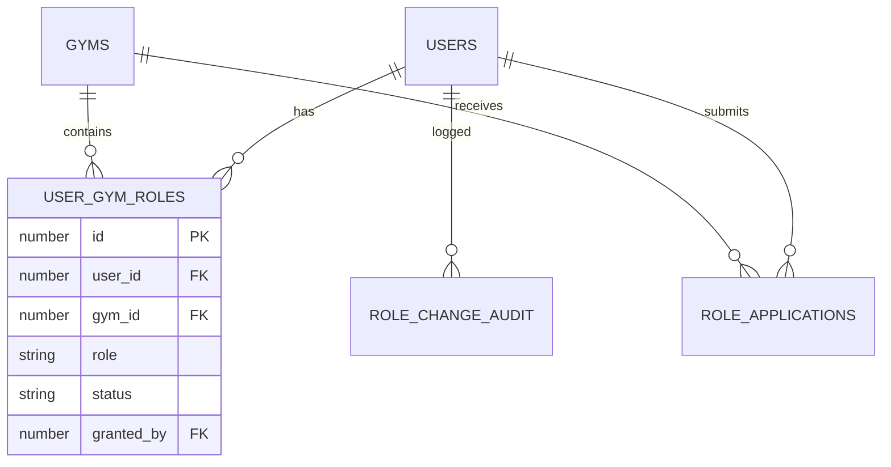

# Role Management & Switching — Technical Specification
## AthlonX V2

**Version:** 1.0  
**Date:** January 6, 2026  
**Status:** Draft for Review

---

## 1. Executive Summary

This specification defines a **gym-scoped, multi-role system** where a single user can hold different roles at different gyms (e.g., Trainer at Gym A, Member at Gym B) and seamlessly switch between active contexts without logout.

### Core Principle
> **One account. Multiple roles. Gym-scoped permissions. No duplicates.**

---

## 2. Current State Analysis

### What Exists

| Component | Status | Gap |
|-----------|--------|-----|
| `User.java` | Global roles via `user_role_map` | Roles NOT gym-scoped |
| `Role.java` | Simple (id + name) | No gym association |
| `GymStaff` | Links user→gym with `StaffRole` | Staff only, not members |
| `AuthController` | `set-active-gym` endpoint | No role switching UI |
| `JwtTokenProvider` | Includes `staffRole` in token | Single role per session |
| Frontend | No role switcher component | Must logout to change |

### Current JWT Structure

```json
{
  "sub": "user@email.com",
  "userId": 123,
  "context": "STAFF",
  "gymId": 1,
  "staffRole": "TRAINER",
  "exp": 1704600000
}
```

**Problem:** JWT encodes a single role. Switching requires re-authentication.

---

## 3. Proposed Data Model

### 3.1 New Table: `user_gym_roles`

Central table for gym-scoped role assignments.

```sql
CREATE TABLE user_gym_roles (
    id              NUMBER PRIMARY KEY,
    user_id         NUMBER NOT NULL REFERENCES users(user_id),
    gym_id          NUMBER NOT NULL REFERENCES gyms(gym_id),
    role            VARCHAR2(20) NOT NULL, -- OWNER, ADMIN, TRAINER, MEMBER
    status          VARCHAR2(20) DEFAULT 'ACTIVE', -- ACTIVE, PENDING, SUSPENDED, REVOKED
    granted_by      NUMBER REFERENCES users(user_id),
    granted_at      TIMESTAMP DEFAULT CURRENT_TIMESTAMP,
    expires_at      TIMESTAMP, -- Optional, for temp roles
    notes           VARCHAR2(500),
    
    CONSTRAINT uk_user_gym_role UNIQUE (user_id, gym_id, role)
);

CREATE INDEX idx_ugr_user ON user_gym_roles(user_id);
CREATE INDEX idx_ugr_gym ON user_gym_roles(gym_id);
CREATE INDEX idx_ugr_status ON user_gym_roles(status);
```

### 3.2 New Table: `role_applications`

For trainer/admin role requests requiring approval.

```sql
CREATE TABLE role_applications (
    id              NUMBER PRIMARY KEY,
    user_id         NUMBER NOT NULL REFERENCES users(user_id),
    gym_id          NUMBER NOT NULL REFERENCES gyms(gym_id),
    requested_role  VARCHAR2(20) NOT NULL, -- TRAINER, ADMIN
    status          VARCHAR2(20) DEFAULT 'PENDING', -- PENDING, APPROVED, REJECTED
    applied_at      TIMESTAMP DEFAULT CURRENT_TIMESTAMP,
    reviewed_by     NUMBER REFERENCES users(user_id),
    reviewed_at     TIMESTAMP,
    rejection_reason VARCHAR2(500),
    credentials     CLOB, -- JSON: certifications, experience, etc.
    
    CONSTRAINT uk_pending_app UNIQUE (user_id, gym_id, requested_role, status)
);
```

### 3.3 New Table: `role_change_audit`

Immutable audit log for compliance.

```sql
CREATE TABLE role_change_audit (
    id              NUMBER PRIMARY KEY,
    user_id         NUMBER NOT NULL,
    gym_id          NUMBER NOT NULL,
    action          VARCHAR2(30) NOT NULL, -- ROLE_GRANTED, ROLE_REVOKED, ROLE_SWITCHED, etc.
    old_role        VARCHAR2(20),
    new_role        VARCHAR2(20),
    performed_by    NUMBER NOT NULL,
    performed_at    TIMESTAMP DEFAULT CURRENT_TIMESTAMP,
    ip_address      VARCHAR2(45),
    user_agent      VARCHAR2(500),
    notes           VARCHAR2(500)
);

CREATE INDEX idx_rca_user ON role_change_audit(user_id);
CREATE INDEX idx_rca_gym ON role_change_audit(gym_id);
CREATE INDEX idx_rca_action ON role_change_audit(action);
```

### 3.4 Entity Relationship Diagram



---

## 4. Supported Scenarios

| # | Scenario | Role Configuration |
|---|----------|-------------------|
| 1 | Trainer is also a member at same gym | `user_gym_roles`: 2 rows (TRAINER, MEMBER) for same gym |
| 2 | Member applies to become trainer | `role_applications` row with PENDING status |
| 3 | User is trainer at Gym A, member at Gym B | `user_gym_roles`: 2 rows with different gym_ids |
| 4 | Admin operates in trainer mode | Role switch without permission change |
| 5 | Role suspended temporarily | `status` = SUSPENDED with optional `expires_at` |

---

## 5. Backend API Design

### 5.1 Role Context Endpoints

#### `GET /api/users/{userId}/roles`

Returns all gym-scoped roles for a user.

**Response:**
```json
{
  "userId": 123,
  "contexts": [
    {
      "gymId": 1,
      "gymName": "FitZone Downtown",
      "roles": [
        {"role": "TRAINER", "status": "ACTIVE"},
        {"role": "MEMBER", "status": "ACTIVE"}
      ]
    },
    {
      "gymId": 2,
      "gymName": "FitZone Uptown",
      "roles": [
        {"role": "MEMBER", "status": "ACTIVE"}
      ]
    }
  ]
}
```

---

#### `POST /api/auth/switch-role`

Switch active role without logout. Issues new JWT.

**Request:**
```json
{
  "gymId": 1,
  "targetRole": "MEMBER"
}
```

**Response:**
```json
{
  "token": "eyJhbGciOiJIUzI1NiIsInR5...",
  "activeGymId": 1,
  "activeGymName": "FitZone Downtown",
  "activeRole": "MEMBER",
  "availableRoles": ["TRAINER", "MEMBER"]
}
```

**Validation:**
- User must have `targetRole` at `gymId` with status ACTIVE
- Audit log entry created

---

### 5.2 Role Application Endpoints

#### `POST /api/roles/apply`

Member applies for trainer/admin role.

**Request:**
```json
{
  "gymId": 1,
  "requestedRole": "TRAINER",
  "credentials": {
    "certifications": ["ACE Certified", "CPR"],
    "experience": "3 years",
    "specializations": ["Weight Training", "HIIT"]
  }
}
```

---

#### `GET /api/gyms/{gymId}/role-applications`

Admin views pending applications.

**Response:**
```json
{
  "pending": [
    {
      "id": 45,
      "user": {"id": 123, "name": "Priya Menon", "email": "priya@example.com"},
      "requestedRole": "TRAINER",
      "appliedAt": "2026-01-05T10:30:00Z",
      "credentials": {...}
    }
  ]
}
```

---

#### `POST /api/roles/applications/{id}/approve`

Admin approves application.

**Request:**
```json
{
  "notes": "Verified certifications. Approved."
}
```

**Side Effects:**
1. Creates `user_gym_roles` row with ACTIVE status
2. Updates `role_applications` status to APPROVED
3. Creates audit log entry
4. Sends notification to applicant

---

#### `POST /api/roles/applications/{id}/reject`

Admin rejects application.

**Request:**
```json
{
  "reason": "Missing required certification."
}
```

---

### 5.3 Role Management Endpoints (Admin)

#### `POST /api/gyms/{gymId}/roles/grant`

Admin grants role to user.

**Request:**
```json
{
  "userId": 123,
  "role": "TRAINER",
  "notes": "Promoted from member"
}
```

---

#### `POST /api/gyms/{gymId}/roles/revoke`

Admin revokes role.

**Request:**
```json
{
  "userId": 123,
  "role": "TRAINER",
  "reason": "Policy violation"
}
```

---

#### `POST /api/gyms/{gymId}/roles/suspend`

Temporarily suspend role.

**Request:**
```json
{
  "userId": 123,
  "role": "TRAINER",
  "expiresAt": "2026-02-01T00:00:00Z",
  "reason": "Under investigation"
}
```

---

## 6. Updated JWT Structure

```json
{
  "sub": "user@email.com",
  "userId": 123,
  "gymId": 1,
  "activeRole": "TRAINER",
  "availableRoles": ["OWNER", "TRAINER", "MEMBER"],
  "permissions": ["VIEW_MEMBERS", "LOG_SESSIONS", "BOOK_CLASSES"],
  "iat": 1704550000,
  "exp": 1704636400
}
```

**Key Changes:**
- `activeRole` — currently operating role
- `availableRoles` — roles user can switch to at this gym
- `permissions` — granular permissions for current role

---

## 7. Frontend Components

### 7.1 RoleSwitcher Component

Location: `/components/ui/RoleSwitcher.tsx`

**Placement:** Persistent in header or profile dropdown

**UI States:**
1. **Single Role** — No switcher shown (just role badge)
2. **Multi-Role, Same Gym** — Dropdown to switch (e.g., Trainer ↔ Member)
3. **Multi-Gym** — Two-level selector (Gym → Role)

**Behavior:**
```typescript
interface RoleSwitcherProps {
  currentGymId: number;
  currentRole: string;
  availableContexts: GymRoleContext[];
  onSwitch: (gymId: number, role: string) => Promise<void>;
}

// On switch:
// 1. Call POST /api/auth/switch-role
// 2. Store new JWT
// 3. Redirect to appropriate dashboard
// 4. Show toast confirmation
```

### 7.2 RoleIndicator Component

Always visible badge showing active role.

```typescript
// Examples:
// 🏋️ TRAINER | FitZone Downtown
// 👤 MEMBER | FitZone Uptown
// 👑 OWNER | All Gyms
```

### 7.3 RoleApplicationForm Component

For members applying to become trainers.

**Fields:**
- Certifications (multi-select)
- Experience (years)
- Specializations
- Resume/CV upload (optional)
- Statement of interest

### 7.4 ApprovalDashboard Component

Admin view for managing applications.

**Features:**
- Pending applications list
- Quick approve/reject actions
- View applicant details modal
- Credential verification checklist

---

## 8. Security Requirements

### 8.1 Server-Side RBAC

**Every API endpoint must:**
1. Extract `activeRole` from JWT
2. Verify user has required permission for the action
3. Enforce `gymId` scope (cannot access other gym's data)

**Permission Matrix:**

| Action | OWNER | ADMIN | TRAINER | MEMBER |
|--------|-------|-------|---------|--------|
| View all members | ✅ | ✅ | ❌ | ❌ |
| Edit member profile | ✅ | ✅ | ❌ | Self only |
| Log sessions | ✅ | ✅ | ✅ | ❌ |
| Grant roles | ✅ | ✅ | ❌ | ❌ |
| Revoke roles | ✅ | ⚠️ (not OWNER) | ❌ | ❌ |
| View financials | ✅ | ✅ | ❌ | ❌ |
| Book classes | ✅ | ✅ | ✅ | ✅ |

### 8.2 Audit Logging

**Must log with timestamp and IP:**
- Role granted
- Role revoked
- Role suspended
- Role switched
- Application submitted
- Application approved/rejected

### 8.3 Data Isolation

**Rule:** A user operating as TRAINER at Gym A cannot:
- See members of Gym B
- Access financial data of Gym B
- Switch to a role they don't have

**Implementation:** Hibernate Filter on `gym_id` + JWT validation.

---

## 9. Migration Strategy

### 9.1 Data Migration

```sql
-- Migrate existing GymStaff to user_gym_roles
INSERT INTO user_gym_roles (user_id, gym_id, role, status, granted_at)
SELECT user_id, gym_id, staff_role, 
       CASE WHEN status = 'ACTIVE' THEN 'ACTIVE' ELSE 'SUSPENDED' END,
       created_at
FROM gym_staff;

-- Migrate existing memberships to user_gym_roles
INSERT INTO user_gym_roles (user_id, gym_id, role, status, granted_at)
SELECT user_id, gym_id, 'MEMBER', 
       CASE WHEN status = 'ACTIVE' THEN 'ACTIVE' ELSE 'SUSPENDED' END,
       start_date
FROM memberships
WHERE status IN ('ACTIVE', 'PENDING');
```

### 9.2 Backward Compatibility

- Old endpoints continue working for 90 days
- `GymStaff` table remains readable (deprecated)
- New tokens include both old and new fields

---

## 10. Proposed Changes Summary

### Backend (Spring Boot)

| File | Action | Description |
|------|--------|-------------|
| [NEW] `UserGymRole.java` | Create | Entity for gym-scoped roles |
| [NEW] `RoleApplication.java` | Create | Entity for role applications |
| [NEW] `RoleChangeAudit.java` | Create | Entity for audit log |
| [NEW] `UserGymRoleRepository.java` | Create | Repository |
| [NEW] `RoleApplicationRepository.java` | Create | Repository |
| [NEW] `RoleManagementController.java` | Create | 6 new endpoints |
| [MODIFY] `AuthController.java` | Update | Add `/switch-role` endpoint |
| [MODIFY] `JwtTokenProvider.java` | Update | Include `availableRoles` in JWT |
| [MODIFY] `SecurityConfig.java` | Update | Add permission-based access rules |

### Frontend (React)

| File | Action | Description |
|------|--------|-------------|
| [NEW] `RoleSwitcher.tsx` | Create | Dropdown component |
| [NEW] `RoleIndicator.tsx` | Create | Badge component |
| [NEW] `RoleApplicationForm.tsx` | Create | Application form |
| [NEW] `ApprovalDashboard.tsx` | Create | Admin approval view |
| [NEW] `RoleContext.tsx` | Create | React context for role state |
| [MODIFY] `DashboardLayout.tsx` | Update | Integrate RoleSwitcher |
| [MODIFY] `api.ts` | Update | Add role switching endpoints |

### Database (Flyway)

| File | Description |
|------|-------------|
| `V3__create_user_gym_roles.sql` | New table |
| `V4__create_role_applications.sql` | New table |
| `V5__create_role_change_audit.sql` | Audit table |
| `V6__migrate_existing_roles.sql` | Data migration |

---

## 11. Verification Plan

### 11.1 Unit Tests

```bash
cd /Users/aryan/Intership/backend
mvn test -Dtest=RoleManagementControllerTest
```

**Test cases:**
- Switch role success
- Switch to unauthorized role fails
- Application submission
- Approval workflow
- Revocation workflow

### 11.2 Integration Tests

```bash
cd /Users/aryan/Intership/backend
mvn test -Dtest=RoleSwitchingIntegrationTest
```

### 11.3 Manual Verification

1. **Role Switch Flow:**
   - Login as user with TRAINER + MEMBER roles
   - Click role switcher in header
   - Select MEMBER role
   - Verify dashboard changes to member view
   - Verify JWT updated (check localStorage)

2. **Application Flow:**
   - Login as MEMBER
   - Navigate to "Become a Trainer" page
   - Submit application with credentials
   - Login as ADMIN
   - View pending applications
   - Approve application
   - Verify member now has TRAINER role

3. **Audit Verification:**
   - Perform role switch
   - Check `role_change_audit` table for entry

---

## 12. Implementation Timeline

| Phase | Duration | Deliverables |
|-------|----------|--------------|
| **Phase 1: Schema** | 2 days | Tables, entities, repositories |
| **Phase 2: Backend APIs** | 3 days | All 11 endpoints |
| **Phase 3: JWT Update** | 1 day | Token structure, validation |
| **Phase 4: Frontend** | 3 days | RoleSwitcher, forms, context |
| **Phase 5: Testing** | 2 days | Unit + integration + manual |
| **Phase 6: Migration** | 1 day | Flyway scripts, data migration |

**Total: 12 days**

---

## User Review Required

> [!IMPORTANT]
> **Decisions needed before implementation:**
> 1. Should role switches require re-entering password for security?
> 2. Should trainer applications require document uploads (e.g., PDFs)?
> 3. Should we support "temporary roles" (e.g., fill-in trainer for 1 week)?
> 4. Any additional audit data to capture beyond the proposed fields?
