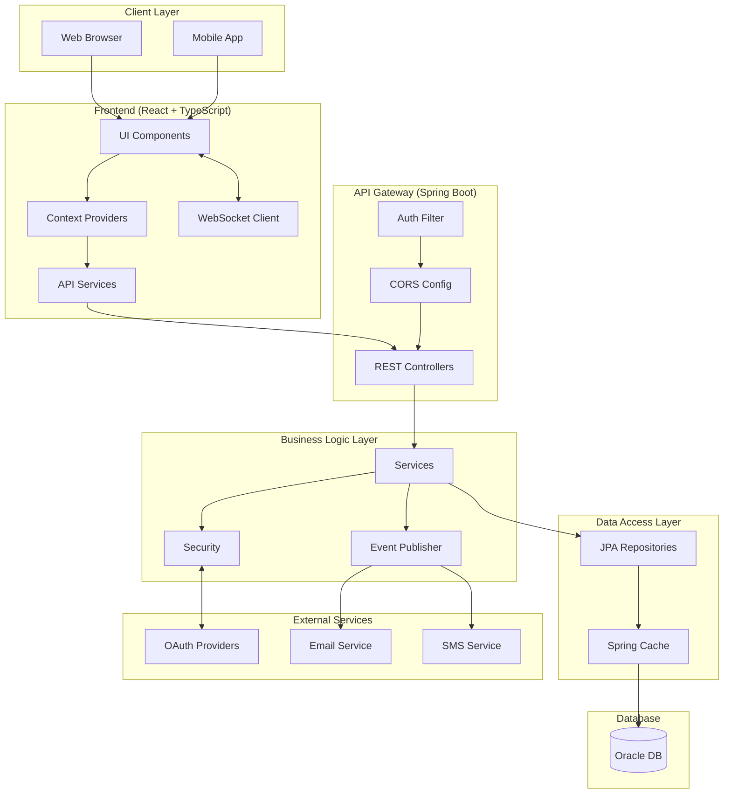
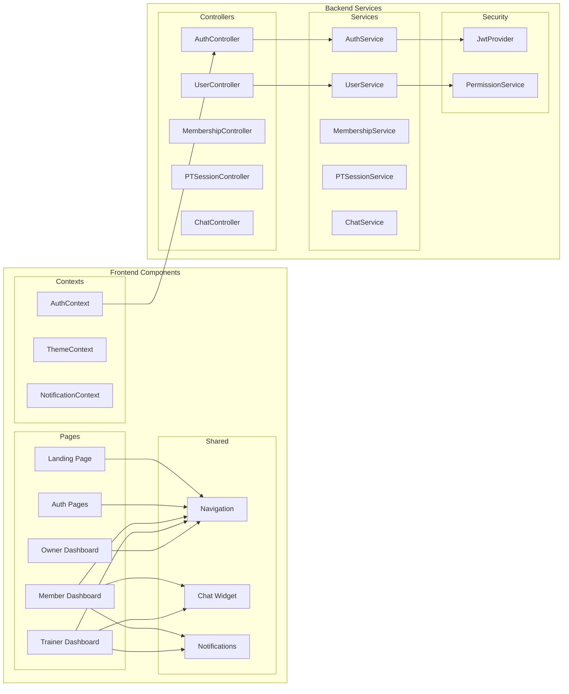
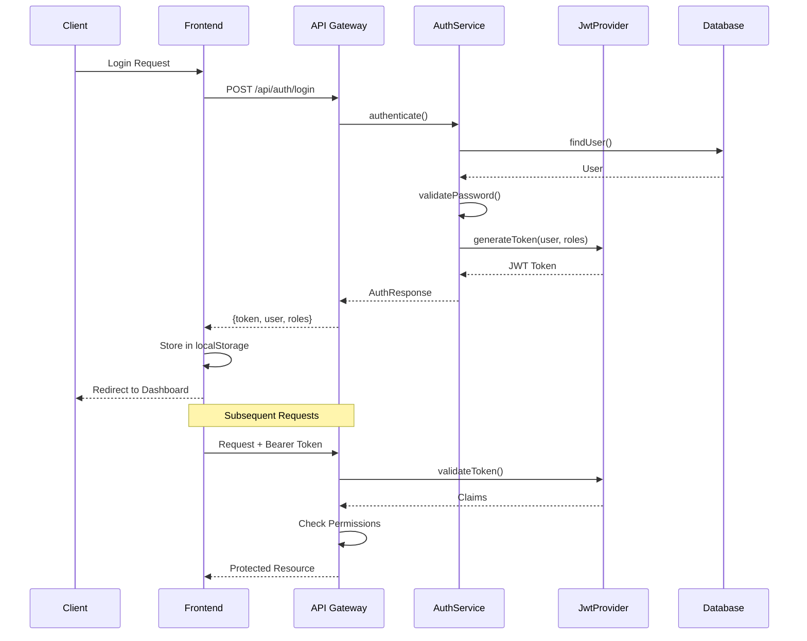
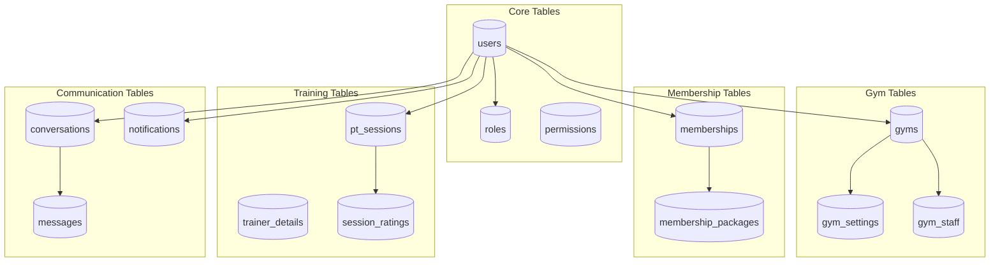
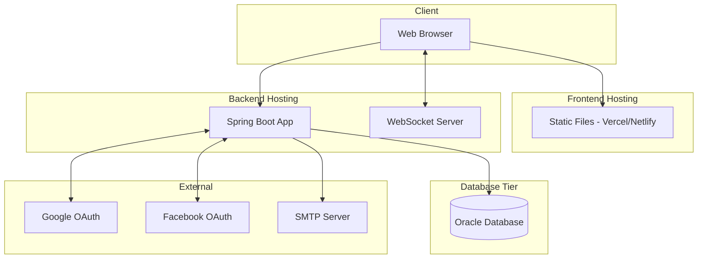

# System Architecture - Gym Management System

## High-Level Architecture

---

## Technology Stack

### Frontend

| Technology | Version | Purpose |
|------------|---------|---------|
| **React** | 18.x | UI Library |
| **TypeScript** | 5.x | Type Safety |
| **Vite** | 5.x | Build Tool |
| **React Router** | 6.x | Client Routing |
| **Axios** | 1.x | HTTP Client |
| **Socket.io Client** | 4.x | Real-time Communication |
| **Framer Motion** | 10.x | Animations |
| **Lucide React** | - | Icons |
| **Recharts** | 2.x | Data Visualization |

### Backend

| Technology | Version | Purpose |
|------------|---------|---------|
| **Spring Boot** | 3.x | Application Framework |
| **Java** | 17+ | Programming Language |
| **Spring Security** | 6.x | Authentication & Authorization |
| **Spring Data JPA** | 3.x | Data Access |
| **Spring WebSocket** | - | Real-time Messaging |
| **Hibernate** | 6.x | ORM |
| **Lombok** | 1.18.x | Boilerplate Reduction |
| **JJWT** | 0.11.x | JWT Handling |

### Database & Infrastructure

| Technology | Purpose |
|------------|---------|
| **Oracle Database** | Primary Data Store |
| **Spring Cache** | Response Caching |
| **HikariCP** | Connection Pooling |

### External Services

| Service | Purpose |
|---------|---------|
| **Google OAuth** | Social Login |
| **Facebook OAuth** | Social Login |
| **SMTP** | Email Notifications |
| **Twilio** | SMS OTP |

---

## Component Architecture

---

## Authentication Flow

---

## Database Architecture

---

## Deployment Architecture

---

## Security Architecture

| Layer | Mechanism | Implementation |
|-------|-----------|----------------|
| **Transport** | TLS/HTTPS | SSL Certificate |
| **Authentication** | JWT | Spring Security + JJWT |
| **Authorization** | RBAC | Custom Permission Service |
| **Password** | BCrypt | Spring Security |
| **Session** | Stateless | JWT Tokens |
| **2FA** | OTP | Email/SMS Verification |
| **Data** | Soft Deletes | Entity Annotations |
| **CORS** | Whitelist | Spring CORS Config |

---

## Scalability Considerations

1. **Multi-Tenancy**: Each gym is a separate tenant with isolated data
2. **Caching**: Spring Cache for frequently accessed data
3. **Connection Pooling**: HikariCP for database connections
4. **Lazy Loading**: JPA relationship optimization
5. **Stateless Auth**: JWT enables horizontal scaling
6. **WebSocket**: Dedicated connection management for real-time features
