# System Workflows - Gym Management System

## User Registration & Authentication

### Registration Flow

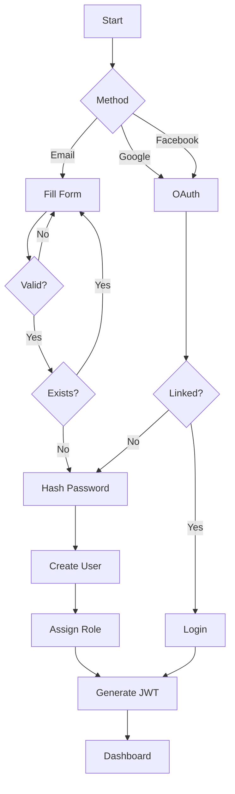

### Login with 2FA

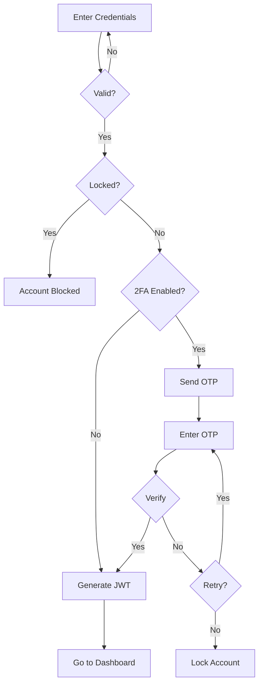

---

## Membership Management

### Purchase Flow

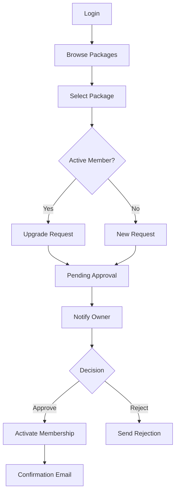

### Expiry Handling

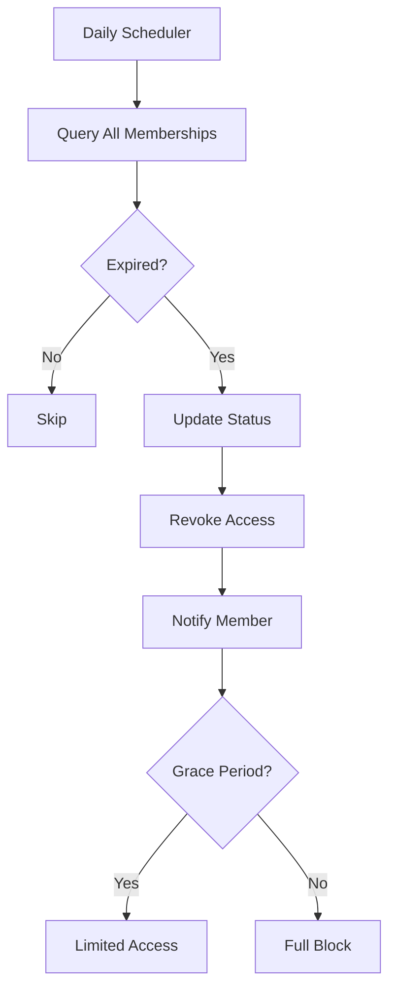

---

## Trainer-Member Interaction

### Trainer Assignment

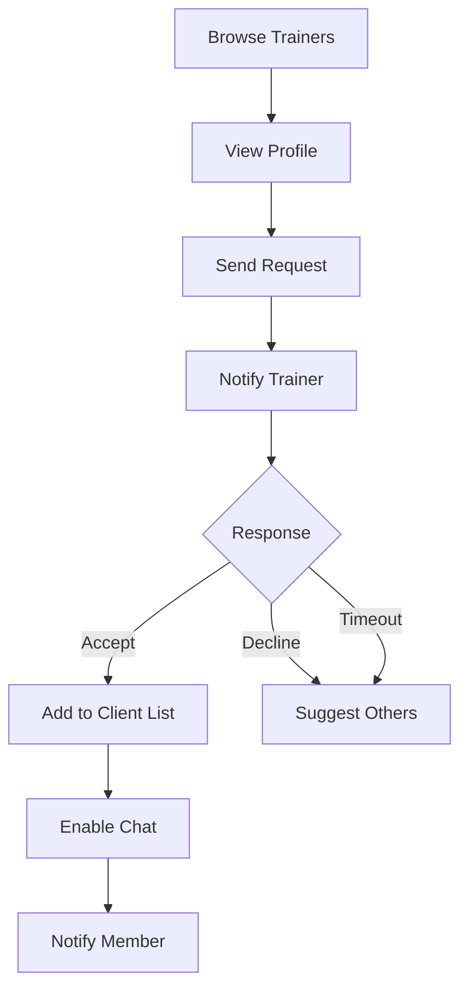

### Progress Tracking

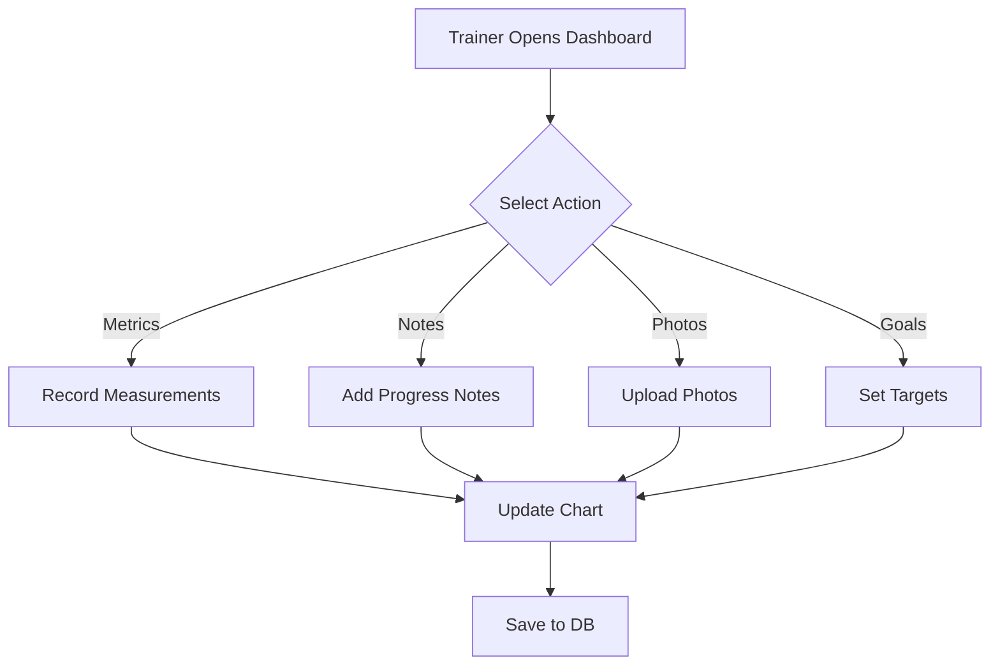

---

## PT Session Booking

### Session Creation

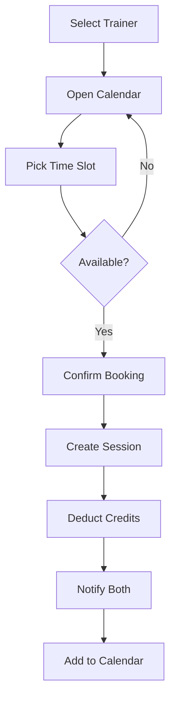

### Session Lifecycle

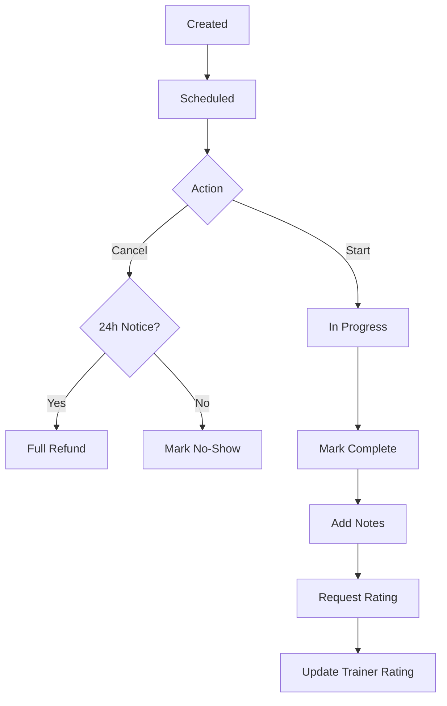

---

## Chat/Messaging

### Conversation

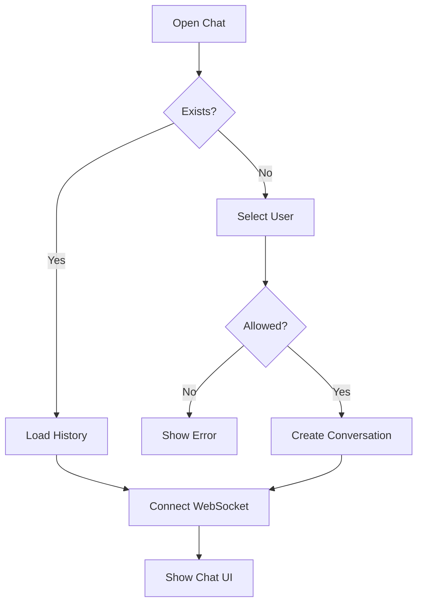

### Message Flow

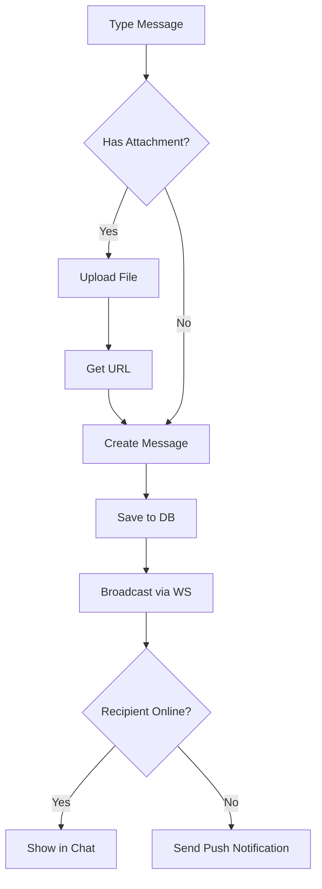

### Message Delivery Status

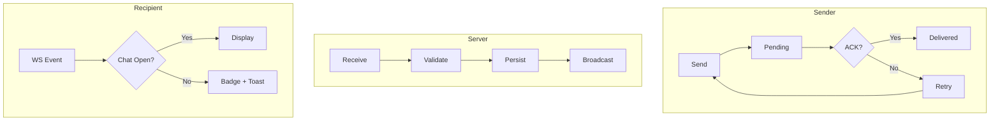

---

## Notifications

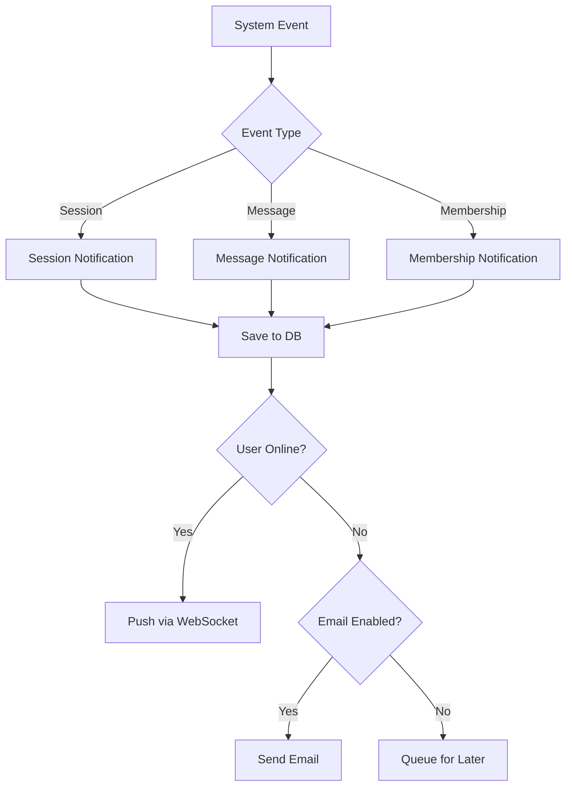
