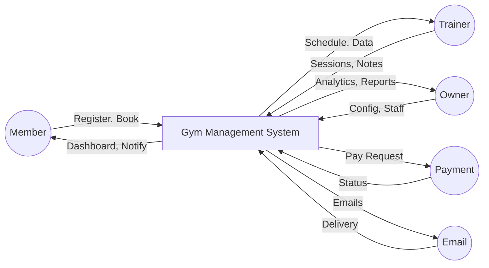
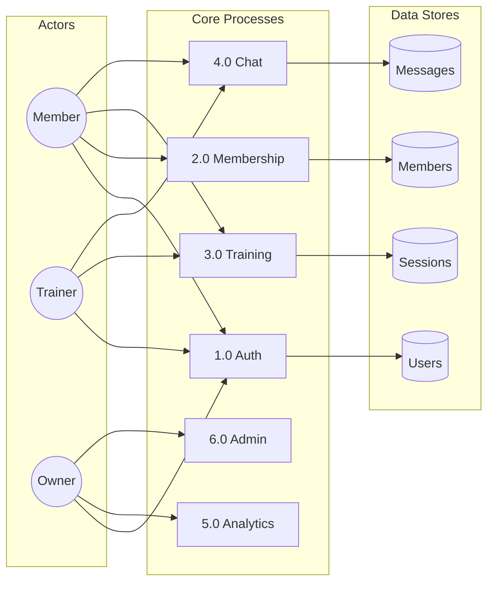
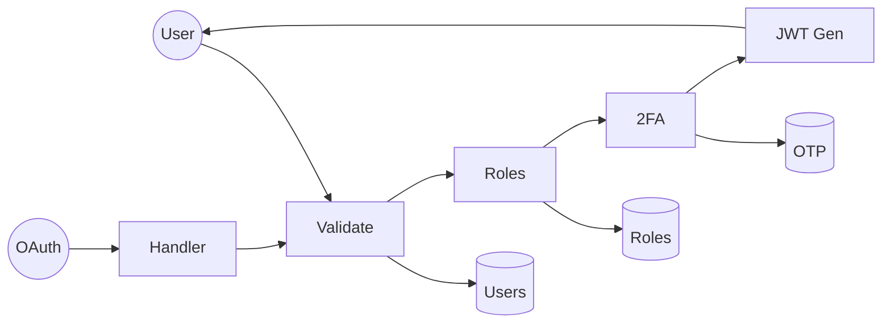
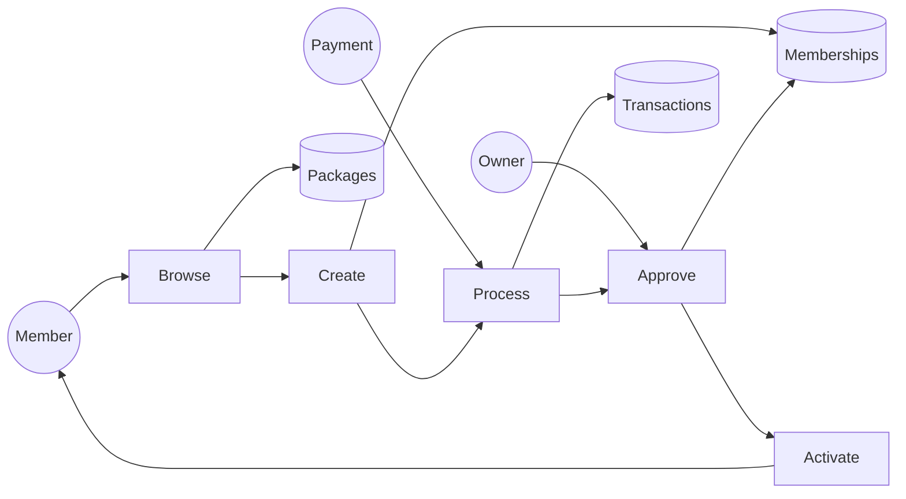
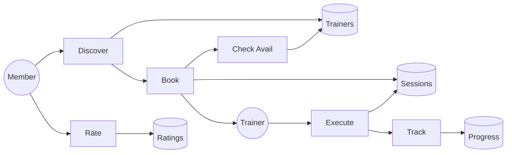
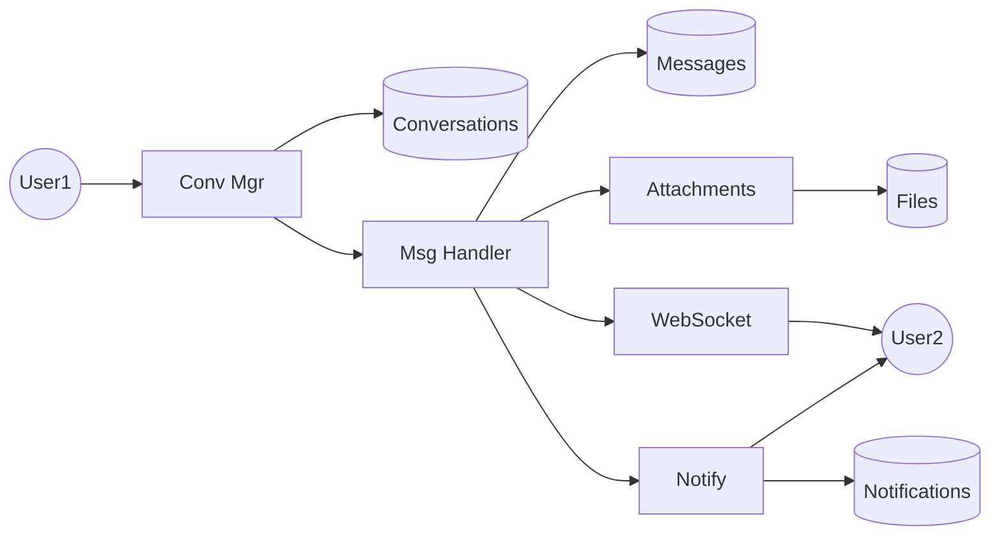
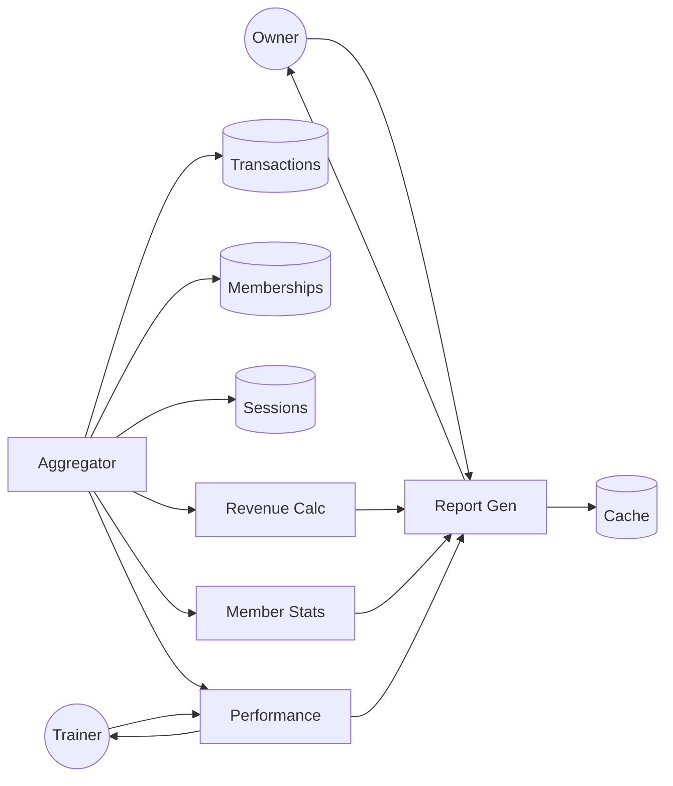

# Data Flow Diagrams - Gym Management System

## Level 0: Context Diagram

---

## Level 1: Main Processes

---

## Level 2: Detailed Sub-Processes

### 2.1 Authentication (Process 1.0)

### 2.2 Membership (Process 2.0)

### 2.3 Training (Process 3.0)

### 2.4 Communication (Process 4.0)

### 2.5 Analytics (Process 5.0)

---

## Data Dictionary

| Store | Description | Key Fields |
|-------|-------------|------------|
| Users | System users | user_id, email, roles |
| Memberships | Subscriptions | id, user_id, status |
| Sessions | PT records | id, trainer_id, date |
| Messages | Chat messages | id, content |
| Transactions | Payments | id, amount, status |
