# UML Diagrams - Gym Management System

## Class Diagram - Core User & Auth

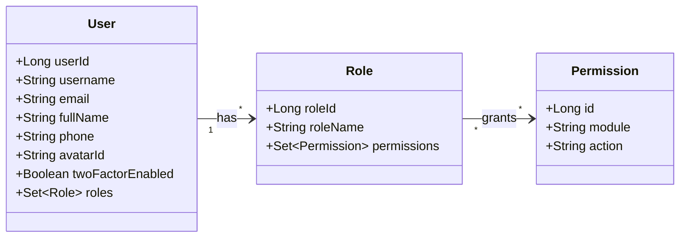

---

## Class Diagram - Gym & Membership

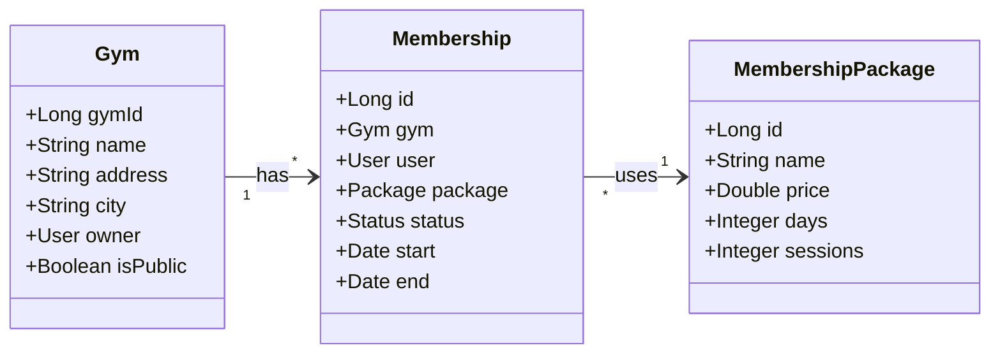

---

## Class Diagram - Training & Sessions

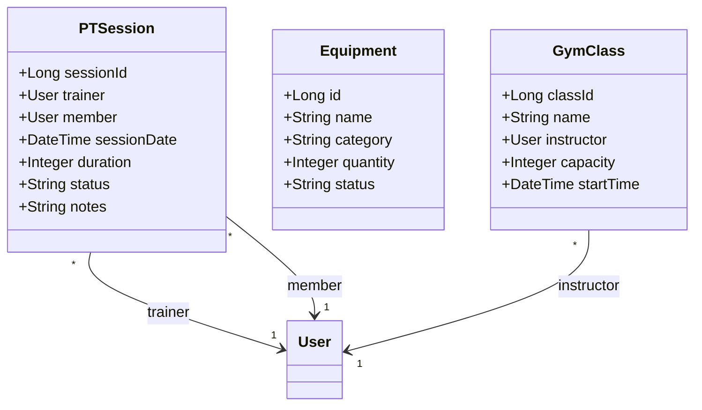

---

## Class Diagram - Communication

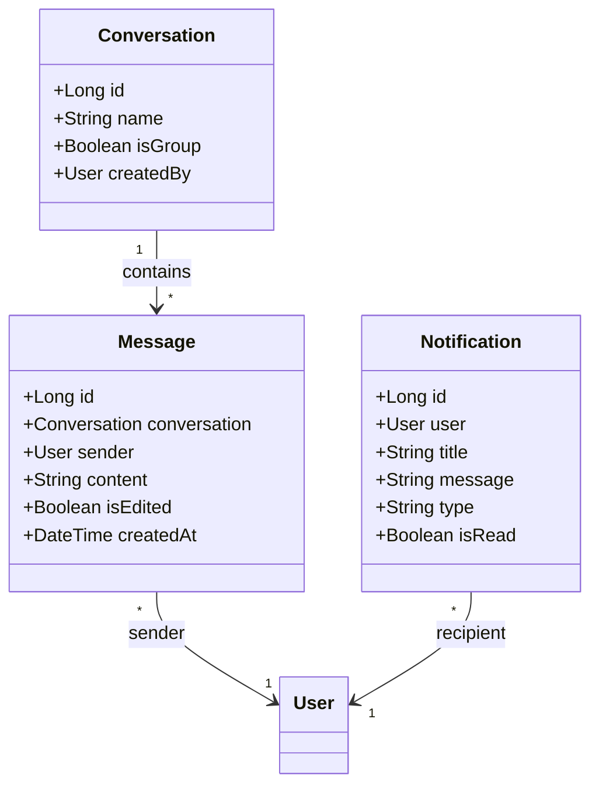

---

## Use Case Diagram

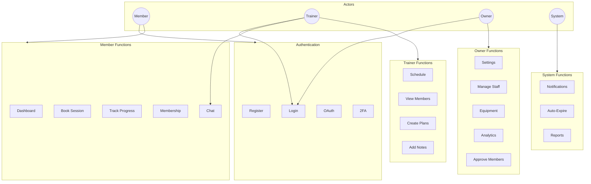

---

## Sequence Diagrams

### User Authentication Flow

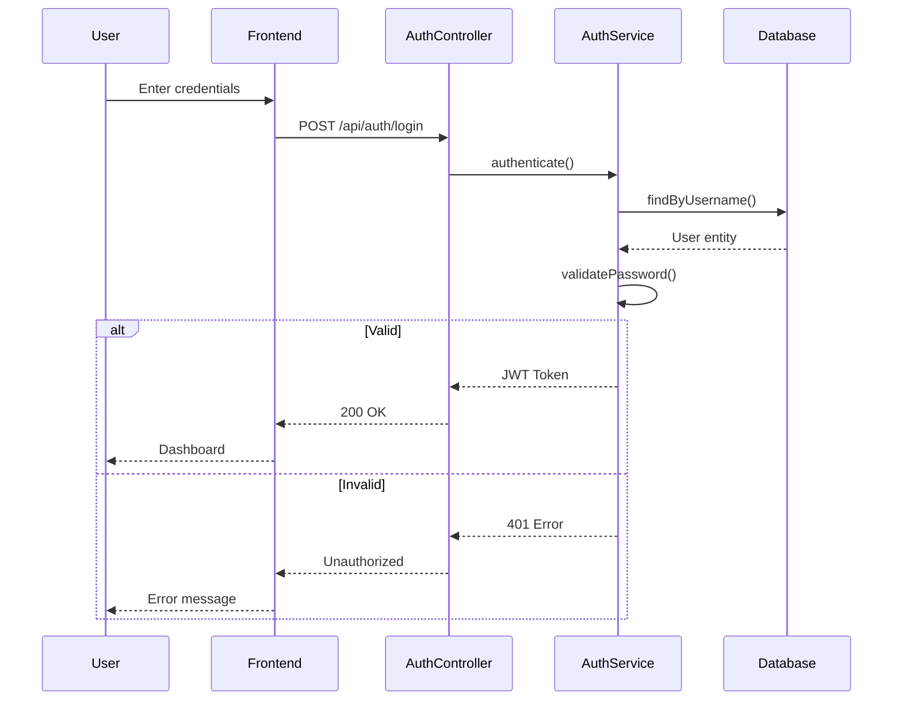

### Membership Purchase Flow

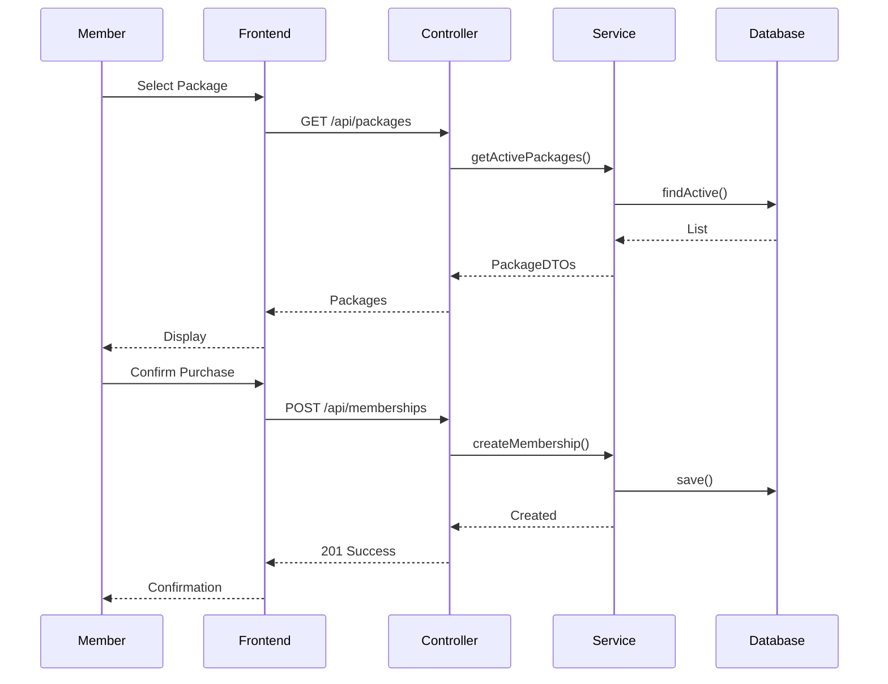

### PT Session Booking Flow

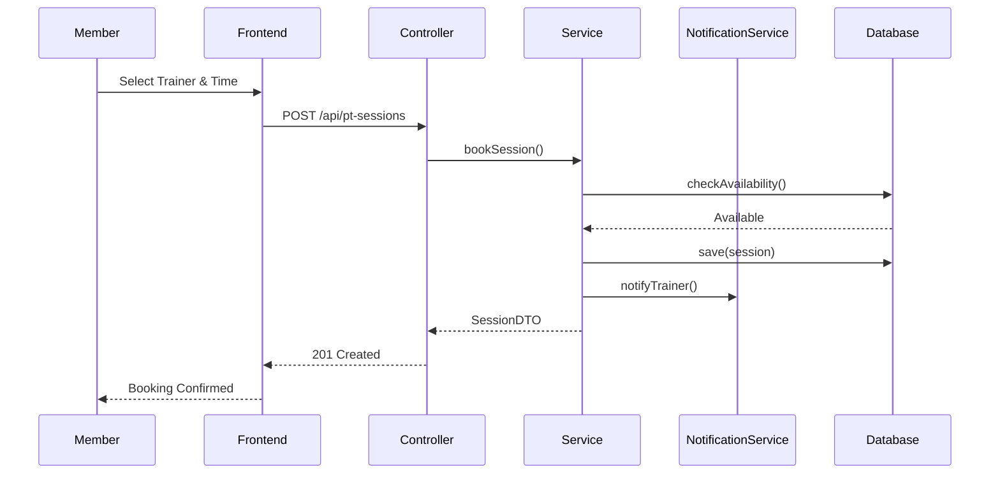

---

## Activity Diagrams

### User Registration Process

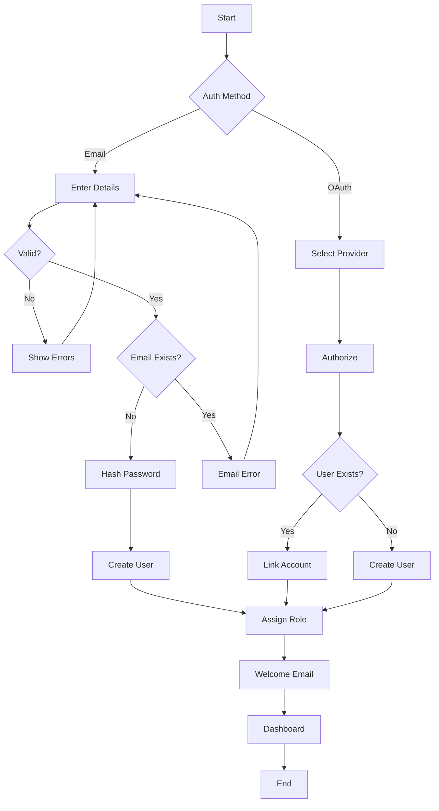

### Membership Approval Workflow

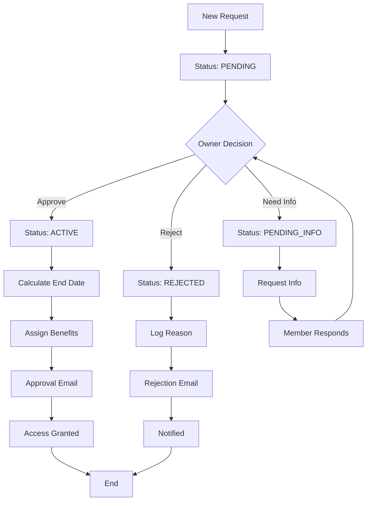

### Chat Message Flow

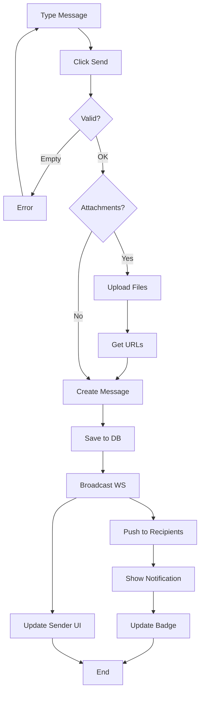
