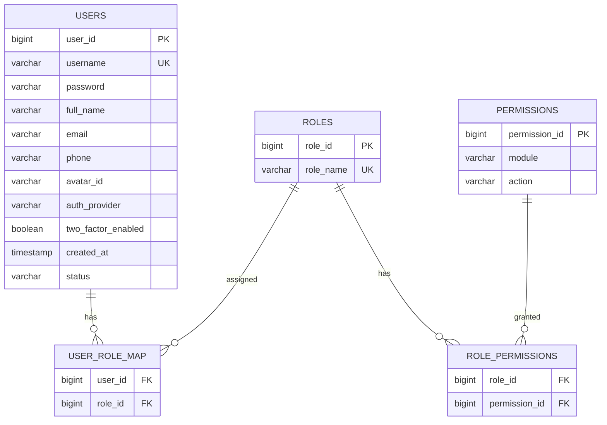
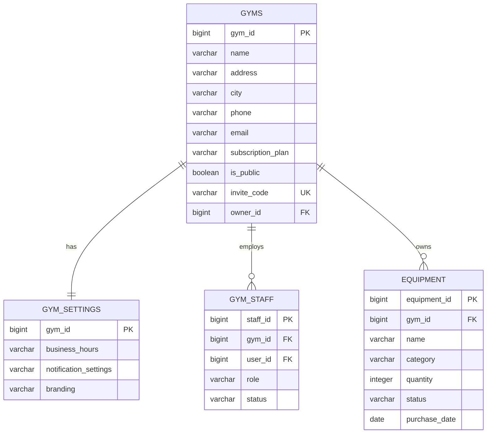
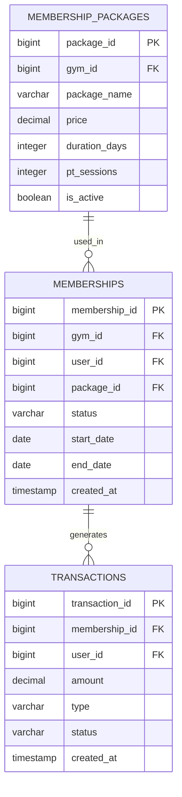
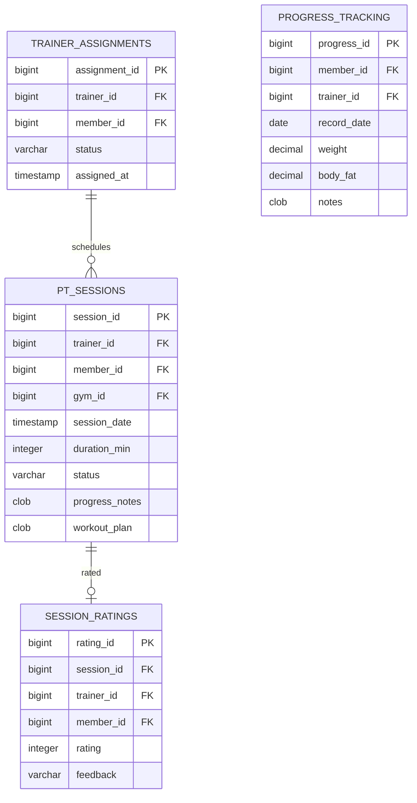
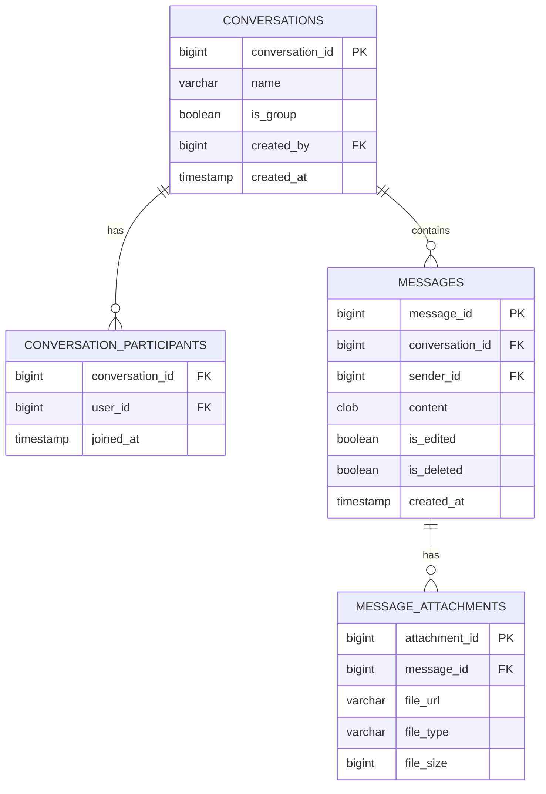
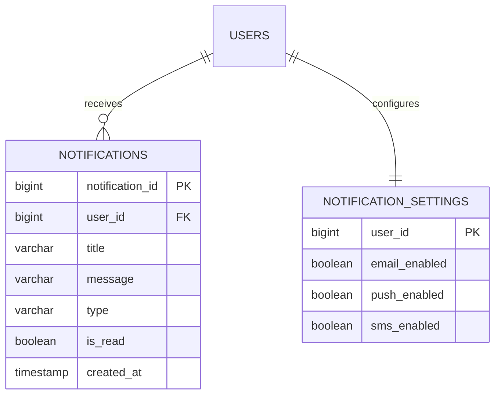
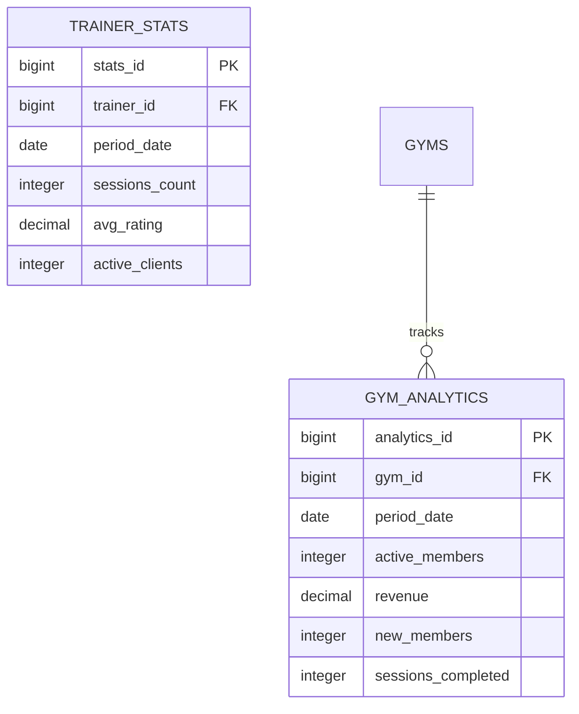

# Entity-Relationship Diagram - Gym Management System

## 1. User & Authentication Entities

---

## 2. Gym Management Entities

---

## 3. Membership Entities

---

## 4. Training & Session Entities

---

## 5. Communication Entities

---

## 6. Notification Entities

---

## 7. Analytics Entities

---

## Entity Summary Table

| Category | Entities | Key Relationships |
|----------|----------|-------------------|
| **Auth** | Users, Roles, Permissions | Many-to-many via mapping tables |
| **Gym** | Gyms, Settings, Staff, Equipment | Owner-owned, one-to-many |
| **Members** | Packages, Memberships, Transactions | Package → Membership → Transaction |
| **Training** | Assignments, Sessions, Ratings, Progress | Trainer-Member assignments |
| **Chat** | Conversations, Messages, Attachments | Conversation hierarchy |
| **Notify** | Notifications, Settings | User notifications |
| **Analytics** | Gym Analytics, Trainer Stats | Period-based aggregations |
