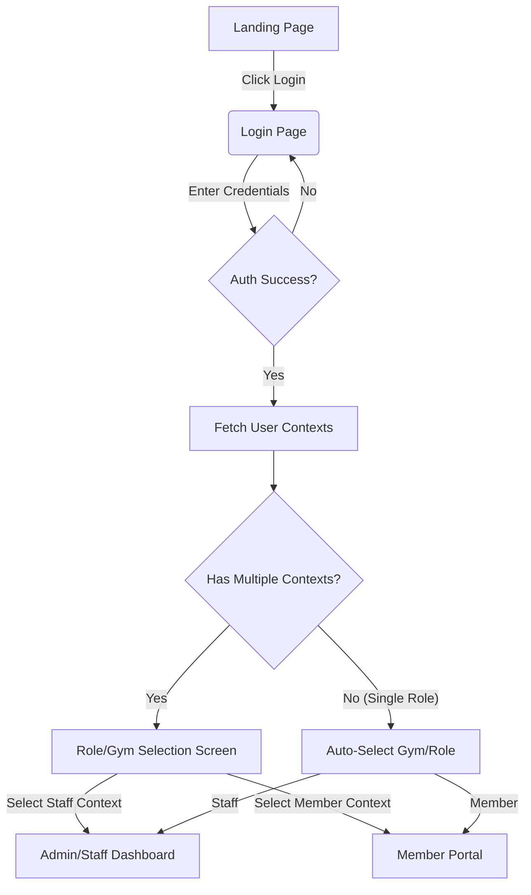
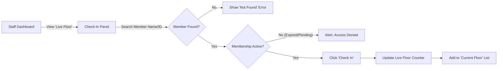
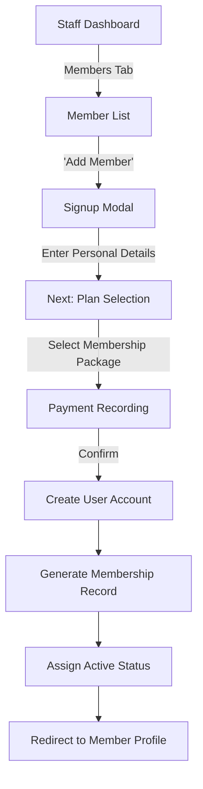
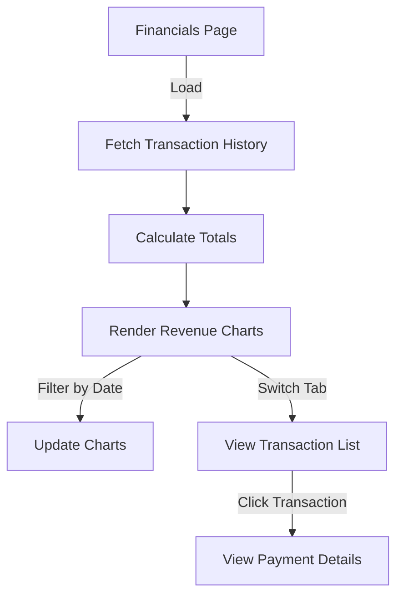
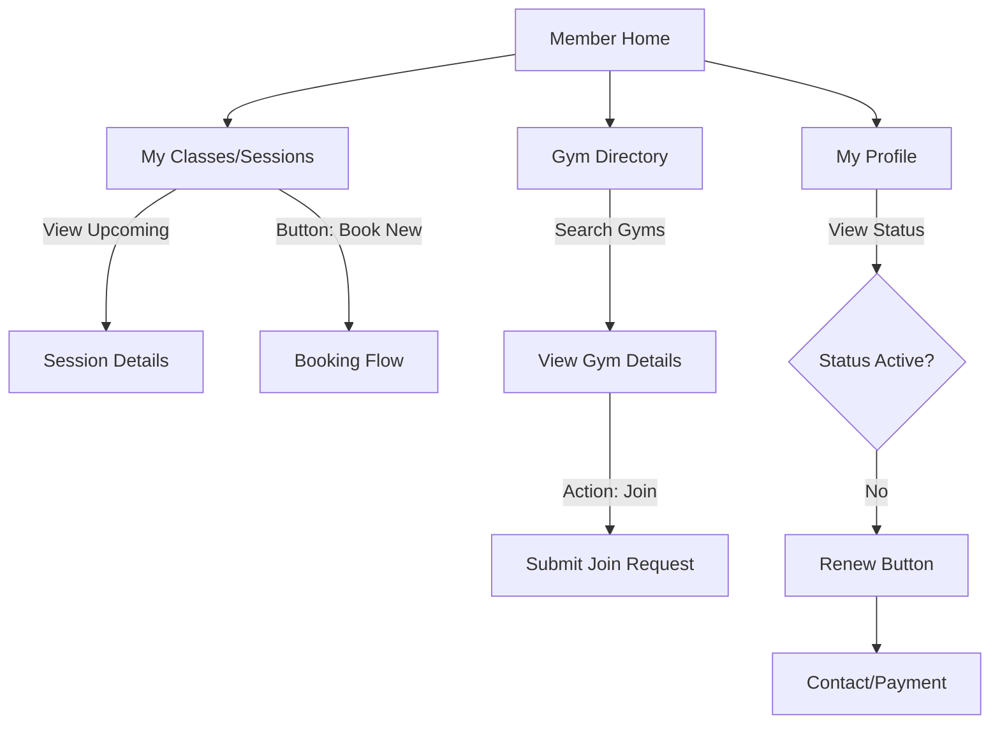

# User Flow Diagrams
## AthlonX Gym Management System

### 1. Authentication & Context Flow
**Scenario**: A user logs in and selects their active gym/role context.



### 2. Staff Check-In Flow
**Scenario**: Front desk staff checks in a member arriving at the gym.



### 3. PT Session Booking Flow
**Scenario**: A member or staff schedules a new Personal Training session.

```mermaid
flowchart TD
    A[Sessions Module] -->|Click 'New Session'| B[Select Trainer]
    B -->|Select Date| C[Fetch Available Slots]
    C --> D[Select Time Slot]
    D -->|Optional| E[Set Recurring (Weekly/Monthly)]
    E --> F[Confirm Booking]
    F --> G{Slot Available?}
    G -- No --> H[Error: Slot Taken]
    G -- Yes --> I[Create Session Record]
    I --> J[Notify Trainer & Member]
    I --> K[Update Calendar]
```

### 4. New Member Onboarding (Staff Driven)
**Scenario**: A new user walks in and staff registers them.



### 5. Financial Reporting Flow
**Scenario**: Admin views monthly revenue.



### 6. Member Portal Navigation (Member Side)
**Scenario**: A logged-in member manages their gym experience.


