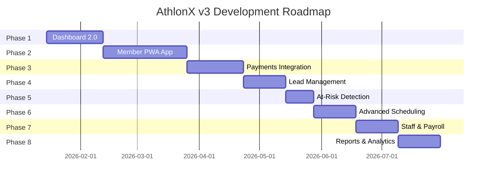

# 🏋️ AthlonX v3 - Product Requirements Document

**Version:** 3.0  
**Target Release:** Q2 2026  
**Benchmark Competitor:** PushPress  
**Goal:** Build a PushPress-killer with clean UI/UX, vast functionality, and self-hosted flexibility

---

## 📋 Executive Summary

AthlonX v3 will be a complete transformation of our gym management platform, targeting the premium market segment dominated by PushPress ($79-$159/mo). Our competitive advantage: **enterprise-grade features at zero cost** with full customization and data ownership.

### Vision Statement
> *"The open-source PushPress alternative that gym owners actually own."*

---

## 🎯 Strategic Goals

| Goal | Target Metric | Timeline |
|------|---------------|----------|
| **UI/UX Parity with PushPress** | User satisfaction score ≥ 4.5/5 | Q2 2026 |
| **Feature Completeness** | 95% feature parity | Q2 2026 |
| **Performance** | All actions < 400ms | Q1 2026 |
| **Mobile Experience** | PWA + Native App | Q3 2026 |
| **Community Adoption** | 100+ GitHub stars | Q4 2026 |

---


## 🆕 V3 New Features Roadmap

### Phase 1: Dashboard 2.0 (PushPress-Inspired)
**Priority: P0 | Timeline: 4 weeks**

```
┌─────────────────────────────────────────────────────────────────┐
│  AthlonX Dashboard 2.0                              👤 Admin ▼  │
├─────────────────────────────────────────────────────────────────┤
│  ┌──────────┐ ┌──────────┐ ┌──────────┐ ┌──────────┐           │
│  │ 📊 MRR   │ │ 👥 Active│ │ ✅ Today │ │ ⚠️ At    │           │
│  │ ₹2.4L    │ │ Members  │ │ Check-ins│ │ Risk     │           │
│  │ +12%     │ │ 103      │ │ 24       │ │ 5        │           │
│  └──────────┘ └──────────┘ └──────────┘ └──────────┘           │
│                                                                 │
│  ┌─────────────────────────┐ ┌─────────────────────────────────┐│
│  │ 📅 Today's Classes      │ │ 💰 Recent Transactions         ││
│  │ ┌─────────────────────┐ │ │ ┌────────────────────────────┐ ││
│  │ │ 🏃 HIIT - 7:00 AM   │ │ │ │ Rahul - ₹2,500 - Premium  │ ││
│  │ │ 12/20 booked        │ │ │ │ Priya - ₹1,200 - Monthly  │ ││
│  │ └─────────────────────┘ │ │ └────────────────────────────┘ ││
│  └─────────────────────────┘ └─────────────────────────────────┘│
│                                                                 │
│  ┌─────────────────────────┐ ┌─────────────────────────────────┐│
│  │ 🎂 Birthdays Today      │ │ 📈 Revenue Trend (30 days)     ││
│  │ • Vikram Singh          │ │ ▓▓▓▓▓▓▓▓▓▓▓▓▓▓▓▓▓▓▓▓▓▓▓▓▓▓▓▓ ││
│  │ • Neha Sharma           │ │        ↗ +18% vs last month    ││
│  └─────────────────────────┘ └─────────────────────────────────┘│
└─────────────────────────────────────────────────────────────────┘
```

#### Features:
- [ ] **Quick Stats Cards** - MRR, Active Members, Today's Check-ins, At-Risk Members
- [ ] **Today's Schedule Widget** - Classes with booking counts
- [ ] **Recent Transactions Feed** - Live payment updates
- [ ] **Birthday Celebrations** - Member birthdays today
- [ ] **Revenue Trend Chart** - 30-day visual graph
- [ ] **Expiring Memberships Alert** - 7-day warning
- [ ] **Overdue Invoices Counter** - Outstanding payments
- [ ] **Quick Action Buttons** - Add Member, New Class, Quick Check-in
- [ ] **Customizable Quick Links** - 30+ draggable shortcuts
- [ ] **Date Range Filters** - Today, Week, Month, Custom

---

### Phase 2: Member App (Mobile-First PWA)
**Priority: P0 | Timeline: 6 weeks**

#### Member-Facing Features:
- [ ] **Class Reservation** - One-tap booking with calendar sync
- [ ] **Check-in History** - Visual attendance timeline
- [ ] **Workout Logging** - Track exercises, sets, reps, PRs
- [ ] **Personal Records (PRs)** - Celebrate with confetti 🎉
- [ ] **Progress Photos** - Before/after comparisons
- [ ] **Membership Status** - View plan, expiry, payments
- [ ] **Push Notifications** - Class reminders, payment alerts
- [ ] **Community Feed** - Social updates from gym
- [ ] **Leaderboards** - Weekly/monthly rankings
- [ ] **Streak Tracking** - Consistency badges and rewards

#### UI/UX Requirements:
```
Mobile Navigation (Bottom Tab Bar):
┌─────┬─────┬─────┬─────┬─────┐
│ 🏠  │ 📅  │ ➕  │ 📊  │ 👤  │
│Home │Book │Log  │Stats│Prof │
└─────┴─────┴─────┴─────┴─────┘
```

---

### Phase 3: Automated Billing & Payments
**Priority: P0 | Timeline: 4 weeks**

#### Payment Features:
- [ ] **Razorpay Integration** - Indian payment gateway
- [ ] **Stripe Integration** - International payments
- [ ] **Recurring Billing** - Auto-charge memberships
- [ ] **Payment Reminders** - SMS/Email before due date
- [ ] **Failed Payment Retry** - Auto-retry with notifications
- [ ] **Invoice Generation** - PDF invoices with GST
- [ ] **Flex Fees** - Pass processing fees to members (optional)
- [ ] **Payment Links** - Secure update payment method
- [ ] **Revenue Forecasting** - Predict next month's income
- [ ] **Tax Reports** - GST-ready transaction exports

---

### Phase 4: Lead Management & CRM
**Priority: P1 | Timeline: 3 weeks**

#### CRM Features:
- [ ] **Lead Capture Forms** - Embeddable website widgets
- [ ] **Lead Pipeline** - Visual kanban board
- [ ] **Automated Follow-ups** - Email/SMS sequences
- [ ] **Trial Management** - Free trial tracking
- [ ] **Conversion Analytics** - Lead-to-member rates
- [ ] **Communication History** - All interactions logged
- [ ] **Lead Scoring** - AI-powered priority ranking
- [ ] **WhatsApp Integration** - Direct messaging

---

### Phase 5: At-Risk Member Detection
**Priority: P1 | Timeline: 2 weeks**

#### Churn Prevention:
- [ ] **Inactivity Alerts** - No check-in for 7+ days
- [ ] **Engagement Score** - 0-100 health score per member
- [ ] **Automated Outreach** - "We miss you" messages
- [ ] **Win-back Campaigns** - Special offers for churned
- [ ] **Cancellation Surveys** - Feedback collection
- [ ] **Retention Dashboard** - Churn rate analytics

---

### Phase 6: Advanced Scheduling
**Priority: P1 | Timeline: 3 weeks**

#### Scheduling Features:
- [ ] **Recurring Classes** - Weekly/daily patterns
- [ ] **Waitlist Management** - Auto-promote when spot opens
- [ ] **Class Capacity Limits** - Auto-stop bookings when full
- [ ] **Trainer Availability** - Staff schedule sync
- [ ] **Room/Equipment Booking** - Resource management
- [ ] **Calendar Integrations** - Google/Apple Calendar sync
- [ ] **Conflict Detection** - Prevent double-bookings

---

### Phase 7: Staff & Payroll Management
**Priority: P1 | Timeline: 3 weeks**

#### Staff Features:
- [ ] **Staff Scheduling** - Drag-drop shift planner
- [ ] **Time Tracking** - Clock in/out with location
- [ ] **Performance Metrics** - Classes taught, attendance
- [ ] **Commission Tracking** - Per-class/per-session rates
- [ ] **Payroll Calculator** - Auto-calculate monthly pay
- [ ] **Staff App** - Dedicated trainer mobile view
- [ ] **PT Revenue Split** - Track trainer earnings

---

### Phase 8: Reporting & Analytics
**Priority: P1 | Timeline: 3 weeks**

#### Reports Available:
- [ ] **Revenue Reports** - Daily/Weekly/Monthly/Annual
- [ ] **Member Reports** - Growth, churn, demographics
- [ ] **Attendance Reports** - Class popularity, peak hours
- [ ] **Trainer Reports** - Performance rankings
- [ ] **Financial Reports** - P&L, Tax summary
- [ ] **Custom Reports** - Build your own with filters
- [ ] **Export Options** - PDF, Excel, CSV
- [ ] **Scheduled Reports** - Auto-email weekly summaries

---

### Phase 9: Member Engagement Tools
**Priority: P2 | Timeline: 4 weeks**

#### Engagement Features:
- [ ] **GymHappy Surveys** - Post-workout feedback
- [ ] **Committed Club** - Check-in goal challenges
- [ ] **Year in Review** - Annual member journey summary
- [ ] **Anniversaries** - Celebrate membership milestones
- [ ] **Referral Program** - Member-get-member rewards
- [ ] **Achievement Badges** - Gamification system
- [ ] **Challenges** - Group fitness competitions
- [ ] **Habit Tracking** - Water, sleep, nutrition logs

---

### Phase 10: Digital Waivers & Documents
**Priority: P2 | Timeline: 2 weeks**

#### Document Management:
- [ ] **Digital Waivers** - E-signature with legal validity
- [ ] **Auto-send on Signup** - Trigger-based delivery
- [ ] **Document Templates** - Customizable forms
- [ ] **Secure Storage** - Encrypted document vault
- [ ] **Expiry Reminders** - Annual waiver renewals
- [ ] **Compliance Reports** - Audit-ready exports

---

### Phase 11: Point of Sale (POS)
**Priority: P2 | Timeline: 3 weeks**

#### Retail Features:
- [ ] **Product Catalog** - Supplements, merchandise
- [ ] **Inventory Management** - Stock tracking
- [ ] **Quick Sale Mode** - Kiosk/tablet interface
- [ ] **Barcode Scanning** - Fast checkout
- [ ] **Sales Reports** - Product performance
- [ ] **Staff Discounts** - Permission-based pricing

---

### Phase 12: Marketing Automation
**Priority: P2 | Timeline: 4 weeks**

#### Marketing Features:
- [ ] **Email Campaigns** - Drag-drop builder
- [ ] **SMS Campaigns** - Bulk messaging
- [ ] **WhatsApp Business API** - Automated messages
- [ ] **Triggered Sequences** - Welcome, re-engagement
- [ ] **A/B Testing** - Optimize message performance
- [ ] **Campaign Analytics** - Open rates, conversions

---

## 🎨 UI/UX Design System (PushPress-Inspired)

### Design Principles

| Principle | Implementation |
|-----------|----------------|
| **Simplicity** | One primary action per screen |
| **Speed** | < 400ms for all interactions |
| **Clarity** | Clear hierarchy, no clutter |
| **Consistency** | Unified color/typography system |
| **Accessibility** | WCAG 2.1 AA compliant |

### Color Palette

```css
/* Primary Colors */
--primary-600: #4F46E5;      /* Indigo - Primary actions */
--primary-500: #6366F1;      /* Hover states */
--primary-100: #E0E7FF;      /* Backgrounds */

/* Semantic Colors */
--success-500: #22C55E;      /* Green - Success/Active */
--warning-500: #F59E0B;      /* Amber - Warnings */
--danger-500: #EF4444;       /* Red - Errors/Delete */
--info-500: #3B82F6;         /* Blue - Info */

/* Neutrals */
--gray-900: #111827;         /* Text primary */
--gray-600: #4B5563;         /* Text secondary */
--gray-100: #F3F4F6;         /* Backgrounds */
--white: #FFFFFF;            /* Cards */

/* Dark Mode */
--dark-bg: #0F172A;
--dark-card: #1E293B;
--dark-border: #334155;
```

---

## 🌙 Dark Theme System (User Preference)

### Dark Mode Philosophy
Users can toggle between **Light** and **Dark** themes. Dark mode is the **default for logged-in users** with system preference detection.

### Dark Theme Color Palette

```css
/* Dark Mode - Premium Gym Aesthetic */
:root[data-theme="dark"] {
  /* Backgrounds */
  --bg-primary: #0A0A0B;         /* Deep black */
  --bg-secondary: #111113;       /* Card background */
  --bg-tertiary: #1A1A1D;        /* Elevated surfaces */
  --bg-hover: #232326;           /* Interactive hover */
  
  /* Glassmorphism */
  --glass-bg: rgba(255, 255, 255, 0.03);
  --glass-border: rgba(255, 255, 255, 0.08);
  --glass-shadow: 0 8px 32px rgba(0, 0, 0, 0.4);
  
  /* Text Colors */
  --text-primary: #FAFAFA;       /* White text */
  --text-secondary: #A1A1AA;     /* Muted text */
  --text-tertiary: #71717A;      /* Subtle text */
  
  /* Accent Colors (Vibrant in dark) */
  --accent-primary: #818CF8;     /* Indigo glow */
  --accent-success: #34D399;     /* Emerald */
  --accent-warning: #FBBF24;     /* Amber */
  --accent-danger: #F87171;      /* Rose */
  --accent-info: #60A5FA;        /* Sky blue */
  
  /* Borders & Dividers */
  --border-default: #27272A;
  --border-subtle: #1F1F22;
  
  /* Gradients */
  --gradient-primary: linear-gradient(135deg, #4F46E5 0%, #7C3AED 100%);
  --gradient-card: linear-gradient(180deg, rgba(255,255,255,0.02) 0%, transparent 100%);
}
```

### Dark Mode Dashboard Preview

```
┌─────────────────────────────────────────────────────────────────┐
│  ▓▓▓▓▓▓▓▓▓▓▓▓▓▓▓▓▓▓▓▓▓▓▓▓▓▓▓▓▓▓▓▓▓▓▓▓▓▓▓▓▓▓▓▓▓▓▓▓▓▓▓▓▓▓▓▓▓▓▓  │
│  ▓  🏋️ AthlonX                    🌙 Dark  🔔  👤 Admin  ▓  │
│  ▓▓▓▓▓▓▓▓▓▓▓▓▓▓▓▓▓▓▓▓▓▓▓▓▓▓▓▓▓▓▓▓▓▓▓▓▓▓▓▓▓▓▓▓▓▓▓▓▓▓▓▓▓▓▓▓▓▓▓  │
│                                                                 │
│  ┌────────────┐ ┌────────────┐ ┌────────────┐ ┌────────────┐   │
│  │ ✨ GLASS   │ │ ✨ GLASS   │ │ ✨ GLASS   │ │ ✨ GLASS   │   │
│  │ ₹2.4L MRR │ │ 103 Active │ │ 24 Today  │ │ 5 At Risk  │   │
│  │ ↗ +12%    │ │ ↗ +8%     │ │           │ │ ⚠️ Alert   │   │
│  └────────────┘ └────────────┘ └────────────┘ └────────────┘   │
│                                                                 │
│  Cards have subtle glass effect with blur backdrop             │
│  Accent colors glow softly against dark background             │
│  Smooth 300ms transitions on all theme changes                 │
└─────────────────────────────────────────────────────────────────┘
```

### Theme Toggle Implementation

```tsx
// Theme Toggle Component
const ThemeToggle = () => {
  const [theme, setTheme] = useState(
    localStorage.getItem('theme') || 
    (window.matchMedia('(prefers-color-scheme: dark)').matches ? 'dark' : 'light')
  );
  
  return (
    <button onClick={() => setTheme(t => t === 'dark' ? 'light' : 'dark')}>
      {theme === 'dark' ? '☀️ Light' : '🌙 Dark'}
    </button>
  );
};
```

### Dark Mode Requirements
- [ ] **System Preference Detection** - Auto-detect user's OS theme
- [ ] **Persistent Preference** - Store in localStorage + user profile
- [ ] **Smooth Transitions** - 300ms ease-in-out on theme change
- [ ] **No Flash** - Prevent white flash on page load in dark mode
- [ ] **Glassmorphism Cards** - Subtle blur effect on dark surfaces
- [ ] **Glowing Accents** - Soft glow on interactive elements
- [ ] **Chart Dark Variants** - All charts adapt to dark mode
- [ ] **Image Dimming** - Slightly reduce image brightness in dark mode

---

## 🏠 Hybrid Landing Page Design

### Landing Page Strategy
Combine **current AthlonX branding** with **PushPress's clean, conversion-focused layout**.

### Landing Page Sections

```
┌─────────────────────────────────────────────────────────────────┐
│                         HEADER (Sticky)                         │
│  🏋️ AthlonX    Features ▼  Pricing  Blog  Demo    [Login]      │
└─────────────────────────────────────────────────────────────────┘
                              ↓
┌─────────────────────────────────────────────────────────────────┐
│                         HERO SECTION                            │
│                                                                 │
│         "The Gym Management Platform                            │
│          Built By Gym Owners, For Gym Owners"                   │
│                                                                 │
│    ✓ Free Forever  ✓ Open Source  ✓ Self-Hosted                │
│                                                                 │
│         [🚀 Start Free]      [📺 Watch Demo]                    │
│                                                                 │
│          ── Dashboard Screenshot with Glassmorphism ──          │
└─────────────────────────────────────────────────────────────────┘
                              ↓
┌─────────────────────────────────────────────────────────────────┐
│                    SOCIAL PROOF BAR                             │
│  "Trusted by 50+ gyms across India"                             │
│  [Logo] [Logo] [Logo] [Logo] [Logo]                             │
└─────────────────────────────────────────────────────────────────┘
                              ↓
┌─────────────────────────────────────────────────────────────────┐
│                    FEATURES GRID (3 cols)                       │
│                                                                 │
│  ┌─────────────┐ ┌─────────────┐ ┌─────────────┐               │
│  │ 👥 Members  │ │ 📅 Schedule │ │ 💳 Billing  │               │
│  │ Management  │ │ & Classes   │ │ & Payments  │               │
│  │             │ │             │ │             │               │
│  │ Manage all  │ │ Book, wait- │ │ Automated   │               │
│  │ members in  │ │ list, and   │ │ recurring   │               │
│  │ one place   │ │ track...    │ │ billing...  │               │
│  └─────────────┘ └─────────────┘ └─────────────┘               │
│  ┌─────────────┐ ┌─────────────┐ ┌─────────────┐               │
│  │ 📊 Reports  │ │ 📱 Mobile   │ │ 🔔 Alerts   │               │
│  │ & Analytics │ │ App (PWA)   │ │ & Retention │               │
│  └─────────────┘ └─────────────┘ └─────────────┘               │
└─────────────────────────────────────────────────────────────────┘
                              ↓
┌─────────────────────────────────────────────────────────────────┐
│                    COMPARISON TABLE                             │
│                                                                 │
│  "Why Switch from PushPress?"                                   │
│                                                                 │
│  Feature          AthlonX     PushPress    Mindbody            │
│  ─────────────    ─────────   ──────────   ─────────           │
│  Pricing          FREE        $79-159/mo   $139+/mo            │
│  Self-Hosted      ✅          ❌           ❌                   │
│  Open Source      ✅          ❌           ❌                   │
│  Multi-Gym Roles  ✅          ❌           ❌                   │
│  Indian Payments  ✅ Razorpay ❌           ❌                   │
└─────────────────────────────────────────────────────────────────┘
                              ↓
┌─────────────────────────────────────────────────────────────────┐
│                    TESTIMONIALS CAROUSEL                        │
│                                                                 │
│  "AthlonX saved us ₹15,000/month in software fees"             │
│                    — Vikram, CrossFit Mumbai                    │
│                                                                 │
│            ◀  ●  ○  ○  ○  ▶                                     │
└─────────────────────────────────────────────────────────────────┘
                              ↓
┌─────────────────────────────────────────────────────────────────┐
│                    CTA SECTION (Gradient BG)                    │
│                                                                 │
│    "Ready to Transform Your Gym Management?"                    │
│                                                                 │
│    [🚀 Get Started Free]    [📞 Book a Demo]                    │
└─────────────────────────────────────────────────────────────────┘
                              ↓
┌─────────────────────────────────────────────────────────────────┐
│                         FOOTER                                  │
│  AthlonX | Features | Pricing | Blog | Docs | GitHub           │
│  © 2026 AthlonX | Made with ❤️ in India                        │
└─────────────────────────────────────────────────────────────────┘
```

### Landing Page Features
- [ ] **Hero with Animated Dashboard** - Floating UI elements
- [ ] **Social Proof Counter** - "50+ gyms, 10,000+ members"
- [ ] **Feature Cards with Hover** - Expand to show details
- [ ] **Interactive Comparison Table** - Highlight AthlonX advantages
- [ ] **Testimonial Carousel** - Auto-rotate customer quotes
- [ ] **Gradient CTA Section** - High-contrast call-to-action
- [ ] **Sticky Header with Blur** - Glassmorphism on scroll
- [ ] **Mobile-First Responsive** - Perfect on all devices

---

## 🔝 Enhanced Header Navigation

### Header Design Philosophy
Keep **current AthlonX header structure** but add **PushPress-style mega dropdowns** with detailed hover information.

### Header Structure

```
┌─────────────────────────────────────────────────────────────────┐
│  🏋️ AthlonX   Features ▼  Pricing  Resources ▼  [Login] [Demo] │
└─────────────────────────────────────────────────────────────────┘

On Hover "Features ▼":
┌─────────────────────────────────────────────────────────────────┐
│  FEATURES                                                       │
│  ═══════════════════════════════════════════════════════════   │
│                                                                 │
│  MEMBER MANAGEMENT          SCHEDULING                         │
│  ──────────────────         ──────────────────                  │
│  👥 Member Profiles          📅 Class Scheduling                │
│  Manage all member data      Create & manage classes            │
│  in one place                with waitlists                     │
│                                                                 │
│  📊 At-Risk Detection        🔄 Recurring Classes              │
│  Identify members about      Automate weekly                   │
│  to churn                    class scheduling                   │
│                                                                 │
│  BILLING & PAYMENTS         ANALYTICS                          │
│  ──────────────────         ──────────────────                  │
│  💳 Automated Billing        📈 Revenue Reports                │
│  Razorpay & Stripe          Track MRR, growth,                 │
│  integration                 and projections                   │
│                                                                 │
│  🧾 GST Invoicing           📉 Churn Analytics                 │
│  India-compliant            Understand why                     │
│  tax invoices               members leave                      │
│                                                                 │
│  ─────────────────────────────────────────────────────────────  │
│  [🔍 See All Features →]    [📺 Watch Product Tour →]          │
└─────────────────────────────────────────────────────────────────┘

On Hover "Resources ▼":
┌─────────────────────────────────────────────────────────────────┐
│  RESOURCES                                                      │
│  ═══════════════════════════════════════════════════════════   │
│                                                                 │
│  LEARN                      SUPPORT                            │
│  ──────────────────         ──────────────────                  │
│  📚 Documentation            💬 Help Center                    │
│  Complete guides for         Get answers to                    │
│  every feature               common questions                  │
│                                                                 │
│  📝 Blog                     📧 Contact Support                │
│  Tips, updates, and          Reach our team                    │
│  industry insights           via email                         │
│                                                                 │
│  🎓 Video Tutorials          🐛 Report Issues                  │
│  Step-by-step                GitHub issue                      │
│  walkthrough videos          tracker                           │
│                                                                 │
│  COMMUNITY                                                      │
│  ──────────────────                                             │
│  ⭐ GitHub                   💬 Discord                        │
│  Star us & contribute        Join 500+ gym owners              │
│                                                                 │
└─────────────────────────────────────────────────────────────────┘
```

### Mega Dropdown Requirements
- [ ] **2-Column Layout** - Feature categories on left, details on right
- [ ] **Icons for Each Item** - Visual recognition
- [ ] **Short Descriptions** - 10-15 word explanation
- [ ] **Hover Highlight** - Subtle background change on item hover
- [ ] **Smooth Animation** - 200ms slide down, 150ms slide up
- [ ] **Click-Through Links** - Each item links to detail page
- [ ] **CTA Buttons** - "See All Features" and "Watch Demo" at bottom
- [ ] **Keyboard Navigation** - Arrow keys and Tab support
- [ ] **Mobile Accordion** - Collapse to accordion on mobile

### Header Animations

```css
/* Dropdown Animation */
.mega-dropdown {
  opacity: 0;
  transform: translateY(-10px);
  visibility: hidden;
  transition: all 200ms ease-out;
}

.nav-item:hover .mega-dropdown {
  opacity: 1;
  transform: translateY(0);
  visibility: visible;
}

/* Glassmorphism Header (on scroll) */
.header.scrolled {
  background: rgba(255, 255, 255, 0.8);
  backdrop-filter: blur(12px);
  border-bottom: 1px solid rgba(0, 0, 0, 0.05);
}

/* Dark mode header */
[data-theme="dark"] .header.scrolled {
  background: rgba(10, 10, 11, 0.9);
  backdrop-filter: blur(12px);
  border-bottom: 1px solid rgba(255, 255, 255, 0.05);
}
```

### Typography

```css
/* Font Family */
--font-primary: 'Inter', system-ui, sans-serif;
--font-mono: 'JetBrains Mono', monospace;

/* Font Sizes */
--text-xs: 0.75rem;    /* 12px - Labels */
--text-sm: 0.875rem;   /* 14px - Body small */
--text-base: 1rem;     /* 16px - Body */
--text-lg: 1.125rem;   /* 18px - Body large */
--text-xl: 1.25rem;    /* 20px - Heading 4 */
--text-2xl: 1.5rem;    /* 24px - Heading 3 */
--text-3xl: 1.875rem;  /* 30px - Heading 2 */
--text-4xl: 2.25rem;   /* 36px - Heading 1 */
```

### Component Library

| Component | Variants |
|-----------|----------|
| **Button** | Primary, Secondary, Ghost, Danger, Loading |
| **Card** | Default, Elevated, Interactive, Stat |
| **Input** | Text, Email, Password, Search, Date, Select |
| **Table** | Sortable, Paginated, Selectable, Responsive |
| **Modal** | Small, Medium, Large, Fullscreen |
| **Toast** | Success, Error, Warning, Info |
| **Badge** | Status, Count, Tag |
| **Avatar** | Small, Medium, Large, Group |
| **Chart** | Line, Bar, Pie, Donut, Area |

### Navigation Structure

```
┌─────────────────────────────────────────────────────────────┐
│  🏋️ AthlonX                                    🔔  👤      │
├──────────────┬──────────────────────────────────────────────┤
│              │                                              │
│  📊 Dashboard│                                              │
│  👥 Members  │                                              │
│  📅 Schedule │              MAIN CONTENT                    │
│  💳 Billing  │                                              │
│  📈 Reports  │                                              │
│  🏃 Classes  │                                              │
│  👨‍🏫 Staff    │                                              │
│  ⚙️ Settings │                                              │
│              │                                              │
└──────────────┴──────────────────────────────────────────────┘
```

---

## 🗃️ Database Schema Additions

### New Tables for V3

```sql
-- Lead Management
CREATE TABLE leads (
    lead_id NUMBER PRIMARY KEY,
    name VARCHAR2(100) NOT NULL,
    email VARCHAR2(100),
    phone VARCHAR2(20),
    source VARCHAR2(50),           -- website, referral, walkin
    status VARCHAR2(20),           -- new, contacted, converted, lost
    assigned_to NUMBER,            -- FK: users (staff)
    score NUMBER,                  -- 0-100 AI lead score
    notes CLOB,
    created_at TIMESTAMP,
    converted_at TIMESTAMP,
    gym_id NUMBER
);

-- Products (POS)
CREATE TABLE products (
    product_id NUMBER PRIMARY KEY,
    name VARCHAR2(100) NOT NULL,
    description VARCHAR2(500),
    price NUMBER(10,2) NOT NULL,
    cost NUMBER(10,2),
    sku VARCHAR2(50),
    stock_quantity NUMBER,
    category VARCHAR2(50),
    is_active NUMBER(1),
    gym_id NUMBER
);

-- Product Sales
CREATE TABLE product_sales (
    sale_id NUMBER PRIMARY KEY,
    product_id NUMBER,
    user_id NUMBER,
    quantity NUMBER,
    unit_price NUMBER(10,2),
    total_amount NUMBER(10,2),
    sold_by NUMBER,                -- staff who made sale
    sale_date TIMESTAMP,
    gym_id NUMBER
);

-- Digital Waivers
CREATE TABLE waivers (
    waiver_id NUMBER PRIMARY KEY,
    user_id NUMBER,
    template_id NUMBER,
    signed_at TIMESTAMP,
    signature_data CLOB,           -- base64 signature
    ip_address VARCHAR2(45),
    expires_at DATE,
    gym_id NUMBER
);

-- Challenges
CREATE TABLE challenges (
    challenge_id NUMBER PRIMARY KEY,
    name VARCHAR2(100),
    description VARCHAR2(500),
    start_date DATE,
    end_date DATE,
    goal_type VARCHAR2(50),        -- checkins, workouts, streak
    goal_value NUMBER,
    prize VARCHAR2(200),
    gym_id NUMBER
);

-- Challenge Participants
CREATE TABLE challenge_participants (
    id NUMBER PRIMARY KEY,
    challenge_id NUMBER,
    user_id NUMBER,
    current_progress NUMBER,
    completed_at TIMESTAMP,
    rank NUMBER
);

-- Workout Logs
CREATE TABLE workout_logs (
    log_id NUMBER PRIMARY KEY,
    user_id NUMBER,
    workout_date DATE,
    exercises CLOB,                -- JSON array of exercises
    duration_minutes NUMBER,
    calories_burned NUMBER,
    notes VARCHAR2(500),
    class_id NUMBER,               -- if done in a class
    trainer_id NUMBER
);

-- Personal Records
CREATE TABLE personal_records (
    pr_id NUMBER PRIMARY KEY,
    user_id NUMBER,
    exercise_name VARCHAR2(100),
    value NUMBER,
    unit VARCHAR2(20),             -- kg, lbs, seconds
    achieved_at DATE,
    previous_best NUMBER
);

-- Lead Communications
CREATE TABLE lead_communications (
    id NUMBER PRIMARY KEY,
    lead_id NUMBER,
    type VARCHAR2(20),             -- email, sms, whatsapp, call
    direction VARCHAR2(10),        -- inbound, outbound
    content CLOB,
    sent_by NUMBER,
    sent_at TIMESTAMP
);

-- Feedback Surveys
CREATE TABLE feedback_surveys (
    survey_id NUMBER PRIMARY KEY,
    user_id NUMBER,
    class_id NUMBER,
    trainer_id NUMBER,
    rating NUMBER(1),              -- 1-5 stars
    comment VARCHAR2(500),
    submitted_at TIMESTAMP,
    gym_id NUMBER
);
```

---

## 📱 Tech Stack Updates

### Frontend (v3)

| Current (v2) | Upgrade (v3) | Reason |
|--------------|--------------|--------|
| React + Vite | React + Vite | Keep - already optimal |
| Basic CSS | **Tailwind CSS 4.0** | PushPress-like design speed |
| react-icons | **Lucide Icons** | Cleaner, consistent icons |
| fetch API | **TanStack Query** | Caching, optimistic updates |
| Local state | **Zustand** | Lightweight global state |
| - | **Framer Motion** | Smooth animations |
| - | **Recharts** | Beautiful analytics charts |

### Backend (v3)

| Current (v2) | Upgrade (v3) | Reason |
|--------------|--------------|--------|
| Spring Boot 3.2 | Spring Boot 3.3 | Latest features |
| - | **Spring WebSocket** | Real-time updates |
| - | **Spring Batch** | Scheduled jobs (reminders) |
| - | **Redis Cache** | Performance optimization |

### New Integrations

| Service | Purpose |
|---------|---------|
| **Razorpay** | Indian payment gateway |
| **Twilio** | SMS notifications |
| **SendGrid** | Email campaigns |
| **WhatsApp Business API** | Messaging |
| **Google Calendar API** | Class sync |
| **Firebase Cloud Messaging** | Push notifications |
| **AWS S3** | File storage (photos, docs) |

---

## 📊 Success Metrics

### Key Performance Indicators (KPIs)

| Metric | Target | Measurement |
|--------|--------|-------------|
| **Page Load Time** | < 2 seconds | Lighthouse |
| **Time to Interactive** | < 3 seconds | Core Web Vitals |
| **API Response Time** | < 400ms (p95) | Backend logs |
| **User Satisfaction** | ≥ 4.5/5 stars | In-app surveys |
| **Feature Adoption** | > 60% use 5+ features | Analytics |
| **Mobile Usage** | > 40% from mobile | Analytics |
| **Churn Reduction** | -30% with at-risk alerts | Member retention |
| **Payment Success Rate** | > 98% | Payment gateway |

---

## 🚀 Implementation Timeline



---

## 🔒 Security Requirements

| Requirement | Implementation |
|-------------|----------------|
| **Authentication** | JWT + Refresh Tokens |
| **Authorization** | Role-based (existing) + Permissions |
| **Data Encryption** | TLS 1.3 in transit, AES-256 at rest |
| **Payment Security** | PCI-DSS compliant gateways only |
| **Audit Logging** | All admin actions logged |
| **Rate Limiting** | 100 req/min per user |
| **OWASP Top 10** | All vulnerabilities addressed |

---

## 📝 Definition of Done

Each feature is considered complete when:

- [ ] Code written and reviewed
- [ ] Unit tests pass (≥80% coverage)
- [ ] Integration tests pass
- [ ] UI matches design specs
- [ ] Responsive on mobile/tablet/desktop
- [ ] Accessibility audit passed
- [ ] Performance benchmarks met
- [ ] Documentation updated
- [ ] Deployed to staging
- [ ] UAT completed
- [ ] Deployed to production

---

## 👥 Team Structure

| Role | Responsibility |
|------|----------------|
| **Product Owner** | Feature prioritization, user stories |
| **Frontend Dev** | React UI, Mobile PWA |
| **Backend Dev** | Spring Boot APIs, integrations |
| **Designer** | UI/UX, Design system |
| **QA Engineer** | Testing, automation |
| **DevOps** | CI/CD, infrastructure |

---

## 📚 References

- [PushPress Features](https://www.pushpress.com/features)
- [PushPress Dashboard 2.0](https://www.pushpress.com/blog/announcing-dashboard-2-0)
- [PushPress Member App](https://www.pushpress.com/members-app)
- [Tailwind CSS](https://tailwindcss.com)
- [Razorpay Integration](https://razorpay.com/docs/)

---

*Document Version: 1.0 | Last Updated: January 8, 2026*
