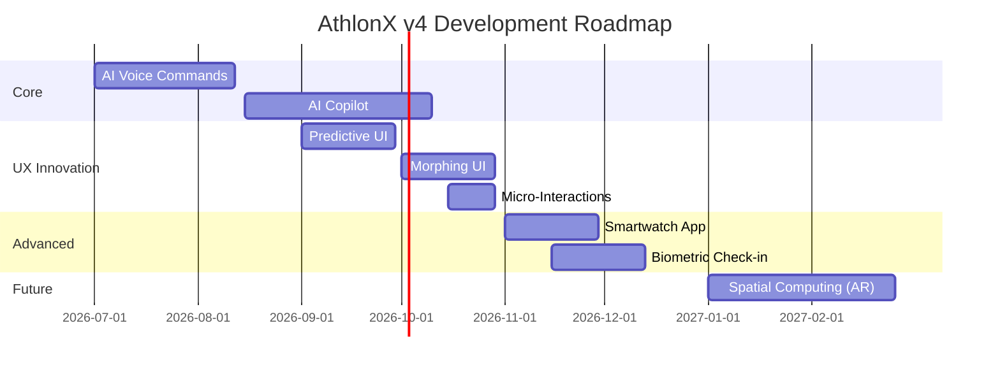

# 🏋️ AthlonX v4 - Product Requirements Document

**Version:** 4.0  
**Target Release:** Q4 2026  
**Codename:** "Project Horizon"  
**Theme:** Revolutionary UX Innovations - Industry Firsts

---

## 📋 Executive Summary

AthlonX v4 represents our **moonshot release** - implementing cutting-edge UX innovations that NO gym management software has ever attempted. This version will position AthlonX as the most technologically advanced platform in the fitness industry.

### Vision Statement
> *"The gym management platform from the future - today."*

---

## 🎯 Strategic Goals

| Goal | Target Metric | Timeline |
|------|---------------|----------|
| **Industry Innovation Leader** | First gym software with AI voice, AR, biometrics | Q4 2026 |
| **Viral Product** | 1000+ GitHub stars | Q1 2027 |
| **Media Coverage** | Featured in TechCrunch, ProductHunt #1 | Q4 2026 |
| **Enterprise Adoption** | 10+ gym chains using AthlonX | Q1 2027 |

---

## 🚀 Revolutionary UX Innovations (Industry First)

> *Features that NO gym management software has ever implemented. These will make AthlonX the most innovative platform in the industry.*

---

### 🎙️ 1. AI Voice Command Center
**Status: Industry First | No gym software has voice UI**

```
"Hey AthlonX, show me today's at-risk members"
"Book Rahul for the 6 PM yoga class"
"What's my revenue this week?"
"Cancel all classes for tomorrow due to holiday"
```

#### Features:
- [ ] **Natural Language Commands** - Speak naturally, not robotic commands
- [ ] **Context Awareness** - Understands "he", "that class", "yesterday"
- [ ] **Multi-Language** - Hindi, English, Regional languages
- [ ] **Hands-Free Kiosk Mode** - For front desk operations
- [ ] **Voice Dictation** - Add notes, write messages by speaking
- [ ] **Confirmation Dialogs** - "Did you mean cancel yoga at 6 PM?"

---

### 🔮 2. Predictive UI (AI-Powered Interface)
**Status: Revolutionary | UI that reads your mind**

The interface **predicts what you want to do** before you click:

```
┌─────────────────────────────────────────────────────────────────┐
│  🧠 AthlonX thinks you want to...                               │
│                                                                 │
│  ┌─────────────────┐ ┌─────────────────┐ ┌─────────────────┐   │
│  │ ⏰ 9:00 AM      │ │ 📧 Follow up    │ │ 💳 Process      │   │
│  │ Start check-in  │ │ Rahul's payment │ │ pending bills   │   │
│  │ mode           │ │ (overdue 3 days)│ │ (5 invoices)    │   │
│  │ [One Click] ✨  │ │ [Send Now] ✨   │ │ [View All] ✨   │   │
│  └─────────────────┘ └─────────────────┘ └─────────────────┘   │
└─────────────────────────────────────────────────────────────────┘
```

#### Features:
- [ ] **Time-Based Predictions** - Morning = check-ins, Evening = class bookings
- [ ] **Behavior Learning** - Learns YOUR workflow over time
- [ ] **Smart Quick Actions** - One-click solutions to predicted needs
- [ ] **Anomaly Alerts** - "Unusual: 40% fewer bookings today"
- [ ] **Auto-Prioritized Dashboard** - Most relevant widgets at top

---

### ⌚ 3. Smartwatch Dashboard (Wearable-First)
**Status: Industry First | No gym software has watch app**

Full control from Apple Watch, Wear OS, Fitbit:

```
┌─────────────┐
│ AthlonX ⌚  │
│             │
│  Today      │
│  ──────────│
│  24 Check-ins│
│  3 Classes   │
│  ₹12,500 rev │
│             │
│ [📋 Details]│
│ [🎤 Voice]  │
└─────────────┘
```

#### Features:
- [ ] **Glanceable Stats** - MRR, check-ins, alerts on wrist
- [ ] **Haptic Alerts** - Vibration for new member signup, payment received
- [ ] **Voice Commands** - "Check in Rahul" from your wrist
- [ ] **Quick Approve** - Approve PT sessions with one tap
- [ ] **Emergency Alerts** - Security issues, equipment failures
- [ ] **Trainer Mode** - See who's in your next class

---

### 🌐 4. Spatial Computing (AR/VR Ready)
**Status: Future-Proof | Apple Vision Pro, Meta Quest support**

```
┌─────────────────────────────────────────────────────────────────┐
│                    SPATIAL DASHBOARD (3D)                       │
│                                                                 │
│     📊           👥           💳           📅                  │
│   Revenue      Members      Billing      Schedule              │
│    Panel        Wall         Cards       Calendar              │
│                                                                 │
│  ← Pinch to zoom │ Look to select │ Tap to open →              │
│                                                                 │
│  Floating widgets around you in 3D space                       │
└─────────────────────────────────────────────────────────────────┘
```

#### Features:
- [ ] **3D Dashboard** - Widgets floating in space around you
- [ ] **Eye Tracking Navigation** - Look at what you want to open
- [ ] **Hand Gesture Controls** - Pinch to zoom, swipe to navigate
- [ ] **Virtual Gym Tour** - Show new members around in AR
- [ ] **Equipment AR Tags** - Point phone at treadmill, see usage stats
- [ ] **Spatial Class Scheduling** - Drag classes to time slots in 3D

---

### 🤖 5. AI Copilot (Personal Business Assistant)
**Status: Revolutionary | ChatGPT-level assistant for gym owners**

```
┌─────────────────────────────────────────────────────────────────┐
│  💬 AthlonX Copilot                                   ✨ AI     │
├─────────────────────────────────────────────────────────────────┤
│                                                                 │
│  You: "Why did we lose 5 members last month?"                  │
│                                                                 │
│  AI: "Based on my analysis:                                    │
│  • 3 members (60%) cited price as reason                       │
│  • Their avg attendance was 2x/week (below 3x avg)             │
│  • All 3 were in 'at-risk' category 2 weeks before             │
│                                                                 │
│  📌 Recommendation: Offer 20% retention discount to            │
│  current at-risk members. Should I draft the message?"         │
│                                                                 │
│  [Yes, draft it] [Show me at-risk list] [More analysis]        │
└─────────────────────────────────────────────────────────────────┘
```

#### Features:
- [ ] **Business Q&A** - Ask anything about your gym data
- [ ] **Churn Analysis** - AI explains why members leave
- [ ] **Revenue Forecasting** - "What will my MRR be in 3 months?"
- [ ] **Marketing Copywriter** - Generate emails, SMS, social posts
- [ ] **Smart Scheduling** - "Optimize my class schedule for max attendance"
- [ ] **Competitor Analysis** - "How does my pricing compare to nearby gyms?"

---

### 🎮 6. Gamified Admin Experience
**Status: Industry First | Make work feel like play**

```
┌─────────────────────────────────────────────────────────────────┐
│  🏆 Your Admin Score: 847 pts    Level: Gym Master 🥇          │
├─────────────────────────────────────────────────────────────────┤
│                                                                 │
│  Today's Quests:                                                │
│  ┌─────────────────────────────────────────────────────────┐   │
│  │ ✅ Check in 10 members           +50 pts    ██████████  │   │
│  │ 🔄 Follow up with 3 leads        +30 pts    ████░░░░░░  │   │
│  │ ⏳ Process all pending payments  +100 pts   ░░░░░░░░░░  │   │
│  └─────────────────────────────────────────────────────────┘   │
│                                                                 │
│  Streak: 🔥 12 days    │    Badges: 🏅🎖️⭐🌟                   │
└─────────────────────────────────────────────────────────────────┘
```

#### Features:
- [ ] **Daily Quests** - Gamified task completion
- [ ] **XP & Leveling** - Admin levels from Rookie to Gym Master
- [ ] **Achievement Badges** - "100 Check-ins in a Day", "Zero Churn Month"
- [ ] **Leaderboards** - Multi-staff gyms compete friendly
- [ ] **Streak Rewards** - Consecutive days completing tasks
- [ ] **Seasonal Events** - Special challenges during festivals

---

### 🎨 7. Morphing UI (Adaptive Interface)
**Status: Revolutionary | UI that transforms based on context**

The entire interface **changes based on time, role, and activity**:

| Context | UI Transformation |
|---------|-------------------|
| **Morning (6-10 AM)** | Check-in focused, large member search |
| **Admin after login** | Full dashboard, all metrics visible |
| **Trainer after login** | Only their clients, schedule, PT sessions |
| **Billing day (1st)** | Payment reminders prominent, invoice tools |
| **Low-light evening** | Auto-switch to dark mode |
| **Mobile device** | Bottom-nav, thumb-friendly buttons |

#### Features:
- [ ] **Time-Aware Layouts** - Different UI for morning vs evening
- [ ] **Role-Based Morphing** - Trainers see different UI than admins
- [ ] **Activity States** - UI changes during check-in rush hour
- [ ] **Ambient Light Sensor** - Dim environment = dark mode
- [ ] **Device Adaptation** - Touch-first on tablet, desktop on PC

---

### 📊 8. Living Data Visualizations
**Status: Industry First | Charts that breathe and react**

```
┌─────────────────────────────────────────────────────────────────┐
│  Revenue Pulse (Live)                                          │
│                                                                 │
│  ₹2.4L ████████████████████████████░░░░░ ₹3L goal              │
│         ↑ +₹5,000 just now (New member: Priya)                 │
│                                                                 │
│  The bar PULSES when new revenue comes in                      │
│  Color shifts from amber → green as you approach goal          │
└─────────────────────────────────────────────────────────────────┘
```

#### Features:
- [ ] **Pulse Animations** - Charts pulse when data changes
- [ ] **Real-Time Updates** - No refresh needed, WebSocket powered
- [ ] **Color Mood** - Green = good, amber = watch, red = alert
- [ ] **Particle Effects** - Confetti on milestones (100th member!)
- [ ] **3D Chart Options** - Toggle between 2D and 3D views
- [ ] **Narrative Analytics** - "Your best day was Tuesday with ₹45K"

---

### 🔄 9. Zero-Click Actions (Automation at Glance)
**Status: Revolutionary | Actions that complete themselves**

```
┌─────────────────────────────────────────────────────────────────┐
│  🤖 Auto-Completed Actions (Last 24h)                          │
│                                                                 │
│  ✅ Sent 12 payment reminders                    Saved 15 min  │
│  ✅ Checked in 8 members via face recognition    Saved 8 min   │
│  ✅ Cancelled 2 classes (trainer sick)           Saved 20 min  │
│  ✅ Sent birthday wishes to 3 members            Saved 5 min   │
│  ✅ Marked 5 at-risk members for follow-up       Saved 10 min  │
│                                                                 │
│  Total time saved today: 58 minutes ⏱️                         │
└─────────────────────────────────────────────────────────────────┘
```

#### Features:
- [ ] **Smart Defaults** - System knows what you'd do and does it
- [ ] **Approval Queue** - Review auto-actions, override if needed
- [ ] **Time Saved Counter** - Show value of automation
- [ ] **Learning Mode** - Watch what you do, offer to automate
- [ ] **Undo Timeline** - Revert any action from last 24 hours

---

### 👁️ 10. Biometric Quick Actions
**Status: Industry First | Face/fingerprint for gym operations**

```
┌─────────────────────────────────────────────────────────────────┐
│  👁️ Face Check-in Mode                                         │
│                                                                 │
│           ┌─────────────────┐                                   │
│           │                 │                                   │
│           │    📷 Camera    │        "Welcome back, Rahul!"    │
│           │    Scanning...  │        ✓ Monthly Active          │
│           │                 │        ✓ Last visit: Yesterday   │
│           └─────────────────┘                                   │
│                                                                 │
│  No cards, no typing - just walk in and smile                  │
└─────────────────────────────────────────────────────────────────┘
```

#### Features:
- [ ] **Face Recognition Check-in** - Members just walk in
- [ ] **Admin Face Unlock** - Secure areas with face
- [ ] **Fingerprint Payments** - Authorize refunds securely
- [ ] **Voice Print ID** - "Hey AthlonX" recognizes WHO is speaking
- [ ] **Privacy Mode** - All biometric data stored locally

---

### 🌍 11. Offline-First Architecture
**Status: Critical | Works without internet**

```
┌─────────────────────────────────────────────────────────────────┐
│  📶 Offline Mode Active                     [Sync when online]  │
│                                                                 │
│  All features work:                                             │
│  ✓ Check-ins (syncs later)                                     │
│  ✓ Class bookings (queued)                                     │
│  ✓ View all member data                                        │
│  ✓ PT session notes                                            │
│                                                                 │
│  Pending sync: 15 actions                                       │
└─────────────────────────────────────────────────────────────────┘
```

#### Features:
- [ ] **Full Offline Mode** - Check-ins, bookings work without net
- [ ] **Smart Sync** - Auto-sync when connection returns
- [ ] **Conflict Resolution** - Handle overlapping changes
- [ ] **Offline Indicators** - Clear status of what's synced
- [ ] **Data Compression** - Minimal storage for offline cache

---

### 🎯 12. Contextual Micro-Interactions
**Status: Premium UX | Every click feels satisfying**

| Action | Micro-Interaction |
|--------|-------------------|
| Check-in | ✓ checkmark with satisfying "pop" sound |
| Payment received | 💰 coins animation + cha-ching sound |
| New member signup | 🎉 confetti burst |
| Milestone reached | 🏆 trophy animation with haptic feedback |
| Error occurred | 📳 gentle shake + helpful message |
| Loading | Skeleton screens, never spinners |

#### Features:
- [ ] **Sound Design** - Optional audio feedback for actions
- [ ] **Haptic Feedback** - Vibrations on mobile for key actions
- [ ] **Progress Celebrations** - Confetti, animations on milestones
- [ ] **Satisfying Animations** - Spring physics, natural motion
- [ ] **Skeleton Loading** - Content-shaped placeholders, not spinners

---

### 🧩 13. Widget-Based Dashboard (Drag & Drop)
**Status: Industry First | Users build their own dashboard**

```
┌─────────────────────────────────────────────────────────────────┐
│  🧩 Customize Your Dashboard              [+ Add Widget] [Save] │
│                                                                 │
│  Drag widgets to rearrange. Resize corners.                    │
│                                                                 │
│  ┌──────────────┐ ┌──────────────┐ ┌──────────────────────────┐│
│  │ 📊 Revenue   │ │ 👥 Check-ins │ │                          ││
│  │ ₹2.4L/month │ │ 24 today     │ │   📅 Class Schedule      ││
│  │ [📈 Chart]  │ │ [List view]  │ │      (Large Widget)      ││
│  └──────────────┘ └──────────────┘ │                          ││
│  ┌──────────────┐ ┌──────────────┐ │                          ││
│  │ 🎂 Birthdays │ │ ⚠️ At-Risk   │ │                          ││
│  └──────────────┘ └──────────────┘ └──────────────────────────┘│
└─────────────────────────────────────────────────────────────────┘
```

#### Features:
- [ ] **Drag & Drop** - Rearrange widgets freely
- [ ] **Resizable Widgets** - Small, medium, large sizes
- [ ] **Widget Library** - 50+ widgets to choose from
- [ ] **Role Presets** - "Admin View", "Trainer View", "Owner View"
- [ ] **Export/Import Layouts** - Share configurations
- [ ] **Widget Developer API** - Build custom widgets

---

### 🔐 14. Invisible Security
**Status: Revolutionary | Secure without friction**

Security that works in the background, never interrupting:

#### Features:
- [ ] **Continuous Auth** - Verify identity by typing patterns
- [ ] **Anomaly Detection** - Alert if login from new device/location
- [ ] **Silent 2FA** - Device fingerprint instead of OTP
- [ ] **Session Trust Score** - Suspicious activity = re-verify
- [ ] **Auto-Logout** - Smart detection when you walk away
- [ ] **Audit Trail UI** - See all actions with beautiful timeline

---

### 🌈 15. Emotional Design System
**Status: Industry First | UI that responds to your mood**

The interface adapts to **reduce stress** during high-pressure moments:

| Situation | UI Response |
|-----------|-------------|
| **High alert count** | Calm blue theme, soothing animations |
| **Payment success streak** | Celebratory green, upbeat micro-interactions |
| **End of day** | Dimmer colors, relaxing transitions |
| **Busy check-in time** | Minimal UI, maximum efficiency |
| **Quiet hours** | Full dashboard, exploration mode |

#### Features:
- [ ] **Stress-Aware Colors** - Blue tones during high-pressure moments
- [ ] **Celebration Moments** - Extra animations on good numbers
- [ ] **Focus Mode** - One task, hide everything else
- [ ] **Breathing Animations** - Subtle pulse that calms
- [ ] **Positive Framing** - "5 members left" → "95% retained! 🎉"

---

## 📅 V4 Implementation Timeline



---

## 🛠️ Technology Requirements

| Feature | Technology Stack |
|---------|------------------|
| **AI Voice** | Web Speech API, Whisper, Google Speech-to-Text |
| **AI Copilot** | OpenAI GPT-4, Anthropic Claude |
| **Smartwatch** | WatchOS SDK, Wear OS, React Native |
| **Spatial Computing** | WebXR, Three.js, Apple ARKit |
| **Biometrics** | FaceID, WebAuthn, TensorFlow.js |
| **Real-time** | WebSockets, Server-Sent Events |
| **Offline** | IndexedDB, Service Workers, PouchDB |

---

## 📊 Success Metrics

| Metric | Target |
|--------|--------|
| Voice command accuracy | > 95% |
| AI Copilot response time | < 3 seconds |
| Smartwatch app rating | 4.5+ stars |
| Face recognition accuracy | > 99% |
| Offline sync reliability | 100% |

---

*Document Version: 1.0 | Last Updated: January 8, 2026*
*Dependency: Requires AthlonX v3 to be completed first*
