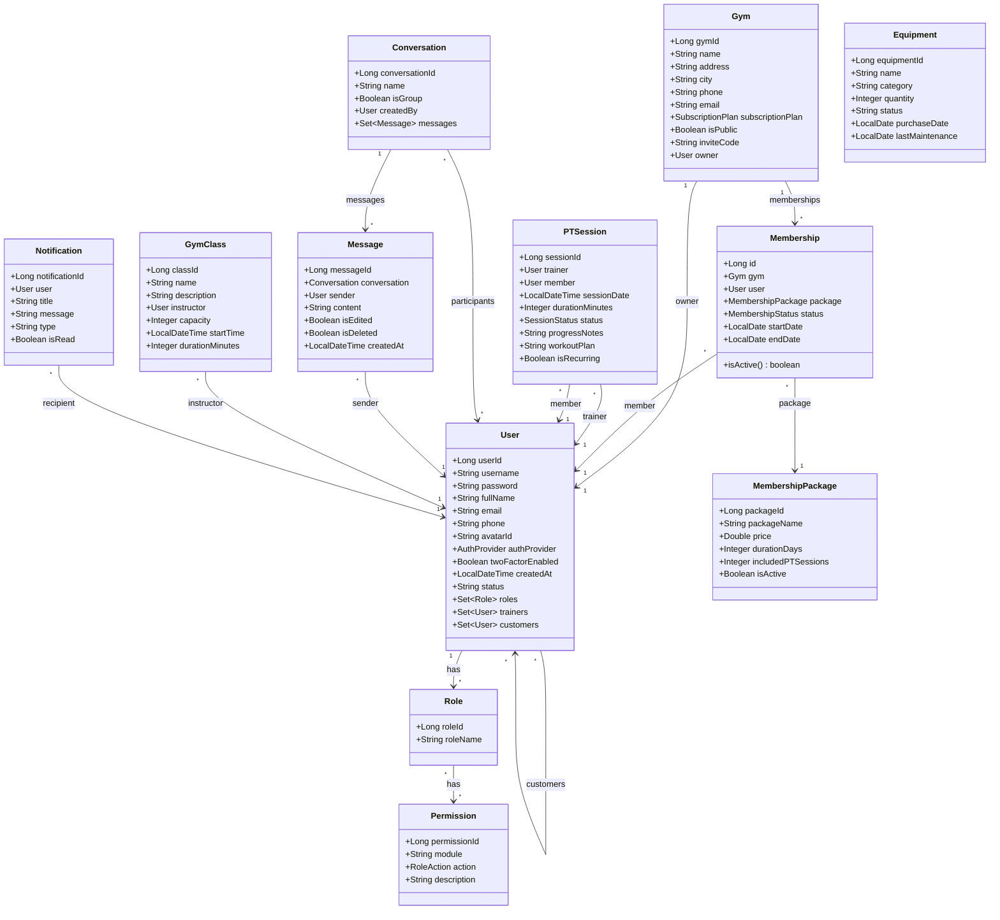
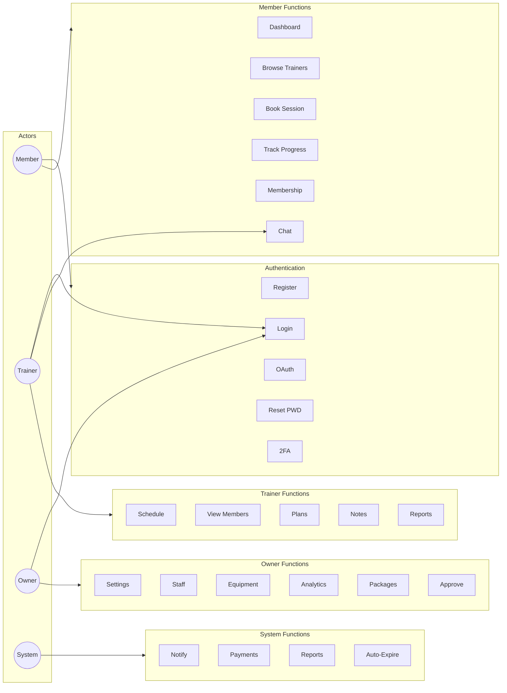
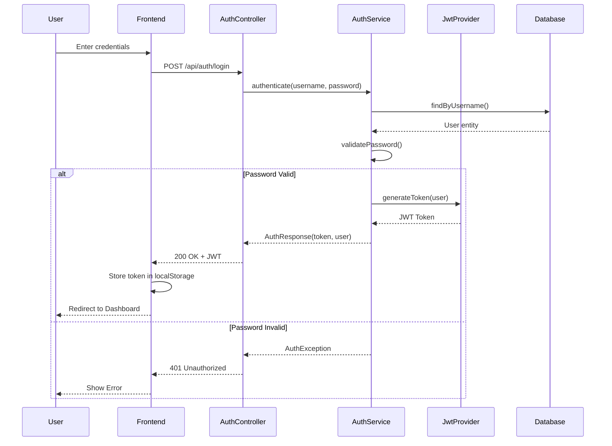
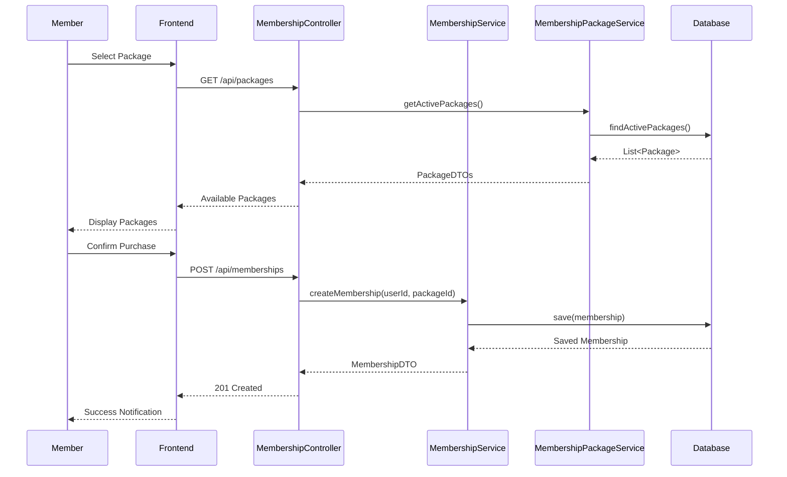
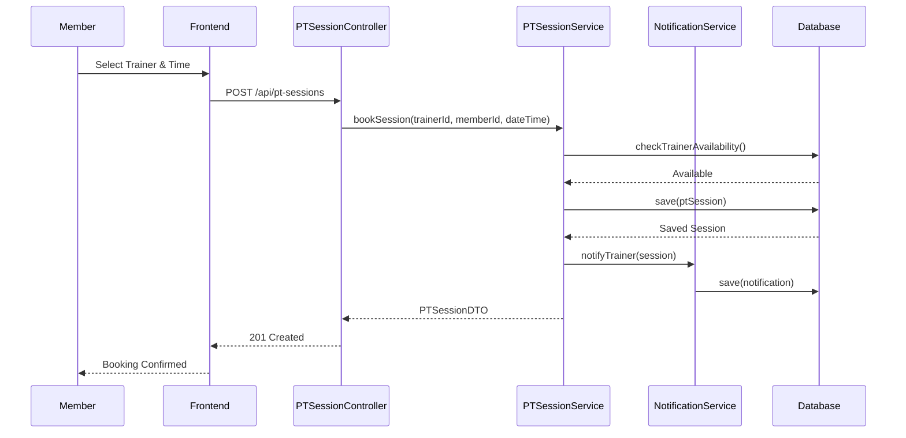
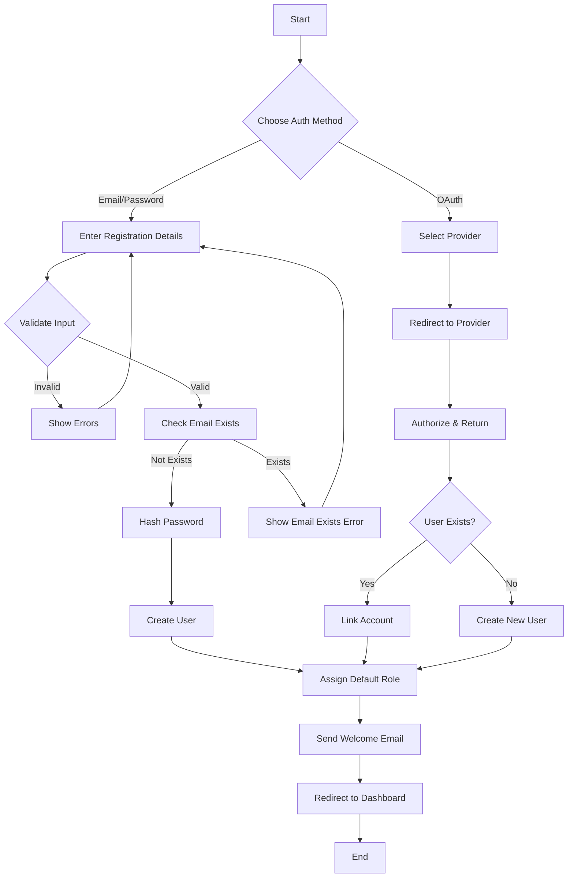
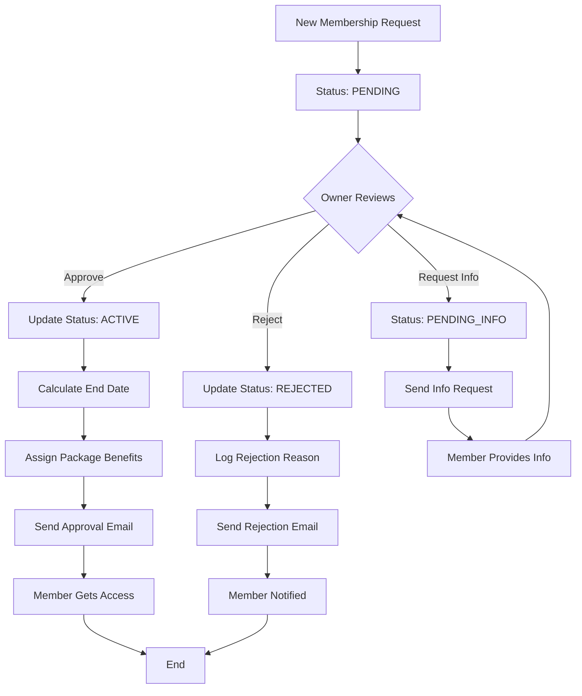
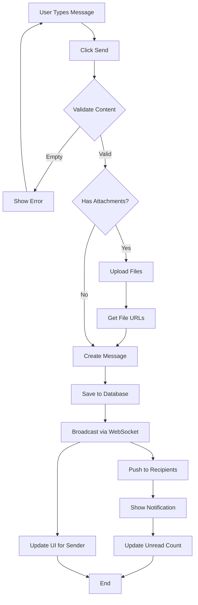

# UML Diagrams - Gym Management System

## 1. Class Diagram (Core Entities)

---

## 2. Use Case Diagram

---

## 3. Sequence Diagrams

### 3.1 User Authentication Flow

### 3.2 Membership Purchase Flow

### 3.3 PT Session Booking Flow

---

## 4. Activity Diagrams

### 4.1 User Registration Process

### 4.2 Membership Approval Workflow

### 4.3 Chat Message Flow

