# System Workflows - Gym Management System

## 1. User Registration & Authentication

### 1.1 Registration Flow

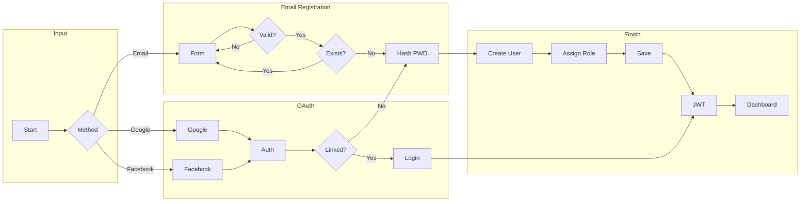

### 1.2 Login with 2FA

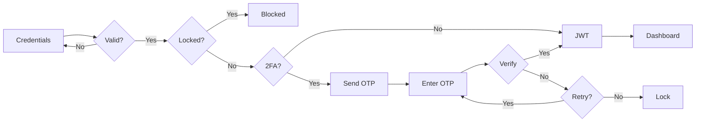

---

## 2. Membership Management

### 2.1 Purchase Flow

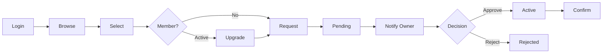

### 2.2 Expiry Handling

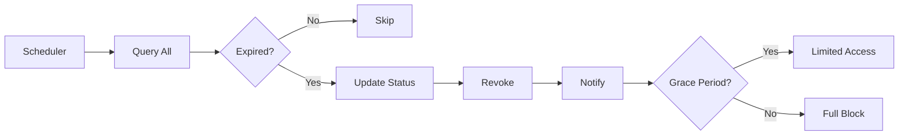

---

## 3. Trainer-Member Interaction

### 3.1 Trainer Assignment

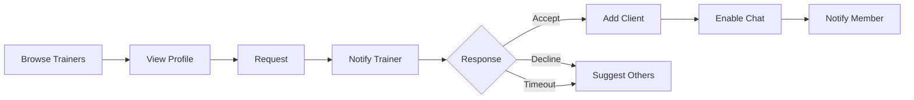

### 3.2 Progress Tracking

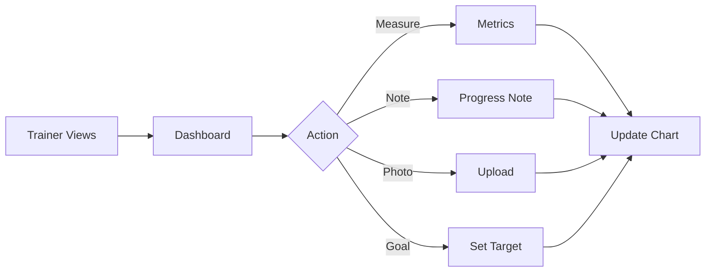

---

## 4. PT Session Booking

### 4.1 Session Creation

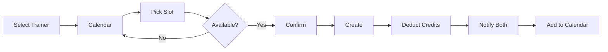

### 4.2 Session Lifecycle

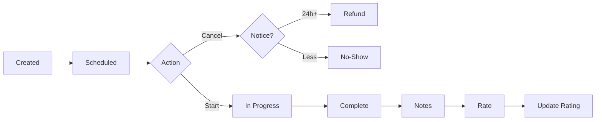

---

## 5. Chat/Messaging

### 5.1 Conversation

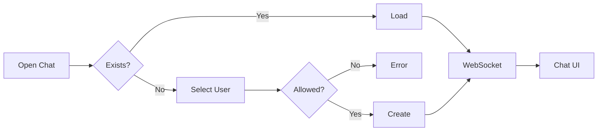

### 5.2 Message Sending

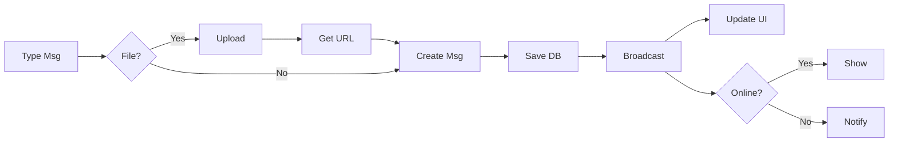

### 5.3 Real-time Updates

**Sender Side:**

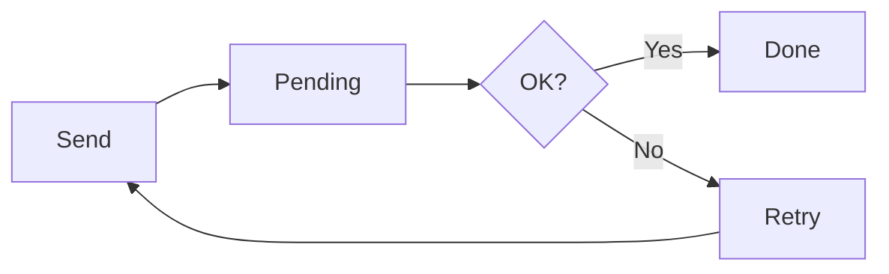

**Server Side:**

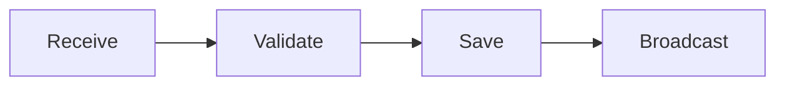

**Recipient Side:**

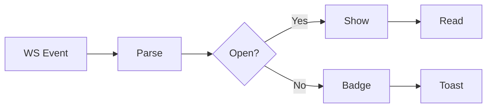

## 6. Notifications

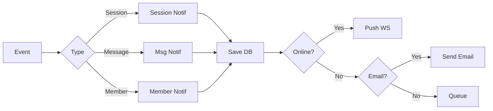
